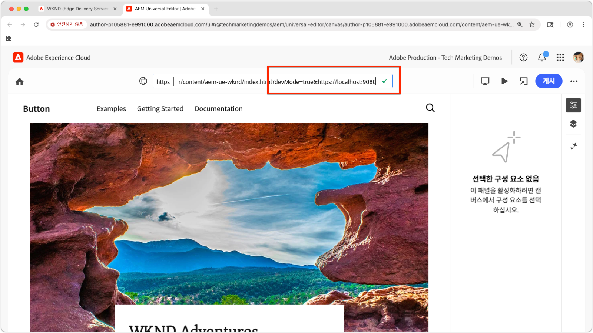

# 로컬 범용 편집기 확장 기능 미리보기

>[!TIP]
> [범용 편집기 확장 기능을 만드는](https://developer.adobe.com/uix/docs/services/aem-universal-editor/) 방법을 알아보십시오.

개발 중에 범용 편집기 확장 기능을 미리보기하려면 다음 작업을 수행하십시오.

1. 로컬에서 확장 기능을 실행합니다.
2. 자체 서명된 인증서를 수락합니다.
3. 범용 편집기에서 페이지를 엽니다.
4. 위치 URL을 업데이트하여 로컬 확장 기능을 로드합니다.

## 로컬에서 확장 기능을 실행합니다.

이는 이미 [범용 편집기 확장 기능](https://developer.adobe.com/uix/docs/services/aem-universal-editor/)을 생성했으며 로컬에서 테스트하고 개발하는 동안 미리보기를 수행하려 한다고 가정합니다.

다음을 사용하여 범용 편집기 확장 기능을 시작하십시오.

```bash
$ aio app run
```

출력에 다음과 같이 표시됩니다.

```
To view your local application:
  -> https://localhost:9080
To view your deployed application in the Experience Cloud shell:
  -> https://experience.adobe.com/?devMode=true#/custom-apps/?localDevUrl=https://localhost:9080
```

이렇게 하면 기본적으로 `https://localhost:9080`에서 확장 기능이 실행됩니다.


## 자체 서명된 인증서 수락

범용 편집기는 확장 기능을 로드하기 위해 HTTPS를 필요로 합니다. 로컬 개발에서는 자체 서명된 인증서를 사용하므로 브라우저에서 해당 인증서를 명시적으로 신뢰해야 합니다.

새 브라우저 탭을 열고 `aio app run` 명령을 사용하여 출력된 로컬 확장 URL로 이동합니다.

```
https://localhost:9080
```

브라우저에 인증서 경고가 표시됩니다. 계속하려면 인증서를 수락하십시오.


승인되면 로컬 확장 기능의 플레이스홀더 페이지가 표시됩니다.


## 범용 편집기에서 페이지 열기

[범용 편집기 콘솔](https://experience.adobe.com/#/@myOrg/aem/editor/canvas/)을 통해 열거나 범용 편집기를 사용하는 AEM Sites의 페이지를 편집하여 범용 편집기를 엽니다.


## 확장 기능 로드

범용 편집기에서 인터페이스의 상단 중앙에 있는 **위치** 필드를 찾습니다. **브라우저 주소 표시줄이 아닌** **위치 필드에서 URL**&#x200B;을 확장하고 업데이트합니다.

다음 쿼리 매개변수를 추가합니다.

* `devMode=true` – 범용 편집기에 대한 개발 모드를 활성화합니다.
* `ext=https://localhost:9080` – 로컬에서 실행 중인 확장 기능을 로드합니다.

예:

```
https://author-pXXX-eXXX.adobeaemcloud.com/content/aem-ue-wknd/index.html?devMode=true&ext=https://localhost:9080
```




## 확장 기능 미리보기

브라우저를 **하드 리로드**&#x200B;하여 업데이트된 URL이 사용되도록 합니다.

이제 범용 편집기가 브라우저 세션에서만 로컬 확장 기능을 로드합니다.

로컬에서 수행하는 모든 코드 변경이 즉시 반영됩니다.


