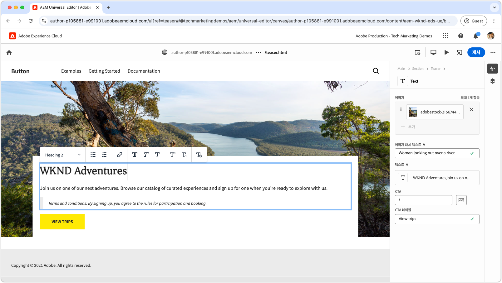

# Edge Delivery Services 비디오

Edge Delivery Services로 웹 사이트를 빠르게 만드는 방법에 대해 알아봅니다.

>[!VIDEO](https://video.tv.adobe.com/v/3427989/?learn=on)

Edge Delivery Services와 해당 기능에 대한 자세한 내용은 [설명서](https://experienceleague.adobe.com/ko/docs/experience-manager-cloud-service/content/edge-delivery/overview)를 검토하십시오.

## Edge Delivery Services 개발자 튜토리얼

<!-- CARDS 

* https://experienceleague.adobe.com/en/docs/experience-manager-cloud-service/content/edge-delivery/build/tutorial
  {title = Document-based authoring and Edge Delivery Services tutorial}
  {description = Learn how to create Edge Delivery Services web sites authored using Document-based authoring.}
  {cta = Start the tutorial}

* ./developing/universal-editor/0-overview.md
  {title = Universal Editor and Edge Delivery Services tutorial}
  {description = Learn the basics of creating an Edge Delivery Services web sites authored with Universal Editor.}
  {cta = Start the tutorial}

-->
<!-- START CARDS HTML - DO NOT MODIFY BY HAND -->

    

        

            

                <figure class="image x-is-16by9">
                    
                </figure>
            

            

                

                    

                        <a href="https://experienceleague.adobe.com/ko/docs/experience-manager-cloud-service/content/edge-delivery/build/tutorial" target="_blank" rel="referrer" title="문서 기반 작성 및 Edge Delivery Services 튜토리얼">문서 기반 작성 및 Edge Delivery Services 튜토리얼</a>
                    

                    
문서 기반 작성을 사용하여 작성된 Edge Delivery Services 웹 사이트를 만드는 방법을 알아봅니다.

                

                <a href="https://experienceleague.adobe.com/ko/docs/experience-manager-cloud-service/content/edge-delivery/build/tutorial" target="_blank" rel="referrer" class="spectrum-Button spectrum-Button--outline spectrum-Button--primary spectrum-Button--sizeM" style="align-self: flex-start; margin-top: 1rem;">
                    튜토리얼 시작
                </a>
            

        

    

    

        

            

                <figure class="image x-is-16by9">
                    
                </figure>
            

            

                

                    

                        <a href="./developing/universal-editor/0-overview.md" target="_blank" rel="referrer" title="범용 편집기 및 Edge Delivery Services 튜토리얼">범용 편집기 및 Edge Delivery Services 튜토리얼</a>
                    

                    
범용 편집기로 작성된 Edge Delivery Services 웹 사이트를 만드는 기본 사항에 대해 알아봅니다.

                

                <a href="./developing/universal-editor/0-overview.md" target="_blank" rel="referrer" class="spectrum-Button spectrum-Button--outline spectrum-Button--primary spectrum-Button--sizeM" style="align-self: flex-start; margin-top: 1rem;">
                    튜토리얼 시작
                </a>
            

        

    

<!-- END CARDS HTML - DO NOT MODIFY BY HAND -->

## Edge Delivery Services 시작하기

    <!-- Prerequisites -->
    

      

        

          <figure class="image is-16by9">
            
          </figure>
        

        

          

            
5분

            

              <a href="./developing/prerequisites.md" title="사전 요구 사항">개발자 사전 요구 사항</a>
            

            
Edge Delivery Services를 사용하여 개발을 시작하는 데 필요한 사항을 알아봅니다.

            <a href="./developing/prerequisites.md" class="spectrum-Button
              spectrum-Button--outline spectrum-Button--primary
              spectrum-Button--sizeM">
              비디오 시청
            </a>
          

        

      

    
 
    <!-- Setting up your Repository-->
    

      

        

          <figure class="image is-16by9">
            
          </figure>
        

        

          

            
1분

            

              <a href="./developing/aem-boilerplate.md" title="보일러플레이트 템플릿 사용">AEM 보일러플레이트</a>
            

            
AEM 보일러플레이트 템플릿을 사용하여 코드 저장소를 설정합니다.

            <a href="./developing/aem-boilerplate.md" class="spectrum-Button
              spectrum-Button--outline spectrum-Button--primary
              spectrum-Button--sizeM">
              비디오 시청
            </a>
          

        

      

    

    <!-- Linking Google Drive -->
    

      

        

          <figure class="image is-16by9">
            
          </figure>
        

        

          

            
1분

            

              <a href="./developing/content-repository.md" title="Google Drive 링크">Google Drive 링크</a>
            

            
Google Drive를 모든 콘텐츠의 저장소로 사용합니다.

            <a href="./developing/content-repository.md" class="spectrum-Button
              spectrum-Button--outline spectrum-Button--primary
              spectrum-Button--sizeM">
              비디오 시청
            </a>
          

        

      

    

    <!-- Link Sharepoint --->
    

      

        

          <figure class="image is-16by9">
            
          </figure>
        

        

          

            
1분

            

              <a href="./developing/content-repository.md" title="SharePoint 링크">SharePoint 링크</a>
            

            
SharePoint를 모든 콘텐츠의 저장소로 사용합니다.

            <a href="./developing/content-repository.md"
              class="spectrum-Button spectrum-Button--outline
              spectrum-Button--primary spectrum-Button--sizeM">
              비디오 시청
            </a>
          

        

      

    

    <!-- Previewing and Publishing Content -->
    

      

        

          <figure class="image is-16by9">
            
          </figure>
        

        

          

            
1분

            

              <a href="./developing/preview-and-publish.md" title="콘텐츠 미리 보기 및 게시">콘텐츠 미리 보기 및 게시</a>
            

            
AEM Sidekick을 사용하여 콘텐츠를 미리 보고 게시합니다.

            <a href="./developing/preview-and-publish.md" class="spectrum-Button
              spectrum-Button--outline spectrum-Button--primary
              spectrum-Button--sizeM">
              비디오 시청
            </a>
          

        

      

    

    <!-- Using the Sidekick -->
    

      

        

          <figure class="image is-16by9">
            
          </figure>
        

        

          

            
1분

            

              <a href="./developing/sidekick.md" title="Sidekick 사용">AEM Sidekick 사용</a>
            

            
AEM Sidekick 사용 방법을 알아봅니다.

            <a href="./developing/sidekick.md" class="spectrum-Button
              spectrum-Button--outline spectrum-Button--primary
              spectrum-Button--sizeM">
              비디오 시청
            </a>
          

        

      

    

 <!-- Document Structure -->
    

      

        

          <figure class="image is-16by9">
            
          </figure>
        

        

          

            
1분

            

              <a href="./developing/document-structure.md" title="문서 구조">문서 구조</a>
            

            
기본 콘텐츠, 섹션 및 블록을 포함한 문서 구조를 살펴봅니다. 

            <a href="./developing/document-structure.md" class="spectrum-Button
              spectrum-Button--outline spectrum-Button--primary
              spectrum-Button--sizeM">
              비디오 시청
            </a>
          

        

      

    
  
     <!--Local Development -->
    

      

        

          <figure class="image is-16by9">
            
          </figure>
        

        

          

            
2분

            

              <a href="./developing/local-development.md" title="로컬 개발">로컬 개발</a>
            

            
로컬 개발 환경을 구성합니다.

            <a href="./developing/local-development.md" class="spectrum-Button
              spectrum-Button--outline spectrum-Button--primary
              spectrum-Button--sizeM">
              비디오 시청
            </a>
          

        

      

    

    <!--Integrate with Git -->
    

      

        

          <figure class="image is-16by9">
            
          </figure>
        

        

          

            
2분

            

              <a href="./developing/git.md" title="Git과 통합">Git과 통합</a>
            

            
Git 및 Edge Delivery Services를 구성합니다.

            <a href="./developing/git.md" class="spectrum-Button
              spectrum-Button--outline spectrum-Button--primary
              spectrum-Button--sizeM">
              비디오 시청
            </a>
          

        

      

    

## 사용 방법 비디오

    <!--Create RSS Feeds -->
    

      

        

          <figure class="image is-16by9">
            
          </figure>
        

        

          

            
2분

            

              <a href="./how-to/rss.md" title="RSS 피드 만들기">RSS 피드 만들기</a>
            

            
RSS 피드 생성 방법을 알아봅니다.

            <a href="./how-to/rss.md" class="spectrum-Button
              spectrum-Button--outline spectrum-Button--primary
              spectrum-Button--sizeM">
              비디오 시청
            </a>
          

        

      

    

    <!--Social Media Sharing -->
    

      

        

          <figure class="image is-16by9">
            
          </figure>
        

        

          

            
2분

            

              <a href="./how-to/social-media-sharing.md" title="소셜 미디어 공유">소셜 미디어 공유</a>
            

            
소셜 미디어 공유를 위해 콘텐츠를 최적화하는 방법을 알아봅니다.

            <a href="./how-to/social-media-sharing.md" class="spectrum-Button
              spectrum-Button--outline spectrum-Button--primary
              spectrum-Button--sizeM">
              비디오 시청
            </a>
          

        

      

    

    <!--Delete a Page -->
    

      

        

          <figure class="image is-16by9">
            
          </figure>
        

        

          

            
2분

            

              <a href="./how-to/delete-page.md" title="페이지 삭제">페이지 삭제</a>
            

            
페이지 삭제 방법을 알아봅니다.

            <a href="./how-to/delete-page.md" class="spectrum-Button
              spectrum-Button--outline spectrum-Button--primary
              spectrum-Button--sizeM">
              비디오 시청
            </a>
          

        

      

    
    
  

