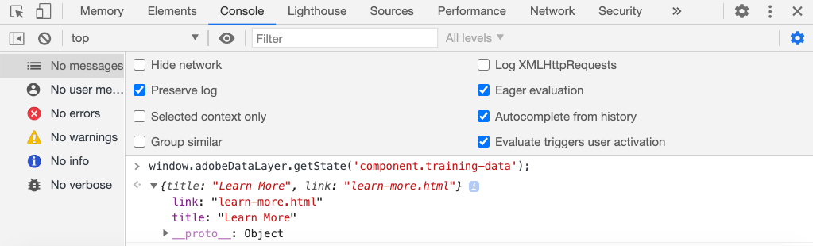

# AEM 핵심 구성 요소에서 Adobe 클라이언트 데이터 레이어 사용 {#overview}

Adobe 클라이언트 데이터 계층은 웹 페이지에서 방문자 경험에 대한 데이터를 수집 및 저장한 다음 이 데이터에 쉽게 액세스할 수 있는 표준 방법을 제공합니다. Adobe 클라이언트 데이터 계층은 플랫폼에 영향을 받지 않지만 AEM에서 사용할 수 있도록 핵심 구성 요소에 완전히 통합됩니다.

>[!VIDEO](https://video.tv.adobe.com/v/41195?quality=12&learn=on)

>[!NOTE]
>
> AEM 사이트에서 Adobe 클라이언트 데이터 계층을 활성화하시겠습니까? [지침은 여기 ](https://experienceleague.adobe.com/docs/experience-manager-core-components/using/developing/data-layer/overview.html#installation-activation)를 참조하십시오.

## 데이터 레이어 살펴보기

브라우저의 개발자 도구와 live [WKND 참조 사이트](https://wknd.site/)를 사용하기만 하면 Adobe 클라이언트 데이터 계층의 내장 기능을 알 수 있습니다.

>[!NOTE]
>
> 아래 스크린샷은 Chrome 브라우저에서 가져옵니다.

1. [https://wknd.site](https://wknd.site)로 이동합니다.
1. 개발자 도구를 열고 **콘솔**&#x200B;에 다음 명령을 입력합니다.

   ```js
   window.adobeDataLayer.getState();
   ```

   AEM 사이트에서 데이터 레이어의 현재 상태를 보는 Inspect 응답입니다. 페이지 및 개별 구성 요소에 대한 정보가 표시됩니다.

   

1. 콘솔에 다음을 입력하여 데이터 객체를 데이터 레이어에 푸시합니다.

   ```js
   window.adobeDataLayer.push({
       "component": {
           "training-data": {
               "title": "Learn More",
               "link": "learn-more.html"
           }
       }
   });
   ```

1. `adobeDataLayer.getState()` 명령을 다시 실행하고 `training-data` 항목을 찾습니다.
1. 다음으로 경로 매개 변수를 추가하여 구성 요소의 특정 상태만 반환합니다.

   ```js
   window.adobeDataLayer.getState('component.training-data');
   ```

   

## 이벤트 작업

데이터 계층의 이벤트를 기반으로 모든 사용자 지정 코드를 트리거하는 것이 가장 좋습니다. 다음으로, 다른 이벤트 등록 및 수신 확인을 탐색합니다.

1. 콘솔에서 다음 도우미 메서드를 입력합니다.

   ```js
   function getDataObjectHelper(event, filter) {
       if (event.hasOwnProperty("eventInfo") && event.eventInfo.hasOwnProperty("path")) {
           var dataObject = window.adobeDataLayer.getState(event.eventInfo.path);
           if (dataObject != null) {
               for (var property in filter) {
                   if (!dataObject.hasOwnProperty(property) || (filter[property] !== null && filter[property] !== dataObject[property])) {
                       return;
                   }
                   return dataObject;
               }
           }
       }
       return;
   }
   ```

   위의 코드는 `event` 개체를 검사하고 `adobeDataLayer.getState` 메서드를 사용하여 이벤트를 트리거한 개체의 현재 상태를 가져옵니다. 그러면 도우미 메서드는 `filter` 기준을 검사하며 현재 `dataObject`이 필터를 충족하는 경우에만 해당 기준이 반환됩니다.

   >[!CAUTION]
   >
   > 이 연습 기간 동안 브라우저를 새로 고치는 것은 **중요하지 않습니다. 그렇지 않으면 콘솔 JavaScript가 손실됩니다.**

1. 다음으로 **Teaser** 구성 요소가 **캐러셀** 내에 표시될 때 호출되는 이벤트 처리기를 입력합니다.

   ```js
   function teaserShownHandler(event) {
       var dataObject = getDataObjectHelper(event, {"@type": "wknd/components/teaser"});
       if(dataObject != null) {
           console.log("Teaser Shown: " + dataObject['dc:title']);
           console.log(dataObject);
       }
   }
   ```

   `teaserShownHandler`은 `getDataObjectHelper` 메서드를 호출하고 `wknd/components/teaser` 필터를 `@type` 필터로 전달하여 다른 구성 요소에 의해 트리거되는 이벤트를 필터링합니다.

1. 그런 다음 이벤트 리스너를 데이터 레이어에 푸시하여 `cmp:show` 이벤트를 수신합니다.

   ```js
   window.adobeDataLayer.push(function (dl) {
        dl.addEventListener("cmp:show", teaserShownHandler);
   });
   ```

   `cmp:show` 이벤트는 **캐러셀**&#x200B;에 새 슬라이드를 표시하거나 **탭** 구성 요소에서 새 탭을 선택한 경우와 같이 많은 다른 구성 요소에 의해 트리거됩니다.

1. 페이지에서 회전판 슬라이드를 전환하고 콘솔 문을 관찰합니다.

   

1. 데이터 계층에서 이벤트 리스너를 제거하여 `cmp:show` 이벤트 수신 중지를 지정합니다.

   ```js
   window.adobeDataLayer = window.adobeDataLayer || [];
   window.adobeDataLayer.push(function(dl) {
       dl.removeEventListener("cmp:show", teaserShownHandler);
   });
   ```

1. 페이지로 돌아가서 캐러셀 슬라이드를 전환합니다. 더 이상 문이 기록되지 않고 이벤트가 수신되지 않는다는 것을 확인합니다.

1. 다음으로, 페이지 표시 이벤트가 트리거될 때 호출할 이벤트 처리기를 입력합니다.

   ```js
   function pageShownHandler(event) {
       var dataObject = getDataObjectHelper(event, {"@type": "wknd/components/page"});
       if(dataObject != null) {
           console.log("Page Shown: " + dataObject['dc:title']);
           console.log(dataObject);
       }
   }
   ```

   리소스 유형 `wknd/components/page`은(는) 이벤트를 필터링하는 데 사용됩니다.

1. 그런 다음 이벤트 리스너를 데이터 레이어에 푸시하여 `cmp:show` 이벤트를 수신하고 `pageShownHandler` 를 호출합니다.

   ```js
   window.adobeDataLayer = window.adobeDataLayer || [];
   window.adobeDataLayer.push(function (dl) {
        dl.addEventListener("cmp:show", pageShownHandler);
   });
   ```

1. 페이지 데이터로 실행된 콘솔 문이 즉시 표시됩니다.

   

   페이지에 대한 `cmp:show` 이벤트는 페이지의 맨 위에 있는 각 페이지 로드 시 트리거됩니다. 페이지가 이미 로드되었을 때 이벤트 처리기가 트리거되는 이유는 무엇입니까?를 물어볼 수 있습니다.

   이 기능은 Adobe 클라이언트 데이터 계층의 고유한 기능 중 하나이며, 데이터 계층이 초기화되기 전에 **이벤트 리스너** 또는 **를 등록할 수 있습니다.** 이것은 경합 상황을 피하는 중요한 특징이다.

   데이터 계층은 시퀀스에서 발생한 모든 이벤트의 큐 배열을 유지합니다. 데이터 계층은 기본적으로 **과거**&#x200B;에서 발생한 이벤트와 **미래**&#x200B;의 이벤트에 대한 이벤트 콜백을 트리거합니다. 이벤트를 과거 또는 미래로 필터링할 수 있습니다. [자세한 내용은 설명서에서 확인할 수 있습니다](https://github.com/adobe/adobe-client-data-layer/wiki#addeventlistener).


## 다음 단계

이벤트 기반 Adobe 클라이언트 데이터 레이어를 사용하여 [페이지 데이터를 수집하고 Adobe Analytics](../analytics/collect-data-analytics.md)에 전송하는 방법을 배우려면 다음 자습서를 확인하십시오.

또는 AEM 구성 요소를 사용하여 Adobe 클라이언트 데이터 레이어를 사용자 지정하는 방법](./data-layer-customize.md)[


## 추가 리소스 {#additional-resources}

* [Adobe 클라이언트 데이터 레이어 설명서](https://github.com/adobe/adobe-client-data-layer/wiki)
* [Adobe 클라이언트 데이터 레이어 및 핵심 구성 요소 설명서 사용](https://experienceleague.adobe.com/docs/experience-manager-core-components/using/developing/data-layer/overview.html)
