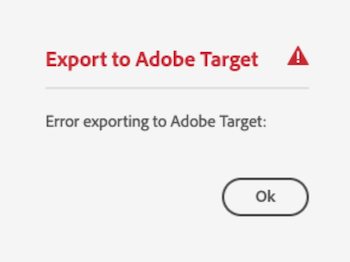

# 경험 조각을 Adobe Target {#experience-fragment-target}로 내보내기

AEM 경험 조각을 Adobe Target 오퍼으로 내보내는 방법을 알아봅니다.

>[!VIDEO](https://video.tv.adobe.com/v/41245?quality=12&learn=on)

## 다음 단계

+ [경험 조각 오퍼를 사용하여 Target 활동 만들기](./create-target-activity.md)

## 문제 해결

### Target으로 경험 조각 내보내기에 실패했습니다.

#### 오류

Adobe Admin Console에서 올바른 권한 없이 경험 조각을 Adobe Target으로 내보내면 AEM 작성자 서비스에서 다음 오류가 발생합니다.

    

... 및 `aemerror` 로그의 다음 로그 메시지:

    

#### 해상도

1. AEM 통합을 사용하지만 Adobe Target 제품 프로필에 대한 관리 권한이 있는 [Admin Console](https://adminconsole.adobe.com/)에 로그인합니다.
2. __제품 > Adobe Target > 제품 프로필__&#x200B;을 선택합니다.
3. __통합__ 탭에서 Cloud Service 환경으로 AEM 통합을 선택합니다(Adobe I/O 프로젝트와 동일한 이름).
4. __편집기__ 또는 __승인자__ 역할 할당

   

Adobe Target 통합에 올바른 권한을 추가하면 이 오류가 해결됩니다.

## 지원 링크

+ [Adobe Experience Cloud Debugger - Chrome](https://chrome.google.com/webstore/detail/adobe-experience-cloud-de/ocdmogmohccmeicdhlhhgepeaijenapj)
+ [Adobe Experience Cloud Debugger - Firefox](https://addons.mozilla.org/en-US/firefox/addon/adobe-experience-platform-dbg/)