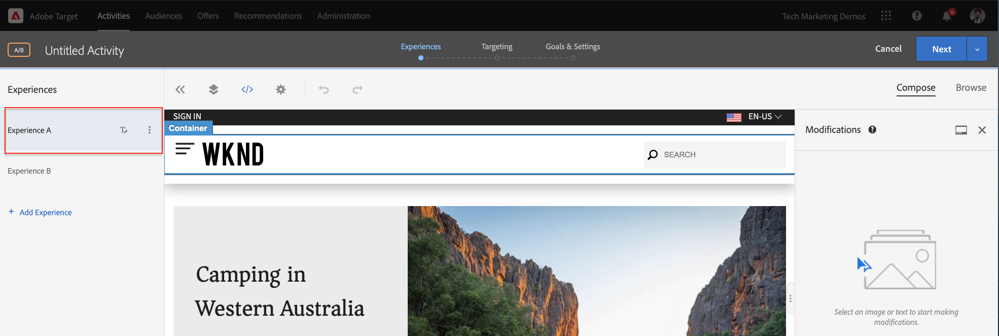
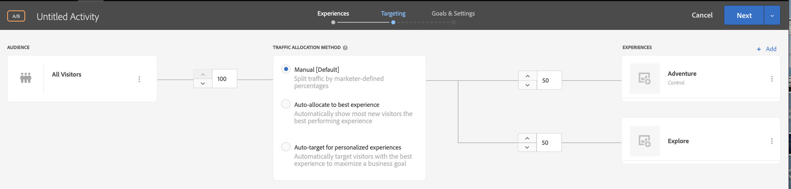

# Visual Experience Composer를 사용한 개인화 {#personalization-vec}

VEC(Visual Experience Composer)를 사용하여 A/B 테스트 Target 활동을 만드는 방법을 알아봅니다.

Target에서 활동을 만들기 전에 다음을 설정해야 합니다.

1. [Experience Platform Launch 및 AEM 통합](https://docs.adobe.com/content/help/en/experience-manager-learn/sites/integrations/experience-platform-launch/overview.html)
2. [Cloud Services을 사용하여 Adobe Experience Manager과 Adobe Target 통합](https://docs.adobe.com/content/help/en/experience-manager-learn/sites/integrations/target/setup-aem-target-cloud-service.html)

## 시나리오 개요

WKND 사이트 홈 페이지에는 지역 활동 또는 도시 주변에서 정보 카드 형태로 해야 할 최상의 사항이 표시됩니다. 마케터는 모험 섹션 Teaser에 텍스트를 변경하고 전환율을 향상시키는 방법을 파악하여 홈 페이지를 수정하는 작업을 할당 받았습니다.

## VEC(Visual Experience Composer)를 사용하여 A/B 테스트를 만드는 절차

1. Adobe Target에 로그인하고 활동 탭으로 이동합니다.
1. 활동 **만들기** 단추를 클릭한 다음 **A/B 테스트** 활동을선택합니다

   

1. Visual Experience **Composer** 옵션을 선택하고 활동 URL을 제공한 다음 **다음을 클릭합니다**

   

1. Visual Experience Composer는 새 활동을 만든 후 왼쪽의 두 탭을 표시합니다. *경험 A* 및 *경험 B*. 목록에서 경험을 선택합니다. 경험 **추가 단추를 사용하여 목록에 새 경험을 추가할 수** 있습니다.

   

1. 페이지에서 이미지나 텍스트를 선택하여 수정 작업을 시작하거나 코드 편집기를 사용하여 HTML 요소를 선택하거나 사용할 수 있습니다.

   

1. 서호주 *의 캠핑에서 호주* 의 *모험으로 텍스트를 변경합니다*. 경험에 추가된 변경 사항 목록은 수정 사항 아래에 표시됩니다. 수정된 항목을 클릭하고 편집하여 CSS 선택기 및 여기에 추가된 새 컨텐츠를 볼 수 있습니다.

   

1. 경험 *A를* 모험으로 *이름 변경*
1. 유사하게, 호주 *서부* 의 Camping에서 경험 B에 *대한 텍스트를* Experience *B로*&#x200B;업데이트하여 오스트레일리아황야를 탐험하십시오.

   

1. 타깃팅으로 **이동하려면** 다음을 클릭하고 두 경험 간에 50-50의 수동 트래픽 할당을 유지하겠습니다.

   

1. 목표 및 설정에 대해 보고 소스를 Adobe Target으로 선택하고 페이지 보기 작업으로 전환으로 목표 지표를 선택합니다.

   

1. 활동 이름을 입력하고 저장을 클릭합니다.
1. 저장된 활동을 활성화하여 변경 사항을 라이브로 푸시합니다.

   

1. 새 탭에서 사이트 페이지(3단계의 활동 URL)를 열고 A/B 테스트 활동에서 경험(모험 또는 탐색) 중 하나를 볼 수 있어야 합니다.

   

## 요약

이 장에서 마케터는 테스트를 실행하기 위해 코드를 변경하지 않고 웹 페이지의 레이아웃과 컨텐츠를 드래그 앤 드롭하고 교체하고 수정하여 Visual Experience Composer를 사용하여 경험을 만들 수 있었습니다.

## 지원 링크

* [Adobe Experience Cloud 디버거 - Chrome](https://chrome.google.com/webstore/detail/adobe-experience-cloud-de/ocdmogmohccmeicdhlhhgepeaijenapj)
* [Adobe Experience Cloud 디버거 - Firefox](https://addons.mozilla.org/en-US/firefox/addon/adobe-experience-platform-dbg/)
