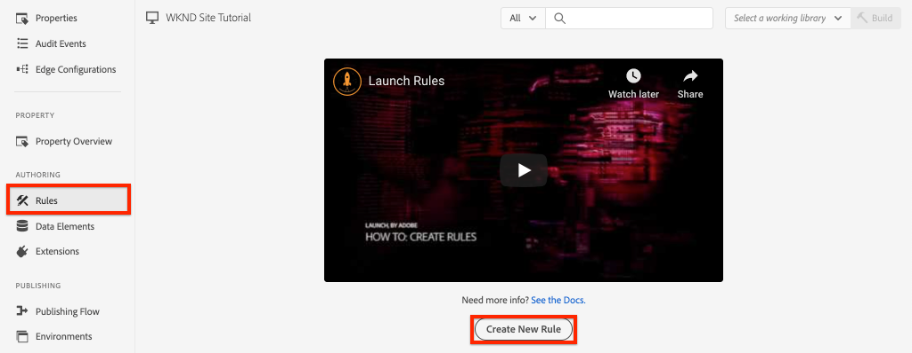
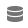

# Adobe Analytics을 사용하여 페이지 데이터 수집

AEM 코어 구성 요소](https://docs.adobe.com/content/help/ko-KR/experience-manager-core-components/using/developing/data-layer/overview.html)와 함께 [Adobe 클라이언트 데이터 레이어의 내장 기능을 사용하여 Adobe Experience Manager Sites의 페이지에 대한 데이터를 수집하는 방법에 대해 학습합니다. [Experience Platform ](https://www.adobe.com/experience-platform/launch.html) Launchch 및  [Adobe Analytics ](https://docs.adobe.com/content/help/en/launch/using/extensions-ref/adobe-extension/analytics-extension/overview.html) Extensionioneholdings를 사용하여 페이지 데이터를 Adobe Analytics으로 보낼 규칙을 만듭니다.

## 구축 분야


이 자습서에서는 Adobe 클라이언트 데이터 레이어의 이벤트를 기반으로 론치 규칙을 트리거하고, 규칙을 실행해야 할 시기를 조건으로 추가하고 AEM 페이지의 **페이지 이름** 및 **페이지 템플릿**&#x200B;을 Adobe Analytics으로 보냅니다.

### 목표 {#objective}

1. 데이터 레이어의 변경 사항을 기반으로 Launch에서 이벤트 기반 규칙 만들기
1. 론치에서 페이지 데이터 요소에 페이지 데이터 레이어 속성 매핑
1. 페이지 데이터 수집 및 페이지 보기 비콘을 사용하여 Adobe Analytics으로 보내기

## 전제 조건

다음은 필수입니다.

* **Experience Platform** LaunchProperty
* **Adobe** Analytics/dev 보고서 세트 ID 및 추적 서버. [새 보고서 세트 만들기](https://docs.adobe.com/content/help/en/analytics/admin/manage-report-suites/new-report-suite/new-report-suite.html)에 대한 다음 설명서를 참조하십시오.
* [Experience Platform ](https://docs.adobe.com/content/help/en/platform-learn/tutorials/data-ingestion/web-sdk/introduction-to-the-experience-platform-debugger.html) 디버거 브라우저 확장 Chrome 브라우저에서 캡처된 이 자습서의 스크린샷
* (선택 사항) [Adobe 클라이언트 데이터 레이어가 활성화된 AEM 사이트](https://docs.adobe.com/content/help/en/experience-manager-core-components/using/developing/data-layer/overview.html#installation-activation). 이 자습서는 공개 사이트 [https://wknd.site/us/en.html](https://wknd.site/us/en.html)을(를) 사용하지만 자신의 사이트를 사용하는 것을 환영합니다.

>[!NOTE]
>
> Launch 및 AEM 사이트 통합에 도움이 필요하십니까? [이 비디오 시리즈를 참조하십시오](../experience-platform-launch/overview.md).

## WKND 사이트에 대한 실행 환경 전환

[https://wknd.](https://wknd.site) sitee는 AEM 구현을 위해 참조 및  [자습서로 ](https://github.com/adobe/aem-guides-wknd) 설계된 오픈 소스 프로젝트를 기반으로 구축된 공개  [](https://docs.adobe.com/content/help/en/experience-manager-learn/getting-started-wknd-tutorial-develop/overview.html) 사이트 사이트입니다.

AEM 환경을 설정하고 WKND 코드 베이스를 설치하는 대신 Experience Platform 디버거를 사용하여 **라이브 [https://wknd.site/](https://wknd.site/)을 *your* 시작 속성으로 &lt;a4/>전환할 수 있습니다.** 물론 이미 [Adobe 클라이언트 데이터 레이어가 활성화된 경우 자체 AEM 사이트를 사용할 수 있습니다.](https://docs.adobe.com/content/help/en/experience-manager-core-components/using/developing/data-layer/overview.html#installation-activation)

1. Experience Platform Launch에 로그인하고 [론치 속성](https://docs.adobe.com/content/help/en/core-services-learn/implementing-in-websites-with-launch/configure-launch/launch.html)을 만듭니다(아직 없는 경우).
1. 초기 시작 [라이브러리가 만들어졌고 시작 [환경](https://docs.adobe.com/content/help/en/launch/using/reference/publish/environments.html)으로 승격되었는지 확인합니다.](https://docs.adobe.com/content/help/en/launch/using/reference/publish/libraries.html#create-a-library)
1. 라이브러리가 게시된 환경에서 론치 포함 코드를 복사합니다.

   

1. 브라우저에서 새 탭을 열고 [https://wknd.site/](https://wknd.site/)로 이동합니다.
1. Experience Platform 디버거 브라우저 확장 열기

   

1. **시작** > **구성**&#x200B;으로 이동하고 **삽입된 포함 코드**&#x200B;에서 기존 론치 포함 코드를 단계 3에서 복사한 *사용자의* 포함 코드로 바꿉니다.

   

1. WKND 탭에서 **콘솔 로깅** 및 **디버거 잠금**&#x200B;을 활성화합니다.

   

## WKND 사이트에서 Adobe 클라이언트 데이터 레이어 확인

[WKND 참조 프로젝트](https://github.com/adobe/aem-guides-wknd)는 AEM 코어 구성 요소를 사용하여 구축되며 기본적으로 [Adobe 클라이언트 데이터 레이어가 활성화되어 있습니다](https://docs.adobe.com/content/help/en/experience-manager-core-components/using/developing/data-layer/overview.html#installation-activation). 다음으로 Adobe 클라이언트 데이터 레이어가 활성화되어 있는지 확인합니다.

1. [https://wknd.site](https://wknd.site)로 이동합니다.
1. 브라우저의 개발자 도구를 열고 **콘솔**&#x200B;로 이동합니다. 다음 명령을 실행합니다.

   ```js
   adobeDataLayer.getState();
   ```

   Adobe 클라이언트 데이터 레이어의 현재 상태를 반환합니다.

   

1. 응답을 확장하고 `page` 항목을 검사합니다. 다음과 같은 데이터 스키마가 표시됩니다.

   ```json
   page-2eee4f8914:
       @type: "wknd/components/page"
       dc:description: "WKND is a collective of outdoors, music, crafts, adventure sports, and travel enthusiasts that want to share our experiences, connections, and expertise with the world."
       dc:title: "WKND Adventures and Travel"
       repo:modifyDate: "2020-08-31T21:02:21Z"
       repo:path: "/content/wknd/us/en.html"
       xdm:language: "en-US"
       xdm:tags: ["Attract"]
       xdm:template: "/conf/wknd/settings/wcm/templates/landing-page-template"
   ```

   데이터 레이어의 [페이지 스키마](https://docs.adobe.com/content/help/en/experience-manager-core-components/using/developing/data-layer/overview.html#page), `dc:title`, `xdm:language` 및 `xdm:template`에서 파생된 표준 속성을 사용하여 페이지 데이터를 Adobe Analytics으로 보냅니다.

   >[!NOTE]
   >
   > `adobeDataLayer` javascript 개체가 표시되지 않습니까? 사이트에서 [Adobe 클라이언트 데이터 레이어가 활성화되어 있는지 확인하십시오](https://docs.adobe.com/content/help/en/experience-manager-core-components/using/developing/data-layer/overview.html#installation-activation).

## 로드된 페이지 규칙 만들기

Adobe 클라이언트 데이터 레이어는 **이벤트** 기반 데이터 레이어입니다. AEM **Page** 데이터 레이어가 로드되면 `cmp:show` 이벤트가 트리거됩니다. `cmp:show` 이벤트를 기반으로 트리거되는 규칙을 만듭니다.

1. Experience Platform Launch으로 이동하고 AEM 사이트와 통합된 웹 속성으로 이동합니다.
1. 시작 UI에서 **규칙** 섹션으로 이동한 다음 **새 규칙 만들기**&#x200B;를 클릭합니다.

   

1. 규칙 이름 **Page Loaded**&#x200B;을 지정합니다.
1. **이벤트** **추가**&#x200B;를 클릭하여 **이벤트 구성** 마법사를 엽니다.
1. **이벤트 유형** 아래에서 **사용자 지정 코드**&#x200B;를 선택합니다.

   

1. 기본 패널에서 **편집기 열기**&#x200B;를 클릭하고 다음 코드 조각을 입력합니다.

   ```js
   var pageShownEventHandler = function(evt) {
      // defensive coding to avoid a null pointer exception
      if(evt.hasOwnProperty("eventInfo") && evt.eventInfo.hasOwnProperty("path")) {
         //trigger Launch Rule and pass event
         console.debug("cmp:show event: " + evt.eventInfo.path);
         var event = {
            //include the path of the component that triggered the event
            path: evt.eventInfo.path,
            //get the state of the component that triggered the event
            component: window.adobeDataLayer.getState(evt.eventInfo.path)
         };
   
         //Trigger the Launch Rule, passing in the new `event` object
         // the `event` obj can now be referenced by the reserved name `event` by other Launch data elements
         // i.e `event.component['someKey']`
         trigger(event);
      }
   }
   
   //set the namespace to avoid a potential race condition
   window.adobeDataLayer = window.adobeDataLayer || [];
   //push the event listener for cmp:show into the data layer
   window.adobeDataLayer.push(function (dl) {
      //add event listener for `cmp:show` and callback to the `pageShownEventHandler` function
      dl.addEventListener("cmp:show", pageShownEventHandler);
   });
   ```

   위의 코드 조각은 [함수를 데이터 레이어에 푸시하여 이벤트 리스너를 추가합니다. ](https://github.com/adobe/adobe-client-data-layer/wiki#pushing-a-function) `cmp:show` 이벤트가 트리거되면 `pageShownEventHandler` 함수가 호출됩니다. 이 함수에서 몇 가지 상태 검사가 추가되고 이벤트를 트리거한 구성 요소에 대한 데이터 레이어](https://github.com/adobe/adobe-client-data-layer/wiki#getstate)의 최신 [상태로 새 `event`이(가) 구성됩니다.

   그 후 `trigger(event)`이(가) 호출됩니다. `trigger()` 은 론치의 예약된 이름이며 론치 규칙을 &quot;트리거&quot;합니다. `event` 개체를 매개 변수로 전달하면 Launch의 `event`이라는 다른 예약 이름으로 표시됩니다. 이제 론치의 데이터 요소는 다음과 같은 다양한 속성을 참조할 수 있습니다.`event.component['someKey']`.

1. 변경 사항을 저장합니다.
1. **작업** 아래의 **추가**&#x200B;를 클릭하여 **작업 구성** 마법사를 엽니다.
1. **작업 유형**&#x200B;에서 **사용자 지정 코드**&#x200B;를 선택합니다.

   

1. 기본 패널에서 **편집기 열기**&#x200B;를 클릭하고 다음 코드 조각을 입력합니다.

   ```js
   console.debug("Page Loaded ");
   console.debug("Page name: " + event.component['dc:title']);
   console.debug("Page type: " + event.component['@type']);
   console.debug("Page template: " + event.component['xdm:template']);
   ```

   `event` 개체는 사용자 지정 이벤트에서 호출된 `trigger()` 메서드에서 전달됩니다. `component` 는 사용자 지정 이벤트의 데이터 레이어 `getState` 에서 파생된 현재 페이지입니다. 데이터 레이어에서 노출한 다양한 키를 보려면 데이터 레이어의 [페이지 스키마](https://docs.adobe.com/content/help/en/experience-manager-core-components/using/developing/data-layer/overview.html#page)의 이전 버전에서 다시 불러옵니다.

1. 변경 내용을 저장하고 Launch에서 [build](https://docs.adobe.com/content/help/en/launch/using/reference/publish/builds.html)을 실행하여 코드를 AEM 사이트에서 사용되는 [environment](https://docs.adobe.com/content/help/en/launch/using/reference/publish/environments.html)으로 승격합니다.

   >[!NOTE]
   >
   > [Adobe Experience Platform Debugger](https://docs.adobe.com/content/help/en/platform-learn/tutorials/data-ingestion/web-sdk/introduction-to-the-experience-platform-debugger.html)를 사용하여 포함 코드를 **개발** 환경으로 전환하는 것이 매우 유용합니다.

1. AEM 사이트로 이동하고 개발자 도구를 열어 콘솔을 봅니다. 페이지를 새로 고치면 콘솔 메시지가 기록되었음을 확인할 수 있습니다.

   

## 데이터 요소 만들기

그런 다음 Adobe 클라이언트 데이터 레이어에서 다른 값을 캡처할 여러 데이터 요소를 만듭니다. 이전 연습에서 보듯이 사용자 지정 코드를 통해 직접 데이터 레이어의 속성에 액세스할 수 있습니다. 데이터 요소를 사용하면 실행 규칙 간에 다시 사용할 수 있다는 이점이 있습니다.

데이터 레이어에서 노출한 [페이지 스키마](https://docs.adobe.com/content/help/en/experience-manager-core-components/using/developing/data-layer/overview.html#page)의 이전 버전에서 다시 불러오기:

데이터 요소는 `@type`, `dc:title` 및 `xdm:template` 속성에 매핑됩니다.

### 구성 요소 리소스 유형

1. Experience Platform Launch으로 이동하고 AEM 사이트와 통합된 웹 속성으로 이동합니다.
1. **데이터 요소** 섹션으로 이동하여 **새 데이터 요소 만들기**&#x200B;를 클릭합니다.
1. **이름**&#x200B;에 **구성 요소 리소스 유형**&#x200B;을 입력합니다.
1. **데이터 요소 유형**&#x200B;에 대해 **사용자 지정 코드**&#x200B;를 선택합니다.

   

1. **편집기 열기**&#x200B;를 클릭하고 사용자 지정 코드 편집기에서 다음을 입력합니다.

   ```js
   if(event && event.component && event.component.hasOwnProperty('@type')) {
       return event.component['@type'];
   }
   ```

   변경 사항을 저장합니다.

   >[!NOTE]
   >
   > Launch에서 **Rule**&#x200B;을(를) 트리거한 이벤트를 기반으로 `event` 개체를 사용할 수 있게 만들고 범위가 지정됨을 다시 호출합니다. 데이터 요소가 규칙 내에서 *참조된*&#x200B;될 때까지 데이터 요소의 값이 설정되지 않습니다. 따라서 이전 단계 *에서 만든&#x200B;**Page Loaded**규칙과 같이 규칙 내에 이 데이터 요소를 사용하는 것은 안전하지만*&#x200B;은 다른 컨텍스트에서 사용하는 것이 안전하지 않습니다.

### 페이지 이름

1. **데이터 요소 추가**&#x200B;를 클릭합니다.
1. **이름**&#x200B;에 **페이지 이름**&#x200B;을 입력합니다.
1. **데이터 요소 유형**&#x200B;에 대해 **사용자 지정 코드**&#x200B;를 선택합니다.
1. **편집기 열기**&#x200B;를 클릭하고 사용자 지정 코드 편집기에서 다음을 입력합니다.

   ```js
   if(event && event.component && event.component.hasOwnProperty('dc:title')) {
       return event.component['dc:title'];
   }
   ```

   변경 사항을 저장합니다.

### 페이지 템플릿

1. **데이터 요소 추가**&#x200B;를 클릭합니다.
1. **이름**&#x200B;에 **페이지 템플릿**&#x200B;을 입력합니다.
1. **데이터 요소 유형**&#x200B;에 대해 **사용자 지정 코드**&#x200B;를 선택합니다.
1. **편집기 열기**&#x200B;를 클릭하고 사용자 지정 코드 편집기에서 다음을 입력합니다.

   ```js
   if(event && event.component && event.component.hasOwnProperty('xdm:template')) {
       return event.component['xdm:template'];
   }
   ```

   변경 사항을 저장합니다.

1. 이제 규칙의 일부로 3개의 데이터 요소가 있어야 합니다.

   

## Analytics 확장 추가

그런 다음 Analytics 확장 기능을 Launch 속성에 추가합니다. 이 데이터를 어디선가 보내야 해!

1. Experience Platform Launch으로 이동하고 AEM 사이트와 통합된 웹 속성으로 이동합니다.
1. **확장** > **카탈로그**&#x200B;로 이동
1. **Adobe Analytics** 확장을 찾아 **설치**&#x200B;를 클릭합니다.

   

1. **라이브러리 관리** > **보고서 세트**&#x200B;에서 각 실행 환경에 사용할 보고서 세트 ID를 입력합니다.

   

   >[!NOTE]
   >
   > 이 튜토리얼에서는 모든 환경에 대해 하나의 보고서 세트를 사용할 수 있지만 실제 환경에서는 아래 이미지와 같이 별도의 보고서 세트를 사용합니다

   >[!TIP]
   >
   >`AppMeasurement.js` 라이브러리를 최신 상태로 보다 쉽게 유지할 수 있도록 라이브러리 관리 설정으로 *내 라이브러리 관리 옵션*&#x200B;을 사용하는 것이 좋습니다.

1. **Activity Map 사용**&#x200B;을(를) 활성화하려면 이 확인란을 선택합니다.

   

1. **일반** > **추적 서버**&#x200B;에서 추적 서버를 입력합니다(예:`tmd.sc.omtrdc.net`. 사이트가 `https://`을(를) 지원하는 경우 SSL 추적 서버를 입력합니다.

   

1. **저장**&#x200B;을 클릭하여 변경 내용을 저장합니다.

## 페이지를 불러온 규칙에 조건 추가

다음으로 `cmp:show` 이벤트가 **페이지**&#x200B;에 대한 경우에만 규칙이 실행되도록 **페이지 불러오기** 규칙을 업데이트하여 **구성 요소 리소스 유형** 데이터 요소를 사용합니다. 다른 구성 요소는 `cmp:show` 이벤트를 실행할 수 있습니다. 예를 들어 슬라이드가 변경되면 캐러셀 구성 요소가 해당 이벤트를 발생시킵니다. 따라서 이 규칙에 조건을 추가하는 것이 중요합니다.

1. 시작 UI에서 이전에 만든 **페이지 불러오기** 규칙으로 이동합니다.
1. **조건**&#x200B;추가&#x200B;**를 클릭하여**&#x200B;조건 구성&#x200B;**마법사를 엽니다.**
1. **조건 유형**&#x200B;에 대해 **값 비교**&#x200B;를 선택합니다.
1. 양식 필드의 첫 번째 값을 `%Component Resource Type%`으로 설정합니다. 데이터 요소 아이콘 을 사용하여 **구성 요소 리소스 유형** 데이터 요소를 선택할 수 있습니다. 비교기를 `Equals`으로 설정합니다.
1. 두 번째 값을 `wknd/components/page`으로 설정합니다.

   

   >[!NOTE]
   >
   > 자습서에서 이전에 만든 `cmp:show` 이벤트를 수신하는 사용자 지정 코드 함수 내에 이 조건을 추가할 수 있습니다. 그러나 UI 내에 규칙을 추가하면 규칙을 변경해야 할 수 있는 추가 사용자에게 가시성이 더 높아집니다. 또한 데이터 요소를 사용할 수 있습니다.

1. 변경 사항을 저장합니다.

## 분석 변수 설정 및 페이지 보기 비콘 트리거

현재 **Page Loaded** 규칙은 콘솔 문을 출력합니다. 다음으로, 데이터 요소와 Analytics 확장을 사용하여 Analytics 변수를 **로드된 페이지** 규칙에서 **action**&#x200B;으로 설정합니다. 또한 **페이지 보기 비콘**&#x200B;을 트리거하는 추가 작업을 설정하고 수집된 데이터를 Adobe Analytics에 전송합니다.

1. **Page Loaded** 규칙 **remove** Core - 사용자 지정 코드&#x200B;**작업(console 문)에서:**

   

1. 작업 아래에서 **추가**&#x200B;를 클릭하여 새 작업을 추가합니다.
1. **Extension** 유형을 **Adobe Analytics**&#x200B;로 설정하고 **작업 유형**&#x200B;을 **변수 설정**

   

1. 주 패널에서 사용 가능한 **eVar**&#x200B;을 선택하고 데이터 요소 **페이지 템플릿**&#x200B;의 값으로 설정합니다. 데이터 요소 아이콘 을 사용하여 **페이지 템플릿** 요소를 선택합니다.

   

1. 아래로 스크롤하여 **추가 설정**&#x200B;페이지 이름&#x200B;**을 데이터 요소**&#x200B;페이지 이름&#x200B;**으로 설정합니다.**

   

   변경 사항을 저장합니다.

1. 그런 다음 **plus** 아이콘을 탭하여 **Adobe Analytics - 변수** 설정 오른쪽에 추가 작업을 추가합니다.

   

1. **Extension** 유형을 **Adobe Analytics**&#x200B;로 설정하고 **작업 유형**&#x200B;을 **Send Beacon**&#x200B;으로 설정합니다. 이것은 페이지 보기로 간주되므로 기본 추적을 **`s.t()`**&#x200B;으로 설정합니다.

   

1. 변경 사항을 저장합니다. 이제 **Page Loaded** 규칙에는 다음 구성이 있어야 합니다.

   

   * **1.** 이벤트  `cmp:show` 수신
   * **2.** 페이지가 이벤트를 트리거했는지 확인합니다.
   * **3.** 페이지 이름 및  **페이지** 템플릿에 대한 분석  **변수 설정**
   * **4.** Analytics 페이지 보기 비콘 보내기
1. 모든 변경 사항을 저장하고 적절한 환경으로 승격하여 론치 라이브러리를 만듭니다.

## 페이지 보기 비콘 및 분석 호출 유효성 확인

이제 **Page Loaded** 규칙이 Analytics 비콘을 전송하므로 Experience Platform 디버거를 사용하여 Analytics 추적 변수를 볼 수 있습니다.

1. 브라우저에서 [WKND 사이트](https://wknd.site/us/en.html)를 엽니다.
1. 디버거 아이콘 을 클릭하여 Experience Platform 디버거를 엽니다.
1. 앞서 설명한 바와 같이 Debugger가 Launch 속성을 *사용자의* 개발 환경에 매핑하고 **콘솔 로깅**&#x200B;이 선택되어 있는지 확인합니다.
1. Analytics 메뉴를 열고 보고서 세트가 *your* 보고서 세트로 설정되어 있는지 확인합니다. 페이지 이름도 입력해야 합니다.

   

1. 아래로 스크롤하고 **네트워크 요청**&#x200B;을 확장합니다. **페이지 템플릿**&#x200B;에 대해 **evar** 세트를 찾을 수 있어야 합니다.

   

1. 브라우저로 돌아가 개발자 콘솔을 엽니다. 페이지 맨 위에 있는 **캐러셀**&#x200B;을 클릭합니다.

   

1. 브라우저 콘솔에서 console 문을 관찰합니다.

   

   이것은 Carousel이 **구성 요소 리소스 유형**&#x200B;을(를) 확인했기 때문에 `cmp:show` 이벤트 *이지만*&#x200B;을(를) 트리거하기 때문에 이벤트가 실행되지 않기 때문입니다.

   >[!NOTE]
   >
   > 콘솔 로그가 표시되지 않으면 Experience Platform Debugger의 **Launch**&#x200B;에서 **콘솔 로깅**&#x200B;이 선택되어 있는지 확인합니다.

1. [Western Australia](https://wknd.site/us/en/magazine/western-australia.html)와 같은 아티클 페이지로 이동합니다. 페이지 이름 및 템플릿 유형 변경을 확인합니다.

## 축하합니다!

이벤트 기반 Adobe 클라이언트 데이터 레이어와 Experience Platform Launch을 사용하여 AEM 사이트에서 데이터 페이지 데이터를 수집하고 Adobe Analytics으로 전송했습니다.

### 다음 단계

이벤트 기반 Adobe 클라이언트 데이터 레이어를 사용하여 Adobe Experience Manager 사이트](track-clicked-component.md)에서 특정 구성 요소의 클릭 수를 [추적하는 방법을 알아보려면 다음 자습서를 확인하십시오.
