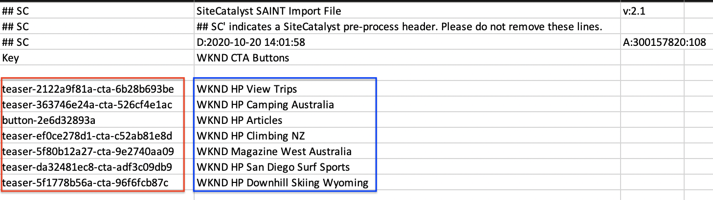

# Analysis Workspace을 사용하여 데이터 분석

Adobe Experience Manager 사이트에서 캡처한 데이터를 Adobe Analytics 보고서 세트의 지표 및 차원에 매핑하는 방법을 알아봅니다. Adobe Analytics의 Analysis Workspace 기능을 사용하여 자세한 보고 대시보드를 만드는 방법을 알아봅니다.

## 구축 내용

WKND 마케팅 팀은 홈 페이지에서 가장 잘 수행하는 CTA(Call to Action) 단추를 이해하려고 합니다. 이 자습서에서는 다양한 CTA 버튼의 성능을 시각화하고 사이트의 사용자 행동을 파악할 수 있도록 Analysis Workspace에서 새로운 프로젝트를 만듭니다. 사용자가 WKND 홈 페이지에서 CTA(Call to Action) 단추를 클릭하면 Adobe Analytics을 사용하여 다음 정보가 캡처됩니다.

**분석 변수**

다음은 현재 추적 중인 Analytics 변수입니다.

* `eVar5` -  `Page template`
* `eVar6` - `Page Id`
* `eVar7` - `Page last modified date`
* `eVar8` - `CTA Button Id`
* `eVar9` - `Page Name`
* `event8` - `CTA Button Click event`
* `prop8` - `CTA Button Id`

### 목표 {#objective}

1. 새 보고서 세트를 만들거나 기존 보고서 세트를 사용합니다.
1. 보고서 [세트에서 전환 변수(eVar)](https://docs.adobe.com/content/help/en/analytics/admin/admin-tools/conversion-variables/conversion-var-admin.html) 및 [성공 이벤트(이벤트)](https://docs.adobe.com/help/en/analytics/admin/admin-tools/success-events/success-event.html) 를 구성합니다.
1. 인사이트를 신속하게 구축, 분석 및 공유할 수 있는 툴의 도움으로 [Analysis Workspace 프로젝트를](https://docs.adobe.com/content/help/en/analytics/analyze/analysis-workspace/home.html) 제작하여 데이터를 분석할 수 있습니다.
1. 다른 팀원과 Analysis Workspace 프로젝트를 공유합니다.

## 전제 조건

이 자습서는 Adobe Analytics에서 [클릭한 추적 구성 요소를 계속](./track-clicked-component.md) 이어주는 것이며 다음을 가진다고 가정합니다.

* **Adobe Analytics 확장** 기능이 [활성화된 론치](https://docs.adobe.com/content/help/en/launch/using/extensions-ref/adobe-extension/analytics-extension/overview.html) 속성
* **Adobe Analytics** 테스트/개발 보고서 세트 ID 및 추적 서버 새 보고서 세트를 [만드는 방법은 다음 설명서를 참조하십시오](https://docs.adobe.com/content/help/en/analytics/admin/manage-report-suites/new-report-suite/new-report-suite.html).
* [Experience Platform Debugger](https://docs.adobe.com/content/help/en/platform-learn/tutorials/data-ingestion/web-sdk/introduction-to-the-experience-platform-debugger.html) 브라우저 익스텐션은 https://wknd.site/us/en.html  또는 Adobe 데이터 레이어가 활성화된 AEM 사이트에서 Launch 속성을 불러온 것으로 구성되어 있습니다.

## 전환 변수(eVar) 및 성공 이벤트(이벤트)

Custom Insight 전환 변수(또는 eVar)은 사이트의 선택된 웹 페이지의 Adobe 코드에 삽입됩니다. 주요 목적은 사용자 지정 마케팅 보고서에서 전환 성공 지표를 세그먼트화하는 것입니다. eVar은 방문 기반일 수 있으며 쿠키와 유사한 기능을 수행합니다. eVar 변수로 전달되는 값은 미리 결정된 기간 동안 사용자를 따릅니다.

eVar이 방문자의 값으로 설정되면 Adobe은 값이 만료될 때까지 해당 값을 자동으로 기억합니다. eVar 값이 활성화된 동안 방문자가 발견하는 성공 이벤트는 eVar 값으로 계산됩니다.

eVar는 다음과 같은 원인과 효과를 측정하는 데 가장 적합합니다.

* 매출에 영향을 준 내부 캠페인
* 등록으로 이어지는 배너 광고
* 주문을 하기 전에 내부 검색을 사용한 횟수

성공 이벤트는 추적할 수 있는 작업입니다. 성공 이벤트가 무엇인지 결정합니다. 예를 들어 방문자가 CTA 단추를 클릭하면 클릭 이벤트가 성공 이벤트로 간주될 수 있습니다.

### eVar 구성

1. Adobe Experience Cloud 홈 페이지에서 조직을 선택하고 Adobe Analytics을 실행합니다.

   

1. Analytics 도구 모음에서 관리 > **보고서 세트** 를 **클릭하고** 보고서 세트를 찾습니다.

   

1. 보고서 세트 > 설정 **편집** > **전환** > **전환 변수를 선택합니다.**

   

1. 새 **추가** 옵션을 사용하여 다음과 같이 스키마를 매핑하는 전환 변수를 만들어 보겠습니다.

   * `eVar5` -  `Page Template`
   * `eVar6` - `Page ID`
   * `eVar7` - `Last Modified Date`
   * `eVar8` - `Button Id`
   * `eVar9` - `Page Name`

   

1. 각 eVar에 적절한 이름 및 설명을 입력하고 변경 **내용을** 저장합니다. 다음 섹션에서 이러한 eVar를 사용하여 Analysis Workspace 프로젝트를 만들 예정입니다. 따라서 사용자 친화적인 이름을 사용하면 변수를 쉽게 검색할 수 있습니다.

   

### 성공 이벤트 구성

다음으로 CTA 단추 클릭을 추적하기 위한 even을 만들어 보겠습니다.

1. 보고서 **세트 관리자** 창에서 **보고서 세트 ID를** 선택하고 **설정**&#x200B;편집을 클릭합니다.
1. 전환 **** > **성공 이벤트를 클릭합니다.**
1. 새로 **추가** 옵션을 사용하여 새 사용자 지정 성공 이벤트를 만들어 CTA 단추 클릭 및 변경 내용 **저장을** 추적합니다.
   * `Event` : `event8`
   * `Name`:`CTA Click`
   * `Type`:`Counter`

   

## Analysis Workspace에서 새 프로젝트 만들기 {#workspace-project}

Analysis Workspace은 분석을 신속하게 구축하고 인사이트를 공유할 수 있는 유연한 브라우저 툴입니다. 드래그 앤 드롭 인터페이스에서 분석을 만들고 시각화를 추가하여 데이터를 생동감 있게 표현하고 데이터 세트를 조정하며 조직 내 모든 사람과 프로젝트를 공유하고 예약할 수 있습니다.

그런 다음 새 [프로젝트를](https://docs.adobe.com/content/help/en/analytics/analyze/analysis-workspace/build-workspace-project/t-freeform-project.html) 만들어 대시보드를 만들어 사이트 전체의 CTA 단추의 성능을 분석합니다.

1. Analytics 도구 모음에서 **작업 공간** 을 선택하고 을 클릭하여 새 프로젝트 **를 만듭니다**.

   

1. Adobe 또는 조직에서 만든 사용자 지정 템플릿에서 제공하는 **빈 프로젝트** 또는 미리 작성된 템플릿 중 하나를 선택합니다. 분석 또는 사용 사례에 따라 몇 개의 템플릿을 사용할 수 있습니다. [사용 가능한 다양한 템플릿 옵션에 대해 자세히](https://docs.adobe.com/content/help/en/analytics/analyze/analysis-workspace/build-workspace-project/starter-projects.html) 알아보십시오.

   작업 공간 프로젝트에서 패널, 테이블, 시각화 및 구성 요소는 왼쪽 레일에서 액세스할 수 있습니다. 이것이 프로젝트 구성 요소입니다.

   * **[구성 요소](https://docs.adobe.com/content/help/en/analytics/analyze/analysis-workspace/components/analysis-workspace-components.html)** - 구성 요소는 차원, 지표, 세그먼트 또는 날짜 범위이며, 이 모든 것을 자유 형식 테이블에 결합하여 비즈니스 질문에 답할 수 있습니다. 분석을 시작하기 전에 각 구성 요소 유형에 익숙해져야 합니다. 구성 요소 용어를 마스터하면 드래그 앤 드롭하여 자유 형식 테이블에서 분석을 작성할 수 있습니다.
   * **[시각화](https://docs.adobe.com/content/help/en/analytics/analyze/analysis-workspace/visualizations/freeform-analysis-visualizations.html)** - 막대 또는 라인 차트와 같은 시각화가 데이터 위에 추가되어 시각적으로 생동감 있게 표현할 수 있습니다. 맨 왼쪽 레일에서 가운데 시각화 아이콘을 선택하여 사용 가능한 시각화의 전체 목록을 확인합니다.
   * **[패널](https://docs.adobe.com/content/help/en/analytics/analyze/analysis-workspace/panels/panels.html)** - 패널은 테이블과 시각화의 집합입니다. 작업 공간의 왼쪽 위 아이콘에서 패널에 액세스할 수 있습니다. 패널은 기간, 보고서 세트 또는 분석 사용 사례에 따라 프로젝트를 구성할 때 유용합니다. Analysis Workspace에서는 다음 패널 유형을 사용할 수 있습니다.

   

### Analysis Workspace을 사용하여 데이터 시각화 추가

그런 다음 WKND 사이트 홈 페이지에서 사용자가 CTA(Call to Action) 버튼과 상호 작용하는 방법을 시각적으로 보여주는 테이블을 만듭니다. 이러한 표현을 빌드하려면 클릭한 구성 요소에서 수집된 데이터를 Adobe Analytics과 함께 [사용하십시오](./track-clicked-component.md). 아래는 WKND 사이트에 대한 클릭유도문안 버튼과의 사용자 상호 작용을 위해 추적된 데이터의 빠른 요약입니다.

* `eVar5` -  `Page template`
* `eVar6` - `Page Id`
* `eVar7` - `Page last modified date`
* `eVar8` - `CTA Button Id`
* `eVar9` - `Page Name`
* `event8` - `CTA Button Click event`
* `prop8` - `CTA Button Id`

1. 자유 형식 테이블에 **페이지** 차원 구성 요소를 끌어 놓습니다. 이제 테이블 내에 표시되는 페이지 이름(eVar9) 및 해당 페이지 보기(발생)를 표시하는 시각화를 볼 수 있어야 합니다.

   

1. CTA **클릭** (event8) 지표를 발생 지표에 드래그하여 놓고 바꿉니다. 이제 페이지에서 페이지 이름(eVar9) 및 해당 CTA 클릭 이벤트 수를 표시하는 시각화를 볼 수 있습니다.

   

1. 페이지별로 템플릿 유형별로 분류해 보겠습니다. 구성 요소에서 페이지 템플릿 지표를 선택하고 페이지 템플릿 지표를 페이지 이름 차원으로 드래그하여 놓습니다. 이제 템플릿 유형별로 분류된 페이지 이름을 볼 수 있습니다.

   * **이전**

      

   * **이후**

      

1. 사용자가 WKND 사이트 페이지에 있을 때 CTA 버튼과 상호 작용하는 방식을 이해하려면, 단추 ID(eVar8) 지표를 추가하여 페이지 템플릿 지표를 추가로 분류해야 합니다.

   

1. 아래에서는 페이지 템플릿으로 분류된 WKND 사이트의 시각적 표현을 볼 수 있으며, WKND CTA(Site Click to Action) 버튼과의 사용자 상호 작용으로 세부 분류된 WKND 사이트를 볼 수 있습니다.

   

1. Adobe Analytics 분류를 사용하여 단추 ID 값을 보다 사용자에게 친숙한 이름으로 바꿀 수 있습니다. 특정 지표에 대한 분류를 만드는 방법에 대한 자세한 내용을 [여기에서](https://docs.adobe.com/content/help/en/analytics/components/classifications/c-classifications.html)참조할 수 있습니다. 이 경우 단추 ID를 사용자에게 친숙한 이름 `Button Section (Button ID)` `eVar8` 으로 매핑하는 분류 지표 설정이 있습니다.

   

## 분석 변수에 분류 추가

### 전환 분류

Analytics 분류는 Analytics 변수 데이터를 분류한 다음 보고서를 생성할 때 다른 방법으로 데이터를 표시하는 방법입니다. 단추 ID가 Analytics 작업 공간 보고서에 표시되는 방식을 개선하기 위해 단추 ID(eVar8)에 대한 분류 변수를 만들어 보겠습니다. 분류할 때 변수와 해당 변수와 관련된 메타데이터 간의 관계를 설정하는 것입니다.

다음으로, Analytics 변수를 위한 분류를 만듭니다.

1. 관리 **도구** 모음 메뉴에서 **보고서 세트 선택**
1. 보고서 세트 관리자 **창에서** **보고서 세트 ID를** 선택하고 설정 **편집** > 전환 **분류 >** 게시 전환 **분류를 클릭합니다.**

   

1. 분류 유형 **선택** 드롭다운 목록에서 변수(eVar8-단추 ID)를 선택하여 분류를 추가합니다.
1. 분류 섹션 아래에 나열된 분류 변수 옆에 있는 화살표를 클릭하여 새 분류를 추가합니다.

   

1. 분류 **편집** 대화 상자에서 텍스트 분류에 적합한 이름을 제공합니다. 텍스트 분류 이름이 있는 차원 구성 요소가 생성됩니다.

   

1. **변경 사항을 저장합니다** .

### 분류 가져오기

가져오기를 사용하여 분류를 Adobe Analytics으로 업로드합니다. 가져오기 전에 업데이트를 위해 데이터를 내보낼 수도 있습니다. 가져오기 도구를 사용하여 가져오는 데이터는 특정 형식이어야 합니다. Adobe은 모든 적절한 헤더 세부 정보가 있는 데이터 템플릿을 탭으로 구분된 데이터 파일로 다운로드할 수 있는 옵션을 제공합니다. 이 템플릿에 새 데이터를 추가한 다음 FTP를 사용하여 브라우저에서 데이터 파일을 가져올 수 있습니다.

#### 분류 템플릿

분류를 마케팅 보고서로 가져오기 전에 분류 데이터 파일을 만드는 데 도움이 되는 템플릿을 다운로드할 수 있습니다. 데이터 파일은 원하는 분류를 열 머리글로 사용한 다음, 해당 분류 머리글 아래에 보고 데이터 세트를 구성합니다.

다음으로 단추 ID(eVar8) 변수에 대한 분류 템플릿을 다운로드하겠습니다

1. 관리 > **분류** 가져오기 **로 이동합니다.**
1. 템플릿 다운로드 탭에서 전환 변수에 대한 분류 **템플릿을** 다운로드하겠습니다.
   

1. 템플릿 다운로드 탭에서 데이터 템플릿 구성을 지정합니다.
   * **보고서 세트 선택** :템플릿에서 사용할 보고서 세트를 선택합니다. 보고서 세트와 데이터 세트가 일치해야 합니다.
   * **분류할 데이터 세트** :데이터 파일의 데이터 유형을 선택합니다. 메뉴에는 분류에 대해 구성된 보고서 세트의 모든 보고서가 포함됩니다.
   * **인코딩** :데이터 파일의 문자 인코딩을 선택합니다. 기본 인코딩 형식은 UTF-8입니다.

1. 다운로드 **를** 클릭하고 템플릿 파일을 로컬 시스템에 저장합니다. 템플릿 파일은 대부분의 스프레드시트 애플리케이션에서 지원하는 탭으로 구분된 데이터 파일(.tab 파일 확장명)입니다.
1. 원하는 편집기를 사용하여 탭으로 구분된 데이터 파일을 엽니다.
1. 섹션의 9단계에서 각 eVar9 값에 대해 단추 ID(eVar9) 및 해당 단추 이름을 탭으로 구분된 파일에 추가합니다.

   

1. **탭으로 구분된 파일을 저장합니다** .
1. 파일 **가져오기 탭으로** 이동합니다.
1. 파일 가져오기에 대한 대상을 구성합니다.
   * **보고서 세트 선택** :WKND Site AEM(보고서 세트)
   * **분류할 데이터 세트** :단추 ID(전환 변수 eVar8)
1. 파일 **선택** 옵션을 클릭하여 탭으로 구분된 파일을 시스템에서 업로드한 다음 파일 **가져오기를 클릭합니다**

   

   >[!NOTE]
   >
   > 가져오기에 성공하면 내보내기의 해당 변경 사항이 즉시 표시됩니다. 하지만 보고서의 데이터 변경 사항은 브라우저 가져오기를 사용하는 경우 최대 4시간, FTP 가져오기를 사용하는 경우 최대 24시간이 소요됩니다.

#### 전환 변수를 분류 변수로 바꾸기

1. Analytics 도구 모음에서 **작업** 공간 [을 선택하고 이 자습서의 Analysis Workspace](#workspace-project) 에서 새 프로젝트 만들기 섹션에서만든 작업 영역을 엽니다.

   

1. 그런 다음 작업 영역에서 **단추 ID** 지표를 CTA(클릭유도문안) 단추의 ID를 이전 단계에서 만든 분류 이름으로 바꿉니다.

1. 구성 요소 파인더에서 **WKND CTA 단추를** 검색하고 **WKND CTA 단추(단추 ID)** 차원을 단추 ID 지표로 드래그하여 놓고 바꿉니다.

   * **이전**

      
   * **이후**

      

1. 이제 CTA(클릭유도문안) 단추의 단추 ID가 포함된 단추 ID 지표가 분류 템플릿에서 제공하는 해당 이름으로 대체되었습니다.
1. Analytics 작업 공간 테이블을 WKND 홈 페이지와 비교하고 CTA 단추 클릭 수 및 해당 분석에 대해 알아 보겠습니다. 자유 형식 테이블 데이터를 기반으로, 서호주 서부에서 WKND Home Page Camping에 대해 사용자가 **SKI NOW** 단추를 22번 클릭한 **것과 더 보기** 단추를 4번 클릭했다는 것이분명합니다.

   

1. Adobe Analytics 작업 공간 프로젝트를 저장하고 적절한 이름과 설명을 제공해야 합니다. 원할 경우, 작업 공간 프로젝트에 태그를 추가할 수 있습니다.

   

1. 프로젝트를 성공적으로 저장한 후에는 공유 옵션을 사용하여 다른 동료 또는 팀원과 작업 영역 프로젝트를 공유할 수 있습니다.

   

## 축하합니다!

Adobe Experience Manager 사이트에서 캡처한 데이터를 Adobe Analytics 보고서 세트의 지표 및 차원에 매핑하고, 지표에 대한 분류를 수행하고, Adobe Analytics의 Analysis Workspace 기능을 사용하여 자세한 보고 대시보드를 만드는 방법을 알아보았습니다.

