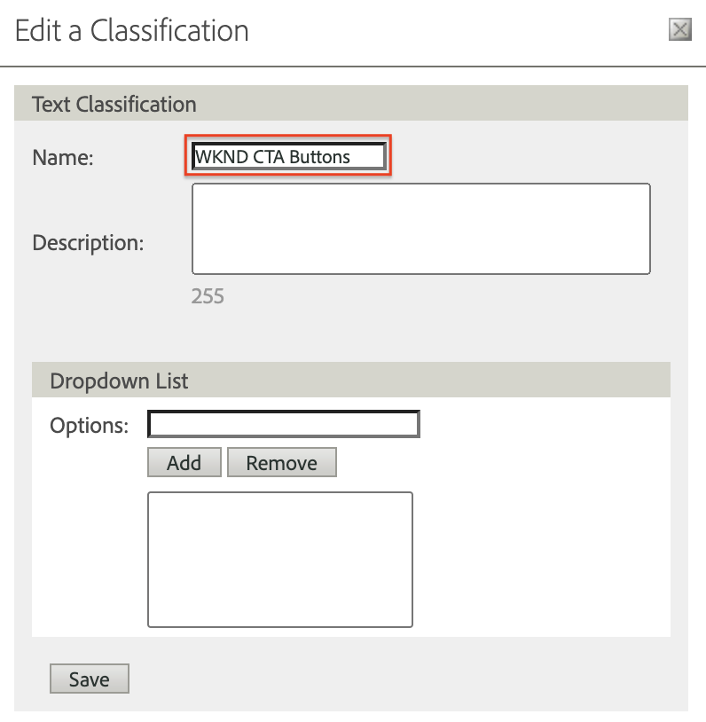

# Analysis Workspace을 사용하여 데이터 분석

Adobe Experience Manager 사이트에서 캡처한 데이터를 Adobe Analytics 보고서 세트의 지표 및 차원에 매핑하는 방법을 알아봅니다. Adobe Analytics의 Analysis Workspace 기능을 사용하여 자세한 보고 대시보드를 작성하는 방법을 알아봅니다.

## 빌드할 항목 {#what-build}

WKND 마케팅 팀은 다음 중 하나를 알고 싶어 합니다. `Call to Action (CTA)` 홈페이지에서 버튼이 가장 잘 작동합니다. 이 자습서에서는 **Analysis Workspace** 를 사용하여 다양한 CTA 버튼의 성능을 시각화하고 사이트에서의 사용자 동작을 이해할 수 있습니다. Adobe Analytics을 사용하여 사용자가 WKND 홈 페이지에서 CTA(콜 투 액션) 버튼을 클릭하면 다음 정보가 캡처됩니다.

**Analytics 변수**

다음은 현재 추적 중인 Analytics 변수입니다.

* `eVar5` -  `Page template`
* `eVar6` - `Page Id`
* `eVar7` - `Page last modified date`
* `eVar8` - `CTA Button Id`
* `eVar9` - `Page Name`
* `event8` - `CTA Button Click event`
* `prop8` - `CTA Button Id`

### 목표 {#objective}

1. 보고서 세트를 만들거나 기존 보고서 세트를 사용합니다.
1. 구성 [전환 변수 (eVar)](https://experienceleague.adobe.com/docs/analytics/admin/admin-tools/manage-report-suites/edit-report-suite/conversion-variables/conversion-var-admin.html) 및 [성공 이벤트 (이벤트)](https://experienceleague.adobe.com/docs/analytics/admin/admin-tools/manage-report-suites/edit-report-suite/conversion-variables/success-events/success-event.html) 를 사용하십시오.
1. 만들기 [Analysis Workspace 프로젝트](https://experienceleague.adobe.com/docs/analytics/analyze/analysis-workspace/home.html) 를 사용하면 통찰력을 빠르게 구축, 분석 및 공유할 수 있는 도구를 사용하여 데이터를 분석할 수 있습니다.
1. 다른 팀 구성원과 Analysis Workspace 프로젝트를 공유합니다.

## 사전 요구 사항

이 자습서는 [클릭한 구성 요소를 Adobe Analytics에서 추적](./track-clicked-component.md) 및 은 사용자가 다음을 보유하고 있다고 가정합니다.

* A **태그 속성** (으)로 [Adobe Analytics 확장](https://experienceleague.adobe.com/docs/experience-platform/tags/extensions/client/analytics/overview.html) 활성화됨
* **Adobe Analytics** test/dev 보고서 세트 ID 및 추적 서버. 에 대한 다음 설명서를 참조하십시오 [보고서 세트 만들기](https://experienceleague.adobe.com/docs/analytics/admin/admin-tools/manage-report-suites/c-new-report-suite/new-report-suite.html).
* [Experience Platform 디버거](https://experienceleague.adobe.com/docs/platform-learn/data-collection/debugger/overview.html) 에 로드된 태그 속성으로 구성된 브라우저 확장 [WKND 사이트](https://wknd.site/us/en.html) 또는 Adobe 데이터 레이어가 활성화된 AEM 사이트입니다.

## 전환 변수 (eVar) 및 성공 이벤트 (이벤트)

Custom Insight 전환 변수(또는 eVar)는 사이트에서 선택한 웹 페이지의 Adobe 코드에 삽입됩니다. 주요 목적은 사용자 지정 마케팅 보고서에서 전환 성공 지표를 세그먼트화하는 것입니다. eVar은 방문 기반일 수 있으며 쿠키와 유사하게 작동합니다. eVar 변수로 전달된 값은 사전 결정된 기간 동안 사용자를 따릅니다.

eVar을 방문자의 값으로 설정하면 Adobe은 값이 만료되기 전까지 해당 값을 자동으로 기억합니다. eVar 값이 활성화되는 동안 방문자가 발생하는 모든 성공 이벤트는 eVar 값에 대해 계산됩니다.

eVar는 다음과 같이 원인과 영향을 측정하는 데 가장 잘 사용됩니다.

* 매출에 영향을 준 내부 캠페인
* 어떤 배너 광고가 궁극적으로 등록을 초래합니까
* 주문하기 전에 내부 검색을 사용한 횟수

성공 이벤트는 추적할 수 있는 작업입니다. 성공 이벤트가 무엇인지 결정합니다. 예를 들어 방문자가 CTA 버튼을 클릭하는 경우 클릭 이벤트를 성공 이벤트로 간주할 수 있습니다.

### eVar 구성

1. Adobe Experience Cloud 홈페이지에서 조직을 선택하고 Adobe Analytics을 시작합니다.

   

1. Analytics 도구 모음에서 를 클릭합니다 **관리자** > **보고서 세트** 보고서 세트를 찾습니다.

   

1. 보고서 세트 선택 > **설정 편집** > **전환** > **전환 변수**

   

1. 사용 **새로 추가** 옵션을 사용하여 아래와 같이 스키마를 매핑할 전환 변수를 생성해 보겠습니다.

   * `eVar5` -  `Page Template`
   * `eVar6` - `Page ID`
   * `eVar7` - `Last Modified Date`
   * `eVar8` - `Button Id`
   * `eVar9` - `Page Name`

   

1. 각 eVar에 대한 적절한 이름과 설명을 제공하고 **저장** 변경 사항. Analysis Workspace 프로젝트에서는 적절한 이름의 eVar가 사용되므로 사용자에게 친숙한 이름을 사용하면 변수를 쉽게 검색할 수 있습니다.

   

### 성공 이벤트 구성

다음으로, CTA 버튼 클릭을 추적하는 이벤트를 만들겠습니다.

1. 다음에서 **보고서 세트 관리자** 창에서 **보고서 세트 ID** 및 클릭 **설정 편집**.
1. 클릭 **전환** > **성공 이벤트**
1. 사용 **새로 추가** 옵션을 설정하는 경우, 사용자 지정 성공 이벤트를 만들어 CTA 버튼을 클릭한 다음 **저장** 변경 사항.
   * `Event` : `event8`
   * `Name`:`CTA Click`
   * `Type`:`Counter`

   

## Analysis Workspace에서 프로젝트 만들기 {#workspace-project}

Analysis Workspace은 분석을 빌드하고 통찰력을 빠르게 공유할 수 있는 유연한 브라우저 도구입니다. 드래그 앤 드롭 인터페이스를 사용하여 분석을 작성하고, 시각화를 추가하여 데이터를 생동감 있게 표현하고, 데이터 세트를 큐레이션하고, 조직 내 누구와도 프로젝트를 공유 및 예약할 수 있습니다.

다음으로, 다음을 생성합니다. [프로젝트](https://experienceleague.adobe.com/docs/analytics/analyze/analysis-workspace/build-workspace-project/freeform-overview.html#analysis-workspace) 를 클릭하여 사이트 전체의 CTA 버튼 성능을 분석하는 대시보드를 작성합니다.

1. Analytics 도구 모음에서 를 선택합니다. **작업 영역** 클릭하여 **새 프로젝트 만들기**.

   

1. 다음 항목에서 시작하도록 선택 **빈 프로젝트** 또는 Adobe에서 제공하는 사전 빌드된 템플릿 또는 조직에서 만든 사용자 지정 템플릿 중 하나를 선택합니다. 분석 또는 염두에 둔 사용 사례에 따라 여러 템플릿을 사용할 수 있습니다. [자세히 알아보기](https://experienceleague.adobe.com/docs/analytics/analyze/analysis-workspace/build-workspace-project/starter-projects.html) 사용할 수 있는 다양한 템플릿 옵션 정보

   Workspace 프로젝트에서 패널, 테이블, 시각화 및 구성 요소는 왼쪽 레일에서 액세스됩니다. 프로젝트의 빌딩 블록을 구성합니다.

   * **[구성 요소](https://experienceleague.adobe.com/docs/analytics/analyze/analysis-workspace/components/analysis-workspace-components.html)** - 구성 요소는 차원, 지표, 세그먼트 또는 날짜 범위입니다. 모두 비즈니스 질문에 답변하기 위해 자유 형식 테이블에서 결합할 수 있습니다. 분석하기 전에 각 구성 요소 유형을 숙지하십시오. 구성 요소 용어를 숙지하면 드래그 앤 드롭을 시작하여 자유 형식 테이블에서 분석을 빌드할 수 있습니다.
   * **[시각화](https://experienceleague.adobe.com/docs/analytics/analyze/analysis-workspace/visualizations/freeform-analysis-visualizations.html)** - 막대 또는 선 차트와 같은 시각화가 데이터 위에 추가되어 시각적으로 생동감 있게 표현됩니다. 맨 왼쪽 레일에서 가운데 시각화 아이콘을 선택하여 시각화의 전체 목록을 확인합니다.
   * **[패널](https://experienceleague.adobe.com/docs/analytics/analyze/analysis-workspace/panels/panels.html)** - 패널은 테이블 및 시각화 컬렉션입니다. 작업 영역의 왼쪽 상단 아이콘에서 패널에 액세스할 수 있습니다. 패널은 기간, 보고서 세트 또는 분석 사용 사례에 따라 프로젝트를 구성하려는 경우 유용합니다. Analysis Workspace에서는 다음 패널 유형을 사용할 수 있습니다.

   

### Analysis Workspace을 사용하여 데이터 시각화 추가

그런 다음 표를 작성하여 사용자와 상호 작용하는 방법을 시각적으로 표시합니다 `Call to Action (CTA)` WKND 사이트 홈 페이지의 단추입니다. 이러한 표현을 작성하기 위해에서 수집된 데이터를 사용하겠습니다. [클릭한 구성 요소를 Adobe Analytics에서 추적](./track-clicked-component.md). 다음은 WKND Site에 대한 콜 투 액션 버튼과의 사용자 상호 작용을 위해 추적된 데이터의 빠른 요약입니다.

* `eVar5` -  `Page template`
* `eVar6` - `Page Id`
* `eVar7` - `Page last modified date`
* `eVar8` - `CTA Button Id`
* `eVar9` - `Page Name`
* `event8` - `CTA Button Click event`
* `prop8` - `CTA Button Id`

1. 드래그 앤 드롭 **페이지** 차원 구성 요소를 자유 형식 테이블에 추가합니다. 이제 테이블 내에 표시된 페이지 이름(eVar 9) 및 해당 페이지 보기(발생 횟수)를 표시하는 시각화를 볼 수 있습니다.

   

1. 드래그 앤 드롭 **CTA 클릭** (event8) 발생 횟수 지표에 기록하고 대체합니다. 이제 페이지의 페이지 이름(eVar9) 및 해당 CTA 클릭 이벤트 수를 표시하는 시각화를 볼 수 있습니다.

   

1. 템플릿 유형별로 페이지를 분류해 보겠습니다. 구성 요소에서 페이지 템플릿 지표를 선택하고 페이지 템플릿 지표를 페이지 이름 차원으로 드래그 앤 드롭합니다. 이제 페이지 이름을 해당 템플릿 유형별로 분류하여 볼 수 있습니다.

   * **이전**

      

   * **이후**

      

1. 사용자가 WKND 사이트 페이지에 있을 때 CTA 버튼과 상호 작용하는 방법을 이해하려면 버튼 ID(eVar8) 지표를 추가하여 추가로 분류해야 합니다.

   

1. 아래에서는 WKND Site를 페이지 템플릿으로 분류하고 WKND Site CTA(클릭 투 액션) 버튼과의 사용자 상호 작용에 의해 추가로 분류된 시각적 표현을 볼 수 있습니다.

   

1. Adobe Analytics 분류를 사용하여 버튼 ID 값을 보다 친숙한 이름으로 바꿀 수 있습니다. 특정 지표에 대한 분류를 만드는 방법에 대해 자세히 알아볼 수 있습니다 [여기](https://experienceleague.adobe.com/docs/analytics/components/classifications/c-classifications.html). 이 경우 분류 지표가 있습니다 `Button Section (Button ID)` 다음에 대한 설정 `eVar8` 버튼 id를 사용자에게 친숙한 이름에 매핑합니다.

   

## 분석 변수에 분류 추가

### 전환 분류

Analytics 분류는 Analytics 변수 데이터를 카테고리별로 분류한 다음 보고서를 생성할 때 데이터를 다양한 방법으로 표시하는 방법입니다. 버튼 ID가 Analytics Workspace 보고서에 표시되는 방식을 개선하기 위해 버튼 ID(eVar 8)에 대한 분류 변수를 만들어 보겠습니다. 분류 시 변수와 해당 변수와 관련된 메타데이터 간의 관계를 설정합니다.

다음으로 Analytics 변수에 대한 분류를 만들어 보겠습니다.

1. 다음에서 **관리자** 도구 모음 메뉴, 선택 **보고서 세트**
1. 다음 항목 선택 **보고서 세트 ID** 다음에서 **보고서 세트 관리자** 창에서 클릭 **설정 편집** > **전환** > **전환 분류**

   

1. 다음에서 **분류 유형 선택** 드롭다운 목록에서 변수(eVar8-버튼 ID)를 선택하여 분류를 추가합니다.
1. 분류 섹션에 나열된 분류 변수 바로 옆에 있는 화살표를 클릭하여 새 분류를 추가합니다.

   

1. 다음에서 **분류 편집** 대화 상자에서 텍스트 분류에 적합한 이름을 제공합니다. 텍스트 분류 이름이 있는 차원 구성 요소가 만들어집니다.

   

1. **저장** 변경 사항.

### 분류 가져오기

가져오기를 사용하여 분류를 Adobe Analytics에 업로드합니다. 가져오기 전에 업데이트할 데이터를 내보낼 수도 있습니다. 가져오기 도구를 사용하여 가져오는 데이터는 특정 형식이어야 합니다. Adobe은 탭으로 구분된 데이터 파일에 있는 모든 적절한 헤더 세부 정보가 있는 데이터 템플릿을 다운로드할 수 있는 옵션을 제공합니다. 이 템플릿에 새 데이터를 추가한 다음 FTP를 사용하여 브라우저에서 데이터 파일을 가져올 수 있습니다.

#### 분류 템플릿

분류를 마케팅 보고서로 가져오기 전에 분류 데이터 파일을 만드는 데 도움이 되는 템플릿을 다운로드할 수 있습니다. 데이터 파일은 원하는 분류를 열 머리글로 사용한 다음, 해당 분류 머리글 아래에 보고 데이터 세트를 구성합니다.

다음으로 단추 ID(eVar8) 변수에 대한 분류 템플릿을 다운로드하겠습니다

1. 다음으로 이동 **관리자** > **분류 가져오기**
1. 다음에서 전환 변수에 대한 분류 템플릿을 다운로드하겠습니다. **템플릿 다운로드** 탭.
   

1. 템플릿 다운로드 탭에서 데이터 템플릿 구성을 지정합니다.
   * **보고서 세트 선택** : 템플릿에서 사용할 보고서 세트를 선택합니다. 보고서 세트와 데이터 세트가 일치해야 합니다.
   * **분류할 데이터 세트** : 데이터 파일에 대한 데이터 유형을 선택합니다. 메뉴에는 분류용으로 구성된 보고서 세트의 모든 보고서가 포함됩니다.
   * **인코딩** : 데이터 파일의 문자 인코딩을 선택합니다. 기본 인코딩 형식은 UTF-8입니다.

1. 클릭 **다운로드** 로컬 시스템에 템플릿 파일을 저장합니다. 템플릿 파일은 탭으로 구분된 데이터 파일(.tab 파일 확장명)이며 대부분의 스프레드시트 애플리케이션에서 지원합니다.
1. 선택한 편집기를 사용하여 탭으로 구분된 데이터 파일을 엽니다.
1. 섹션의 9단계에서 각 eVar9 값에 대해 탭으로 구분된 파일에 단추 ID(eVar9) 및 해당 단추 이름을 추가합니다.

   

1. **저장** 탭으로 구분된 파일입니다.
1. 다음 위치로 이동 **파일 가져오기** 탭.
1. 파일 가져오기 대상을 구성합니다.
   * **보고서 세트 선택** : WKND 사이트 AEM(보고서 세트)
   * **분류할 데이터 세트** : 단추 Id(전환 변수 eVar8)
1. 다음을 클릭합니다. **파일 선택** 시스템에서 탭으로 구분된 파일을 업로드하는 옵션을 선택한 다음 **파일 가져오기**

   

   >[!NOTE]
   >
   > 가져오기에 성공하면 내보내기에 있는 적절한 변경 사항이 즉시 표시됩니다. 하지만 보고서의 데이터 변경 내용은 브라우저 가져오기를 사용할 때 최대 4시간, FTP 가져오기를 사용할 때 최대 24시간이 소요됩니다.

#### 전환 변수를 분류 변수로 바꾸기

1. Analytics 도구 모음에서 를 선택합니다. **작업 영역** 및에서 만든 작업 영역을 엽니다. [Analysis Workspace에서 프로젝트 만들기](#create-a-project-in-analysis-workspace) 섹션 을 참조하십시오.

   

1. 그런 다음 을(를) 바꿉니다. **단추 ID** 이전 단계에서 생성한 분류 이름과 함께 CTA(콜 투 액션) 버튼의 ID를 표시하는 작업 공간의 지표.

1. 구성 요소 파인더에서 **WKND CTA 단추** 을(를) 드래그 앤 드롭합니다. **WKND CTA 단추(단추 Id)** 차원을 단추 ID 지표에 추가하고 바꿉니다.

   * **이전**

      
   * **이후**

      

1. 이제 CTA(콜 투 액션) 버튼의 버튼 ID가 포함된 버튼 ID 지표가 분류 템플릿에 제공된 해당 이름으로 대체되었음을 알 수 있습니다.
1. Analytics Workspace 표를 WKND 홈 페이지와 비교하고 CTA 버튼 클릭 수 및 그 분석에 대해 이해하겠습니다. 작업 영역 자유 형식 테이블 데이터를 기반으로 볼 때 22회 사용자가 **스키 나우** 웨스턴오스트레일리아에서 열리는 WKND 홈 페이지 캠핑 버튼 및 4회 **자세히 보기** 단추를 클릭합니다.

   

1. Adobe Analytics 작업 영역 프로젝트를 저장하고 적절한 이름과 설명을 제공해야 합니다. 선택적으로 작업 영역 프로젝트에 태그를 추가할 수 있습니다.

   

1. 프로젝트를 성공적으로 저장한 후 공유 옵션을 사용하여 다른 동료 또는 팀원과 작업 공간 프로젝트를 공유할 수 있습니다.

   

## 축하합니다!

Adobe Experience Manager 사이트에서 캡처한 데이터를 Adobe Analytics 보고서 세트의 지표 및 차원에 매핑하는 방법에 대해 알아보았습니다. 또한 지표에 대한 분류를 수행하고, Adobe Analytics의 Analysis Workspace 기능을 사용하여 자세한 보고 대시보드를 작성합니다.
