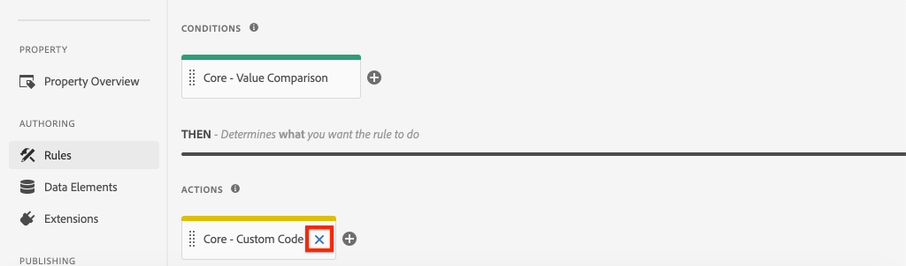
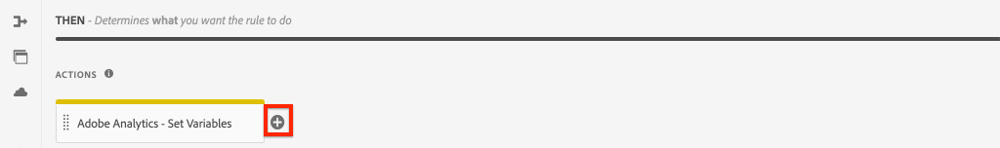

# 클릭한 구성 요소를 Adobe Analytics에서 추적

AEM 코어 구성 요소와 함께 이벤트 기반 [Adobe 클라이언트 데이터](https://docs.adobe.com/content/help/ko-KR/experience-manager-core-components/using/developing/data-layer/overview.html) 레이어를 사용하여 Adobe Experience Manager 사이트에서 특정 구성 요소의 클릭을 추적합니다. Experience Platform Launch의 규칙을 사용하여 클릭 이벤트를 수신하고, 구성 요소별로 필터링하고, 추적 링크 비콘이 있는 Adobe Analytics으로 데이터를 전송하는 방법을 알아봅니다.

## 구축 내용

WKND 마케팅 팀은 홈 페이지에서 가장 성과가 좋은 CTA(Call to Action) 단추를 파악하려고 합니다. 이 자습서에서는 Teaser `cmp:click` 및 **Button** 구성 요소의 이벤트 **를 수신하고 구성 요소 ID와 새 이벤트를 추적 링크 비콘과 함께 Adobe Analytics으로 보내는 Experience Platform Launch의 새 규칙을** 추가합니다.


### 목표 {#objective}

1. 이벤트에 따라 론치에서 이벤트 기반 규칙을 `cmp:click` 만듭니다.
1. 구성 요소 리소스 유형별로 다른 이벤트를 필터링합니다.
1. 클릭한 구성 요소 ID를 설정하고 추적 링크 비콘으로 이벤트 Adobe Analytics을 전송합니다.

## 전제 조건

이 자습서는 Adobe Analytics [와 함께 페이지 데이터 수집을 지속하는 것으로](./collect-data-analytics.md) 사용자가 다음을 보유하고 있다고 가정합니다.

* **Adobe Analytics 확장** 기능이 [활성화된 론치](https://docs.adobe.com/content/help/en/launch/using/extensions-ref/adobe-extension/analytics-extension/overview.html) 속성
* **Adobe Analytics** 테스트/개발 보고서 세트 ID 및 추적 서버 새 보고서 세트를 [만드는 방법은 다음 설명서를 참조하십시오](https://docs.adobe.com/content/help/en/analytics/admin/manage-report-suites/new-report-suite/new-report-suite.html).
* [Experience Platform Debugger](https://docs.adobe.com/content/help/en/platform-learn/tutorials/data-ingestion/web-sdk/introduction-to-the-experience-platform-debugger.html) 브라우저 익스텐션은 https://wknd.site/us/en.html [](https://wknd.site/us/en.html) 또는 Adobe 데이터 레이어가 활성화된 AEM 사이트에서 Launch 속성을 불러온 것으로 구성되어 있습니다.

## Inspect 단추 및 티저 스키마

Launch에서 규칙을 만들기 전에 Button 및 Teaser의 [스키마를 검토하고 데이터](https://docs.adobe.com/content/help/en/experience-manager-core-components/using/developing/data-layer/overview.html#item) 레이어 구현에서 검사하는 것이 유용합니다.

1. https://wknd.site/us/en.html으로 [이동](https://wknd.site/us/en.html)
1. 브라우저의 개발자 도구를 열고 **콘솔로 이동합니다**. 다음 명령을 실행합니다.

   ```js
   adobeDataLayer.getState();
   ```

   Adobe 클라이언트 데이터 레이어의 현재 상태를 반환합니다.

   

1. 응답을 확장하고 시작 `button-` 및 `teaser-xyz-cta` 입력 접두사를 찾습니다. 다음과 같은 데이터 스키마가 표시됩니다.

   단추 스키마:

   ```json
   button-2e6d32893a:
       @type: "wknd/components/button"
       dc:title: "View All"
       parentId: "page-2eee4f8914"
       repo:modifyDate: "2020-07-11T22:17:55Z"
       xdm:linkURL: "/content/wknd/us/en/magazine.html"
   ```

   Teaser 스키마:

   ```json
   teaser-da32481ec8-cta-adf3c09db9:
       @type: "nt:unstructured"
       dc:title: "Surf's Up"
       parentId: "teaser-da32481ec8"
       xdm:linkURL: "/content/wknd/us/en/magazine/san-diego-surf.html"
   ```

   구성 요소/컨테이너 [항목 스키마를 기반으로 합니다](https://docs.adobe.com/content/help/en/experience-manager-core-components/using/developing/data-layer/overview.html#item). Launch에서 만드는 규칙은 이 스키마를 사용합니다.

## CTA 클릭한 규칙 만들기

Adobe 클라이언트 데이터 레이어는 **이벤트** 기반 데이터 레이어입니다. 코어 구성 요소를 클릭하면 데이터 레이어를 통해 `cmp:click` 이벤트가 전달됩니다. 그런 다음 `cmp:click` 이벤트를 수신하기 위한 규칙을 만듭니다.

1. Experience Platform Launch으로 이동하고 AEM 사이트와 통합된 웹 속성으로 이동합니다.
1. 실행 UI에서 **규칙** 섹션으로 이동한 다음 규칙 **추가를 클릭합니다**.
1. 클릭한 규칙의 **이름을 지정합니다**.
1. 이벤트 **** > **추가를** 클릭하여 **이벤트 구성** 마법사를엽니다.
1. 이벤트 **유형** 아래에서 **사용자 지정 코드를 선택합니다**.

   

1. 주 **패널에서 [편집기** 열기]를 클릭하고 다음 코드 조각을 입력합니다.

   ```js
   var componentClickedHandler = function(evt) {
      // defensive coding to avoid a null pointer exception
      if(evt.hasOwnProperty("eventInfo") && evt.eventInfo.hasOwnProperty("path")) {
         //trigger Launch Rule and pass event
         console.debug("cmp:click event: " + evt.eventInfo.path);
         var event = {
            //include the path of the component that triggered the event
            path: evt.eventInfo.path,
            //get the state of the component that triggered the event
            component: window.adobeDataLayer.getState(evt.eventInfo.path)
         };
   
         //Trigger the Launch Rule, passing in the new `event` object
         // the `event` obj can now be referenced by the reserved name `event` by other Launch data elements
         // i.e `event.component['someKey']`
         trigger(event);
      }
   }
   
   //set the namespace to avoid a potential race condition
   window.adobeDataLayer = window.adobeDataLayer || [];
   //push the event listener for cmp:click into the data layer
   window.adobeDataLayer.push(function (dl) {
      //add event listener for `cmp:click` and callback to the `componentClickedHandler` function
      dl.addEventListener("cmp:click", componentClickedHandler);
   });
   ```

   위의 코드 조각은 함수를 데이터 레이어 [로](https://github.com/adobe/adobe-client-data-layer/wiki#pushing-a-function) 밀어 이벤트 리스너를 추가합니다. 이벤트가 `cmp:click` 트리거되면 `componentClickedHandler` 함수가 호출됩니다. 이 함수에서는 몇 가지 상태 확인이 추가되고 이벤트를 트리거한 구성 요소에 대한 데이터 레이어의 `event` 최신 [상태로 새 개체가](https://github.com/adobe/adobe-client-data-layer/wiki#getstate) 구성됩니다.

   그런 다음 `trigger(event)` 에 호출됩니다. `trigger()` 은 론치의 예약된 이름이며 론치 규칙을 &quot;트리거&quot;합니다. 이 `event` 개체를 매개 변수로 전달하면 Launch의 다른 예약 이름으로 표시됩니다 `event`. 이제 론치의 데이터 요소는 다음과 같은 다양한 속성을 참조할 수 있습니다. `event.component['someKey']`.

1. 변경 사항을 저장합니다.
1. 다음으로 **작업** 에서 **** 추가를 **클릭하여** 작업 구성마법사를엽니다.
1. 작업 **유형** 아래에서 **사용자 지정 코드를 선택합니다**.

   

1. 주 **패널에서 [편집기** 열기]를 클릭하고 다음 코드 조각을 입력합니다.

   ```js
   console.debug("Component Clicked");
   console.debug("Component Path: " + event.path);
   console.debug("Component type: " + event.component['@type']);
   console.debug("Component text: " + event.component['dc:title']);
   ```

   사용자 `event` 지정 이벤트에서 호출된 `trigger()` 메서드에서 개체가 전달됩니다. `component` 는 클릭을 트리거한 데이터 레이어에서 파생된 구성 요소 `getState` 의 현재 상태입니다.

1. 변경 내용을 저장하고 Launch에서 [빌드를](https://docs.adobe.com/content/help/en/launch/using/reference/publish/builds.html) 실행하여 코드를 AEM 사이트에서 사용되는 [환경에](https://docs.adobe.com/content/help/en/launch/using/reference/publish/environments.html) 홍보합니다.

   >[!NOTE]
   >
   > 내장 코드를 [개발](https://docs.adobe.com/content/help/en/platform-learn/tutorials/data-ingestion/web-sdk/introduction-to-the-experience-platform-debugger.html) 환경으로 전환하는 데 **Adobe Experience Platform 디버거를** 사용하면 매우 유용합니다.

1. WKND [사이트로](https://wknd.site/us/en.html) 이동하고 개발자 도구를 열어 콘솔을 봅니다. 로그 **유지를 선택합니다**.

1. Teaser 또는 **Button** **** CTA 단추 중 하나를 클릭하여 다른 페이지로 이동합니다.

   

1. 개발자 콘솔에서 **CTA 클릭됨** 규칙이 실행되었음을 확인합니다.

   

## 데이터 요소 만들기

그런 다음 데이터 요소를 만들어 클릭한 구성 요소 ID와 제목을 캡처합니다. 지난 연습에서 기억하기를, 그 결과 `event.path` 는 `component.button-b6562c963d` 비슷한 것이고 그 가치는 &quot;여행 보기&quot;와 `event.component['dc:title']` 같은 것이었다.

### 구성 요소 ID

1. Experience Platform Launch으로 이동하고 AEM 사이트와 통합된 웹 속성으로 이동합니다.
1. 데이터 요소 **섹션으로** 이동하고 새 데이터 요소 **추가를 클릭합니다**.
1. 이름 **에** 구성 **요소 ID를 입력합니다**.
1. 데이터 **요소 유형의** 경우 **사용자 지정 코드를 선택합니다**.

   

1. 편집기 **열기를** 클릭하고 사용자 지정 코드 편집기에서 다음을 입력합니다.

   ```js
   if(event && event.path && event.path.includes('.')) {
       // split on the `.` to return just the component ID
       return event.path.split('.')[1];
   }
   ```

   변경 사항을 저장합니다.

   >[!NOTE]
   >
   > Launch에서 `event` Rule을 트리거한 이벤트를 기반으로 객체를 사용할 수 있도록 **하고 범위가** 지정되었음을다시 호출합니다. 데이터 요소의 값은 데이터 요소가 규칙 내에서 *참조될* 때까지 설정되지 않습니다. 따라서 이전 연습에서 만든 **CTA 클릭됨** 규칙과 같이 규칙 내에서 이 데이터 요소를 사용하는 *것은 안전하지만* 다른 컨텍스트에서 사용하는 것은 안전하지 않습니다.

### 구성 요소 제목

1. 데이터 요소 **섹션으로** 이동하고 새 데이터 요소 **추가를 클릭합니다**.
1. 이름 **에** 구성 **요소 제목을 입력합니다**.
1. 데이터 **요소 유형의** 경우 **사용자 지정 코드를 선택합니다**.
1. 편집기 **열기를** 클릭하고 사용자 지정 코드 편집기에서 다음을 입력합니다.

   ```js
   if(event && event.component && event.component.hasOwnProperty('dc:title')) {
       return event.component['dc:title'];
   }
   ```

   변경 사항을 저장합니다.

## CTA 클릭한 규칙에 조건 추가

그런 다음 **CTA 클릭됨** 규칙을 업데이트하여 `cmp:click` 이벤트가 티저 **또는** 단추 **에 대해 실행될 때만 규칙이 실행되도록**&#x200B;합니다. Teaser의 CTA는 데이터 레이어에서 별도의 개체로 간주되므로 상위 항목을 확인하여 Teaser에서 받았는지 확인해야 합니다.

1. 론치 UI에서 이전에 만든 **페이지** 로딩 규칙으로 이동합니다.
1. 조건 **에서** **추가를** 클릭하여 **조건 구성** 마법사를엽니다.
1. 조건 **유형에** 대해 **사용자 지정 코드를 선택합니다**.

   

1. 편집기 **열기를** 클릭하고 사용자 지정 코드 편집기에서 다음을 입력합니다.

   ```js
   if(event && event.component && event.component.hasOwnProperty('@type')) {
       //Check for Button Type
       if(event.component['@type'] === 'wknd/components/button') {
           return true;
       } else if (event.component['@type'] == 'nt:unstructured') {
           // Check for CTA inside a Teaser
           var parentComponentId = event.component['parentId'];
           var parentComponent = window.adobeDataLayer.getState('component.' + parentComponentId);
   
           if(parentComponent['@type'] === 'wknd/components/teaser') {
               return true;
           }
       }
   }
   
   return false;
   ```

   위의 코드는 먼저 리소스 유형이 **단추에서** 왔는지 확인한 다음 **티저**&#x200B;내의 CTA에서 리소스 유형이 생성되었는지 확인합니다.

1. 변경 사항을 저장합니다.

## Analytics 변수 설정 및 추적 링크 비콘 트리거

현재 **CTA 클릭됨** 규칙은 콘솔 문을 출력합니다. 그런 다음 데이터 요소와 Analytics 확장 기능을 사용하여 Analytics 변수를 **작업으로 설정합니다**. 또한 추적 링크를 트리거하고 수집된 데이터를 **Adobe Analytics에** 전송하는 추가 작업을 설정할 것입니다.

1. 페이지 **로드된** 규칙 **에서** **핵심 - 사용자 지정 코드** 작업(콘솔 문)을제거합니다.

   

1. 작업 아래에서 **추가를** 클릭하여 새 작업을 추가합니다.
1. 확장 **유형** 을 **Adobe Analytics** 로 **설정하고** 작업 유형 **을 Set Variables**&#x200B;로설정합니다.

1. eVar, **Prop**&#x200B;및 **이벤트**&#x200B;에 대해 다음 값을 **설정합니다**.

   * `evar8` - `%Component ID%`
   * `prop8` - `%Component ID%`
   * `event8` - `CTA Clicked`

   

1. 그런 다음 **Adobe Analytics 오른쪽에 추가 작업 추가 -** 더하기 **아이콘을 눌러 변수** 설정:

   

1. 확장 **유형** 을 **Adobe Analytics** 로 **설정하고** 작업 유형 **을 Send Beacon**&#x200B;으로설정합니다.
1. [ **추적]** 아래에서 라디오 단추를 로 **`s.tl()`**&#x200B;설정합니다.
1. 링크 **유형** 사용자 지정 **링크** 및 **링크 이름** 의 경우 값을 데이터 요소 **요소 구성 요소 제목**&#x200B;을 선택합니다.

   

1. 변경 사항을 저장합니다. 이제 **CTA 클릭됨** 규칙에 다음 구성이 있어야 합니다.

   

   * **1.** 이벤트 `cmp:click` 듣기
   * **2.** 이벤트가 **단추** 또는 티저에 의해 트리거되었는지 **확인합니다**.
   * **3.** 구성 요소 ID를 **eVar** , prop ****&#x200B;및 **이벤트** ID로 추적하려면 Analytics 변수를 ****&#x200B;설정합니다.
   * **4.** Analytics 추적 링크 비콘을 보냅니다(그리고 페이지 보기로 처리하지 **마십시오** .).

1. 모든 변경 사항을 저장하고 적절한 환경으로 승격하면서 론치 라이브러리를 작성합니다.

## 추적 링크 비콘 및 분석 호출 유효성 확인

이제 **CTA 클릭됨** 규칙이 Analytics 비콘을 전송하므로 Experience Platform 디버거를 사용하여 Analytics 추적 변수를 볼 수 있습니다.

1. 브라우저에서 [WKND](https://wknd.site/us/en.html) 사이트를 엽니다.
1. 디버거 아이콘  클릭하여 Experience Platform 디버거를 엽니다.
1. 앞에서 설명한 바와 같이 Debugger가 Launch 속성을 개발 환경 *에* 매핑하고 **콘솔 로깅이** 선택되어 있는지 확인합니다.
1. Analytics 메뉴를 열고 보고서 세트가 보고서 세트로 설정되어 있는지 *확인합니다* .

   

1. 브라우저에서 **Teaser** 또는 **Button** CTA 단추 중 하나를 클릭하여 다른 페이지로 이동합니다.

   

1. Experience Platform 디버거로 돌아가서 아래로 스크롤하고 **네트워크 요청** > *보고서 세트를 확장합니다*. eVar, prop **및**&#x200B;이벤트 **세트를 찾을 수**&#x200B;있어야 **합니다** .

   

1. 브라우저로 돌아가 개발자 콘솔을 엽니다. 사이트의 바닥글로 이동하고 탐색 링크 중 하나를 클릭합니다.

   

1. 브라우저 콘솔에서 &quot;CTA 클릭됨&quot; 규칙에 대한 메시지 *&quot;사용자 지정 코드&quot;가 충족되지*&#x200B;않았습니다.

   이것은 탐색 구성 요소가 이벤트를 트리거하지만 `cmp:click` 리소스 유형에 대해 ** 의 확인 때문에 작업이 수행되지 않기 때문입니다.

   >[!NOTE]
   >
   > 콘솔 로그가 표시되지 않으면 Experience Platform Debugger의 **Launch** 아래에서 **콘솔 로깅** 이 선택되었는지 확인하십시오.

## 축하합니다!

이벤트 기반 Adobe 클라이언트 데이터 레이어와 Experience Platform Launch을 사용하여 Adobe Experience Manager 사이트에서 특정 구성 요소의 클릭을 추적했습니다.