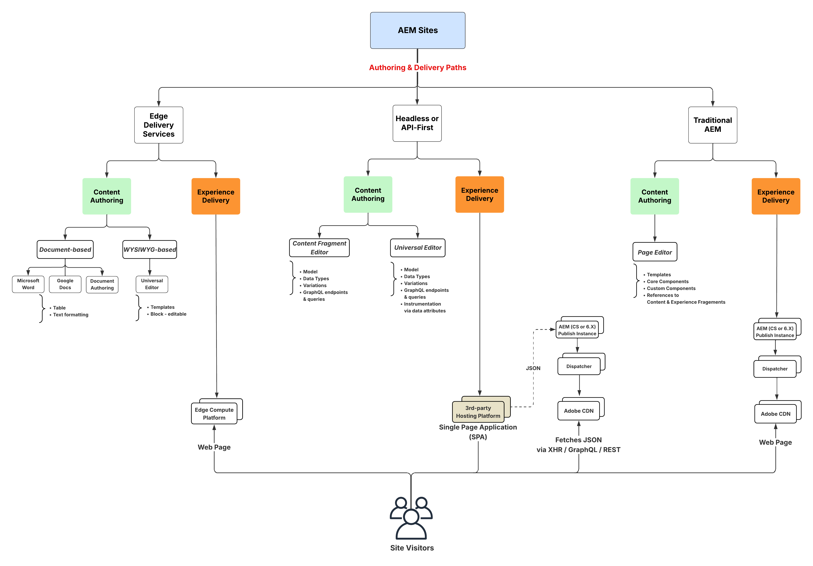

# AEM Sites 비디오 및 자습서 {#overview}

{{edge-delivery-services}}

Adobe Experience Manager(AEM) Sites는 선도적인 경험 관리 플랫폼입니다. 이 사용 안내서에는 AEM Sites의 다양한 기능과 성능에 대한 비디오 및 튜토리얼이 포함되어 있습니다.

## AEM Sites을 사용하여 빌드하는 3가지 방법

AEM Sites은 경험을 구축, 작성 및 전달하는 세 가지 방법을 제공합니다. 전체 페이지를 구축하든, 에지 성능을 위해 최적화하든, 헤드리스 앱을 강화하든 간에 AEM Sites은 프로젝트 요구 사항에 맞는 유연한 옵션을 제공합니다.

1. **기존 사이트**&#x200B;에서는 AEM 작성자의 페이지 편집기를 사용하여 콘텐츠를 작성합니다. 그러면 이 콘텐츠가 활성화되고 AEM Publish as HTML 웹 페이지로 최종 사용자에게 전달됩니다.
1. **Edge Delivery Services** 웹 사이트는 문서 기반 작성 또는 Adobe 유니버설 편집기를 사용하여 콘텐츠를 작성한 후 활성화된 다음 Edge Delivery Services as HTML 웹 페이지를 통해 최종 사용자에게 전달됩니다.
1. **Headless/API-first** 웹 경험은 콘텐츠 조각 편집기 또는 유니버설 편집기를 사용하여 콘텐츠를 만든 다음 활성화하여 AEM Publish에서 JSON으로 제공합니다.

이러한 옵션은 마케팅 조직의 다양한 요구 사항을 충족하고 모든 채널 또는 장치에서 개인화되고 흥미로운 경험을 고속으로 제공하도록 설계되었습니다.

다음 다이어그램은 다양한 경로를 보여 줍니다.

{width="700" zoomable="yes"}

### AEM Sites으로 빌드하는 방법 비교

다음 표에는 세 가지 경로에 대한 높은 수준의 비교가 나와 있습니다. 각 경로의 콘텐츠 작성 및 경험 전달 뉘앙스에 중점을 둡니다.

|            | 기존 사이트 | Edge Delivery Services | 헤드리스 / API 우선 |
|---------------------|------------------------------|---------------------------------|---------------------------------------------|
| **작성 도구** | 페이지 편집기 | 문서 기반 작성, 유니버설 편집기 | 컨텐츠 조각, 유니버설 편집기 |
| **작성된 콘텐츠 저장소** | AEM 작성자(JCR) | 문서 또는 AEM 작성자(JCR) | AEM 작성자(JCR) |
| **게재** | AEM Publish(Adobe CDN + Dispatcher 포함) | Edge Delivery Services | AEM Publish(Adobe CDN + Dispatcher 포함) |
| **게재 콘텐츠 저장소** | AEM 게시 (JCR) | Edge Delivery Services | AEM 게시 (JCR) |
| **게재 형식** | HTML | HTML | JSON |
| **개발 기술** | Java™, JavaScript, CSS | JavaScript, CSS | 모두(예: Swift, React 등) |

## 튜토리얼

다음 자습서를 통해 AEM Sites을 사용하여 빌드할 세 가지 경로에 대해 알아봅니다.

<!-- CARDS

* https://experienceleague.adobe.com/ko/docs/experience-manager-learn/getting-started-wknd-tutorial-develop/overview
  {title = Traditional Sites - WKND Tutorial}
  {description = Learn how to build a sample AEM Sites project using the WKND tutorial. This guide walks you through project setup, Core Components, Editable Templates, client-side libraries, and component development.}
  {image = ./assets/aem-wknd-spa-editor-tutorial.png}
  {target = _self}
* https://www.aem.live/docs/
  {title = Edge Delivery Services - Guides}
  {description = Explore Edge Delivery Services with comprehensive guides. The Build, Publish, and Launch guides cover everything you need to get started with EDS.}
  {image = ./assets/edge-delivery-services.png}
  {target = _blank}
* https://experienceleague.adobe.com/ko/docs/experience-manager-learn/getting-started-with-aem-headless/overview
  {title = Headless/API-First - Tutorials}
  {description = Learn how to build headless applications powered by AEM content. Tutorials cover frameworks like iOS, Android, and React—choose what fits your stack.}
  {image = ./assets/headless.png}
  {target = _self}
-->
<!-- START CARDS HTML - DO NOT MODIFY BY HAND -->

    

        

            

                <figure class="image x-is-16by9">
                    
                </figure>
            

            

                

                    

                        <a href="https://experienceleague.adobe.com/ko/docs/experience-manager-learn/getting-started-wknd-tutorial-develop/overview" target="_self" rel="referrer" title="기존 사이트 - WKND 튜토리얼">기존 사이트 - WKND 자습서</a>
                    

                    
WKND 튜토리얼을 사용하여 샘플 AEM Sites 프로젝트를 빌드하는 방법을 알아봅니다. 이 안내서에서는 프로젝트 설정, 핵심 구성 요소, 편집 가능한 템플릿, 클라이언트측 라이브러리 및 구성 요소 개발에 대해 설명합니다.

                

                <a href="https://experienceleague.adobe.com/ko/docs/experience-manager-learn/getting-started-wknd-tutorial-develop/overview" target="_self" rel="referrer" class="spectrum-Button spectrum-Button--outline spectrum-Button--primary spectrum-Button--sizeM" style="align-self: flex-start; margin-top: 1rem;">
                    자세히 알아보기
                </a>
            

        

    

    

        

            

                <figure class="image x-is-16by9">
                    
                </figure>
            

            

                

                    

                        <a href="https://www.aem.live/docs/" target="_blank" rel="referrer" title="Edge Delivery Services - 안내서">Edge Delivery Services - 안내서</a>
                    

                    
포괄적인 안내서를 통해 Edge Delivery Services을 살펴보십시오. 빌드, 게시 및 실행 안내서는 EDS를 시작하는 데 필요한 모든 것을 다룹니다.

                

                <a href="https://www.aem.live/docs/" target="_blank" rel="referrer" class="spectrum-Button spectrum-Button--outline spectrum-Button--primary spectrum-Button--sizeM" style="align-self: flex-start; margin-top: 1rem;">
                    자세히 알아보기
                </a>
            

        

    

    

        

            

                <figure class="image x-is-16by9">
                    
                </figure>
            

            

                

                    

                        <a href="https://experienceleague.adobe.com/ko/docs/experience-manager-learn/getting-started-with-aem-headless/overview" target="_self" rel="referrer" title="Headless/API-First - 튜토리얼">헤드리스/API 우선 - 튜토리얼</a>
                    

                    
AEM 콘텐츠로 구동되는 Headless 애플리케이션을 구축하는 방법에 대해 알아봅니다. 튜토리얼에서는 iOS, Android™ 및 React와 같은 프레임워크를 다루며 스택에 맞는 항목을 선택합니다.

                

                <a href="https://experienceleague.adobe.com/ko/docs/experience-manager-learn/getting-started-with-aem-headless/overview" target="_self" rel="referrer" class="spectrum-Button spectrum-Button--outline spectrum-Button--primary spectrum-Button--sizeM" style="align-self: flex-start; margin-top: 1rem;">
                    자세히 알아보기
                </a>
            

        

    

<!-- END CARDS HTML - DO NOT MODIFY BY HAND -->

## 추가 리소스

* [AEM Sites 작성 설명서](https://experienceleague.adobe.com/ko/docs/experience-manager-65/content/sites/authoring/essentials/first-steps)
* [AEM Sites 개발 설명서](https://experienceleague.adobe.com/ko/docs/experience-manager-65/content/implementing/developing/introduction/getting-started)
* [AEM Sites 관리 설명서](https://experienceleague.adobe.com/ko/docs/experience-manager-65/content/sites/administering/home)
* [AEM Sites 배포 설명서](https://experienceleague.adobe.com/ko/docs/experience-manager-65/content/implementing/deploying/introduction/platform)
* [AEM as a Cloud Service 자습서](/help/cloud-service/overview.md)
* [AEM Assets 자습서](/help/assets/overview.md)
* [AEM Forms 자습서](/help/forms/overview.md)
* [AEM Foundation 자습서](/help/foundation/overview.md)
