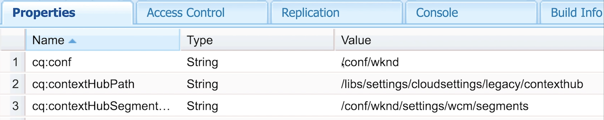

# 개인화를 위한 ContextHub 설정 {#set-up-contexthub}

ContextHub는 컨텍스트 데이터를 저장, 조작 및 제공하기 위한 프레임워크입니다. ContextHub Javascript API를 사용하면 필요에 따라 데이터를 생성, 업데이트 및 삭제하기 위해 저장소에 액세스할 수 있습니다. 이와 같이 ContextHub는 페이지의 데이터 계층을 나타냅니다. 이 페이지에서는 AEM 사이트 페이지에 Context Hub를 추가하는 방법에 대해 설명합니다.

>[!VIDEO](https://video.tv.adobe.com/v/23765/?quality=9&learn=on)

>[!NOTE]
>
>이 비디오에는 WKND 참조 사이트를 사용하므로 AEM 릴리스의 일부가 아닙니다. [최신 버전은 여기](https://github.com/adobe/aem-guides-wknd/releases)에서 다운로드할 수 있습니다.

페이지에 ContextHub를 추가하여 ContextHub 기능을 활성화하고 ContextHub JavaScript 라이브러리에 연결합니다. ContextHub JavaScript API는 ContextHub에서 관리하는 컨텍스트 데이터에 대한 액세스를 제공합니다.

## 페이지 구성 요소에 ContextHub 추가 {#adding-contexthub-to-a-page-component}

ContextHub 기능을 활성화하고 ContextHub JavaScript 라이브러리에 연결하려면 웹 페이지의 `<head>` 섹션에 `contexthub` 구성 요소를 포함하십시오. 페이지 구성 요소에 대한 HTL 코드는 다음 예와 유사합니다.

```java
<!--/* Include Context Hub */-->
<sly data-sly-resource="${'contexthub' @ resourceType='granite/contexthub/components/contexthub'}"/>
*/-->
```

## 사이트 구성 및 ContextHub 세그먼트 {#site-configuration-and-contexthub-segments}

ContextHub에는 세그먼트를 관리하고 현재 컨텍스트에 대해 해결된 세그먼트를 결정하는 세그멘테이션 엔진이 포함되어 있습니다. 여러 세그먼트가 정의됩니다. Javascript API를 사용하여 [해결된 세그먼트를 결정할 수 있습니다](https://helpx.adobe.com/experience-manager/6-5/sites/developing/using/ch-adding.html#DeterminingResolvedContextHubSegments). [[!UICONTROL 구성 브라우저]](https://experienceleague.adobe.com/docs/experience-manager-cloud-service/implementing/developing/configurations.html)에서 사이트에 대한 ContextHub 세그먼트를 활성화합니다.

## 세그먼트 만들기 {#create-segments}

Teaser에 대한 규칙으로 작동하는 AEM 세그먼트를 만듭니다. 즉, 티저 내의 컨텐츠가 웹 페이지에 표시되는 경우를 정의합니다. 그런 후 방문자의 필요 및 관심사와 일치하는 세그먼트에 따라, 이러한 항목을 컨텐츠의 대상으로 구체적으로 지정할 수 있습니다.

## 사이트에 클라우드 구성, 세그먼트 경로 및 ContextHub 경로 할당 {#assigning-cloud-configuration-segment-path-and-contexthub-path-to-your-site}

대상을 위해 개인화된 경험을 만들 수 있도록 클라우드 구성 경로, 세그멘테이션 경로 및 ContextHub 경로를 사이트 루트 노드에 할당합니다. ContextHub를 사용하여 컨텍스트 데이터를 조작하고 해결된 세그먼트를 테스트할 수 있습니다.



아래에서 ContextHub 및 세그멘테이션에 대해 자세히 알아보십시오.

* [ContextHub](https://helpx.adobe.com/experience-manager/6-5/sites/developing/using/contexthub.html)
* [페이지에 Context Hub 추가 및 저장소 액세스](https://helpx.adobe.com/experience-manager/6-5/sites/developing/using/ch-adding.html)
* [세그멘테이션 이해](https://helpx.adobe.com/experience-manager/6-5/sites/classic-ui-authoring/using/classic-personalization-campaigns-segmentation.html)
* [ContextHub로 세그멘테이션 구성](https://helpx.adobe.com/experience-manager/6-5/sites/administering/using/segmentation.html)
