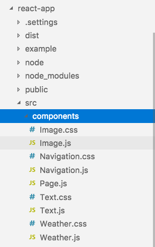
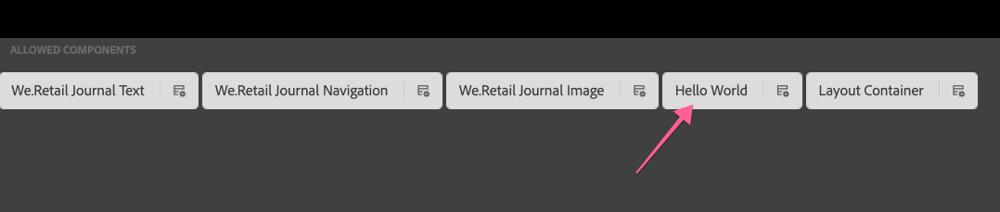

# AEM SPA 편집기를 사용한 개발 - Hello World Tutorial {#developing-with-the-aem-spa-editor-hello-world-tutorial}

>[!WARNING]
>
> 이 자습서는 **더 이상 사용되지 않습니다**&#x200B;입니다. 다음 중 하나를 수행하는 것이 좋습니다.[AEM SPA 편집기로 시작 및 Angular](https://docs.adobe.com/content/help/en/experience-manager-learn/spa-angular-tutorial/overview.html) 또는 [AEM SPA 편집기로 시작 및 응답](https://docs.adobe.com/content/help/en/experience-manager-learn/spa-react-tutorial/overview.html)

AEM SPA 편집기는 단일 페이지 애플리케이션 또는 SPA의 상황에 맞는 편집을 지원합니다. 이 자습서는 AEM SPA Editor JS SDK와 함께 사용할 SPA 개발에 대한 소개입니다. 이 자습서는 사용자 지정 Hello World 구성 요소를 추가하여 We.Retail 저널 앱을 확장합니다. 사용자는 반응 또는 각도 프레임워크를 사용하여 자습서를 완료할 수 있습니다.

>[!NOTE]
>
> 단일 페이지 애플리케이션(SPA) 편집기 기능을 사용하려면 AEM 6.4 서비스 팩 2 이상이 필요합니다.
>
> SPA 편집기는 SPA 프레임워크 기반 클라이언트측 렌더링(예: 반응 또는 각도)이 필요한 프로젝트에 권장되는 솔루션입니다.

## 필수 조건 읽기 {#prereq}

이 자습서는 SPA 구성 요소를 AEM 구성 요소에 매핑하여 컨텍스트 내 편집을 활성화하는 데 필요한 단계를 강조 표시하기 위한 것입니다. 이 자습서를 시작하는 사용자는 Impact of Angular 프레임워크를 사용하여 개발하는 것뿐만 아니라, AEM, Adobe Experience Manager의 개발 기본 개념을 잘 알고 있어야 합니다. 이 자습서에서는 백엔드 개발 및 프런트 엔드 개발 작업을 모두 다룹니다.

이 자습서를 시작하기 전에 다음 리소스를 검토하는 것이 좋습니다.

* [SPA 편집기 기능 비디오](spa-editor-framework-feature-video-use.md)  - SPA 편집기 및 We.Retail Journal 앱에 대한 비디오 개요입니다.
* [Responsive.js 자습서](https://reactjs.org/tutorial/tutorial.html)  - Responsive 프레임워크로 개발하는 방법을 소개합니다.
* [각 자습서](https://angular.io/tutorial)  - 각진 방식으로 개발하는 방법 소개

## 로컬 개발 환경 {#local-dev}

이 튜토리얼은 다음과 같은 용도로 고안되었습니다.

[Adobe Experience Manager 6.5 ](https://helpx.adobe.com/kr/experience-manager/6-5/release-notes.html) 또는  [Adobe Experience Manager 6.4](https://helpx.adobe.com/experience-manager/6-4/sites/deploying/using/technical-requirements.html) +  [서비스 팩 5](https://helpx.adobe.com/kr/experience-manager/6-4/release-notes/sp-release-notes.html)

이 자습서에서는 다음 기술과 도구를 설치해야 합니다.

1. [Java 11](https://downloads.experiencecloud.adobe.com/content/software-distribution/en/general.html)
2. [Apache Maven - 3.3.1+](https://maven.apache.org/)
3. [Node.js - 8.11.1+](https://nodejs.org/en/) 및 npm 5.6.0+(npm이 node.js와 함께 설치됨)

새 터미널을 열고 다음을 실행하여 위의 도구 설치를 다시 확인하십시오.

```shell
$ java -version
java version "11 +"

$ mvn -version
Apache Maven 3.3.9

$ node --version
v8.11.1

$ npm --version
6.1.0
```

## 개요 {#overview}

기본 개념은 SPA 구성 요소를 AEM 구성 요소에 매핑하는 것입니다. AEM 구성 요소, 서버측 실행, JSON 형식으로 컨텐츠 내보내기 JSON 콘텐츠는 SPA이 브라우저에서 클라이언트측을 실행하여 사용합니다. SPA 구성 요소와 AEM 구성 요소 간의 1:1 매핑이 만들어집니다.


인기 있는 프레임워크 [JS](https://reactjs.org/) 및 [Angular](https://angular.io/)가 기본적으로 지원됩니다. 사용자는 가장 익숙한 프레임워크에서 이 자습서를 완료할 수 있습니다.

## 프로젝트 설정 {#project-setup}

SPA 개발은 AEM 개발에 한피트, 다른 한쪽은 그렇지 않다. 그 목표는 SPA 개발이 독립적으로, 그리고 (대부분) AEM에 관계없이 이루어지도록 하는 것이다.

* SPA 프로젝트는 프런트 엔드 개발 중에 AEM 프로젝트와 독립적으로 작동할 수 있습니다.
* Webpack, NPM, [!DNL Grunt] 및 [!DNL Gulp]과 같은 프런트 엔드 빌드 도구와 기술은 계속 사용됩니다.
* AEM용으로 빌드하기 위해 SPA 프로젝트는 컴파일되고 AEM 프로젝트에 자동으로 포함됩니다.
* SPA을 AEM에 배포하는 데 사용되는 표준 AEM 패키지입니다.


*SPA 개발에는 AEM 개발 시 한 발과 다른 발판이 있는데, 즉 SPA개발이 독립적으로, (대부분) AEM과 관계없이 이루어질 수 있습니다.*

이 자습서의 목표는 새 구성 요소로 We.Retail 저널 앱을 확장하는 것입니다. 먼저 We.Retail Journal 앱의 소스 코드를 다운로드하여 로컬 AEM에 배포합니다.

1. **GitHub** 에서 최신  [We.Retail 저널 코드를 다운로드합니다](https://github.com/adobe/aem-sample-we-retail-journal).

   또는 명령줄에서 리포지토리 복제:

   ```shell
   $ git clone git@github.com:adobe/aem-sample-we-retail-journal.git
   ```

   >[!NOTE]
   >
   >이 자습서는 **1.2.1-SNAPSHOT** 버전의 **master** 분기와 관련하여 작동합니다.

1. 다음 구조가 표시됩니다.

   

   이 프로젝트에는 다음과 같은 마비되는 모듈이 포함되어 있습니다.

   * `all`:단일 패키지로 전체 프로젝트를 임베드하여 설치합니다.
   * `bundles`:다음 두 개의 OSGi 번들을 포함합니다.commons 및 core [!DNL Sling Models] 와 기타 Java 코드를 포함합니다.
   * `ui.apps`:프로젝트의 /apps 부분, 즉 JS 및 CSS clientlibs, components, runmode 특정 구성을 포함합니다.
   * `ui.content`:구조적 컨텐츠 및 구성 포함 (`/content`,  `/conf`
   * `react-app`:We.Retail Journal 반응형 응용 프로그램. 이는 Maven 모듈과 웹 팩 프로젝트입니다.
   * `angular-app`:We.Retail 분개 각도 응용 프로그램. 이는 [!DNL Maven] 모듈과 웹 팩 프로젝트 모두입니다.

1. 새 터미널 창을 열고 다음 명령을 실행하여 전체 앱을 빌드하고 [http://localhost:4502](http://localhost:4502)에서 실행 중인 로컬 AEM 인스턴스에 배포합니다.

   ```shell
   $ cd <src>/aem-sample-we-retail-journal
   $ mvn -PautoInstallSinglePackage clean install
   ```

   >[!NOTE]
   >
   > 이 프로젝트에서 전체 프로젝트를 빌드하고 패키지할 Maven 프로필은 `autoInstallSinglePackage`입니다.

   >[!CAUTION]
   >
   > 빌드 중에 오류가 표시되면 [Maven settings.xml 파일에 Adobe의 Maven 아티팩트 저장소](https://helpx.adobe.com/experience-manager/kb/SetUpTheAdobeMavenRepository.html)가 포함되어 있는지 확인합니다.

1. 다음으로 이동:

   * [http://localhost:4502/editor.html/content/we-retail-journal/react/en/home.html](http://localhost:4502/editor.html/content/we-retail-journal/react/en/home.html)
   * [http://localhost:4502/editor.html/content/we-retail-journal/angular/en/home.html](http://localhost:4502/editor.html/content/we-retail-journal/angular/en/home.html)

   We.Retail 저널 앱이 AEM Sites 편집기 내에 표시되어야 합니다.

1. [!UICONTROL 편집] 모드에서 편집할 구성 요소를 선택하고 콘텐트를 업데이트합니다.

   

1. [!UICONTROL 페이지 속성] 아이콘을 선택하여 [!UICONTROL 페이지 속성]을 엽니다. [!UICONTROL 템플릿 편집]을 선택하여 페이지의 템플릿을 엽니다.

   

1. SPA 편집기의 최신 버전에서는 기존 사이트 구현과 동일한 방법으로 [편집 가능한 템플릿](https://helpx.adobe.com/experience-manager/6-5/sites/developing/using/page-templates-editable.html)을 사용할 수 있습니다. 사용자 지정 구성 요소와 함께 나중에 다시 방문됩니다.

   >[!NOTE]
   >
   > AEM 6.5 및 AEM 6.4 + **서비스 팩 5**&#x200B;만 편집 가능한 템플릿을 지원합니다.

## 개발 개요 {#development-overview}


SPA 개발 이터레이션은 AEM과 독립적으로 실행됩니다. SPA을 AEM에 배포할 준비가 되면 위에 설명된 것처럼 다음 고급 단계가 수행됩니다.

1. AEM 프로젝트 빌드가 호출되어 SPA 프로젝트 빌드가 트리거됩니다. We.Retail 저널은 [**frontend-maven-plugin**](https://github.com/eirslett/frontend-maven-plugin)을 사용합니다.
1. SPA 프로젝트의 [**aem-clientlib-generator**](https://www.npmjs.com/package/aem-clientlib-generator)는 컴파일된 SPA을 AEM 프로젝트에 AEM 클라이언트 라이브러리로 포함합니다.
1. AEM 프로젝트는 컴파일된 SPA과 기타 지원 AEM 코드를 포함한 AEM 패키지를 생성합니다.

## AEM 구성 요소 {#aem-component} 만들기

**페르소나:AEM 개발자**

AEM 구성 요소가 먼저 만들어집니다. AEM 구성 요소는 반응 구성 요소에서 읽는 JSON 속성을 렌더링합니다. AEM 구성 요소는 구성 요소의 편집 가능한 속성에 대한 대화 상자도 제공합니다.

[!DNL Eclipse] 또는 다른 [!DNL IDE]을 사용하여 We.Retail Journal Maven 프로젝트를 가져옵니다.

1. [!DNL Apache Rat] 플러그인을 제거하려면 원자로 **pom.xml**&#x200B;을 업데이트합니다. 이 플러그인은 라이센스 헤더가 있는지 확인하기 위해 각 파일을 확인합니다. Adobe는 이러한 기능을 신경 쓸 필요가 없습니다.

   **aem-sample-we-retail-journal/pom.xml** remove **apache-rate-plugin**&#x200B;에서:

   ```xml
   <!-- Remove apache-rat-plugin -->
   <plugin>
           <groupId>org.apache.rat</groupId>
           <artifactId>apache-rat-plugin</artifactId>
           <configuration>
               <excludes combine.children="append">
                   <exclude>*</exclude>
                       ...
               </excludes>
           </configuration>
           <executions>
                   <execution>
                       <phase>verify</phase>
                       <goals>
                           <goal>check</goal>
                       </goals>
               </execution>
           </executions>
       </plugin>
   ```

1. **we-retail-journal-content**(`<src>/aem-sample-we-retail-journal/ui.apps`) 모듈에서 **cq:Component** 유형의 **helloworld**&#x200B;라는 이름의 새 노드를 만듭니다.`ui.apps/jcr_root/apps/we-retail-journal/components`
1. 아래 XML(`/helloworld/.content.xml`)로 표현되는 **helloworld** 구성 요소에 다음 속성을 추가합니다.

   ```xml
   <?xml version="1.0" encoding="UTF-8"?>
   <jcr:root xmlns:cq="http://www.day.com/jcr/cq/1.0" xmlns:jcr="http://www.jcp.org/jcr/1.0"
       jcr:description="Hello World Component for We.Retail Journal"
       jcr:primaryType="cq:Component"
       jcr:title="Hello World"
       componentGroup="We.Retail Journal" />
   ```

   

   >[!NOTE]
   >
   > 편집 가능한 템플릿 기능을 설명하기 위해 `componentGroup="Custom Components"`을 의도적으로 설정했습니다. 실제 프로젝트에는 구성 요소 그룹 수를 최소화하는 것이 가장 좋으므로 다른 컨텐츠 구성 요소와 일치하는 더 나은 그룹이 &quot;[!DNL We.Retail Journal]&quot;이 됩니다.
   >
   > AEM 6.5 및 AEM 6.4 + **서비스 팩 5**&#x200B;만 편집 가능한 템플릿을 지원합니다.

1. **Hello World** 구성 요소에 대해 사용자 지정 메시지를 구성할 수 있도록 대화 상자가 만들어집니다. `/apps/we-retail-journal/components/helloworld` 아래에 **nt:unstructured**&#x200B;의 노드 이름 **cq:dialog**&#x200B;을 추가합니다.
1. **cq:dialog**&#x200B;에 **[!DNL message]**&#x200B;라는 속성에 텍스트를 유지하는 단일 텍스트 필드가 표시됩니다. 새로 만든 **cq:dialog** 아래에서 다음 노드 및 속성을 추가합니다(`helloworld/_cq_dialog/.content.xml`).

   ```xml
   <?xml version="1.0" encoding="UTF-8"?>
   <jcr:root xmlns:sling="http://sling.apache.org/jcr/sling/1.0" xmlns:cq="http://www.day.com/jcr/cq/1.0" xmlns:jcr="http://www.jcp.org/jcr/1.0" xmlns:nt="http://www.jcp.org/jcr/nt/1.0"
       jcr:primaryType="nt:unstructured"
       jcr:title="We.Retail Journal - Hello World"
       sling:resourceType="cq/gui/components/authoring/dialog">
       <content
           jcr:primaryType="nt:unstructured"
           sling:resourceType="granite/ui/components/coral/foundation/container">
           <items jcr:primaryType="nt:unstructured">
               <tabs
                   jcr:primaryType="nt:unstructured"
                   sling:resourceType="granite/ui/components/coral/foundation/tabs"
                   maximized="{Boolean}true">
                   <items jcr:primaryType="nt:unstructured">
                       <properties
                           jcr:primaryType="nt:unstructured"
                           jcr:title="Properties"
                           sling:resourceType="granite/ui/components/coral/foundation/container"
                           margin="{Boolean}true">
                           <items jcr:primaryType="nt:unstructured">
                               <columns
                                   jcr:primaryType="nt:unstructured"
                                   sling:resourceType="granite/ui/components/coral/foundation/fixedcolumns"
                                   margin="{Boolean}true">
                                   <items jcr:primaryType="nt:unstructured">
                                       <column
                                           jcr:primaryType="nt:unstructured"
                                           sling:resourceType="granite/ui/components/coral/foundation/container">
                                           <items jcr:primaryType="nt:unstructured">
                                               <message
                                                   jcr:primaryType="nt:unstructured"
                                                   sling:resourceType="granite/ui/components/coral/foundation/form/textfield"
                                                   fieldLabel="Message"
                                                   name="./message"
                                                   required="{Boolean}true"/>
                                           </items>
                                       </column>
                                   </items>
                               </columns>
                           </items>
                       </properties>
                   </items>
               </tabs>
           </items>
       </content>
   </jcr:root>
   ```

   

   위의 XML 노드 정의는 사용자가 &quot;메시지&quot;를 입력할 수 있는 단일 텍스트 필드가 포함된 대화 상자를 만듭니다. `<message />` 노드 내의 `name="./message"` 속성을 참고하십시오. AEM 내의 JCR에 저장되는 속성의 이름입니다.

1. 다음에 빈 정책 대화 상자가 만들어집니다(`cq:design_dialog`). 템플릿 편집기에서 구성 요소를 보려면 정책 대화 상자가 필요합니다. 이 간단한 사용 사례의 경우 빈 대화 상자가 됩니다.

   `/apps/we-retail-journal/components/helloworld` 아래에 `nt:unstructured`의 노드 이름 `cq:design_dialog`을 추가합니다.

   구성은 아래의 XML로 표시됩니다(`helloworld/_cq_design_dialog/.content.xml`).

   ```xml
   <?xml version="1.0" encoding="UTF-8"?>
   <jcr:root xmlns:sling="http://sling.apache.org/jcr/sling/1.0" xmlns:cq="http://www.day.com/jcr/cq/1.0" xmlns:jcr="http://www.jcp.org/jcr/1.0" xmlns:nt="http://www.jcp.org/jcr/nt/1.0"
   jcr:primaryType="nt:unstructured" />
   ```

1. 명령줄에서 AEM에 코드 베이스를 배포합니다.

   ```shell
   $ cd <src>/aem-sample-we-retail-journal/content
   $ mvn -PautoInstallPackage clean install
   ```

   [CRXDE Lite](http://localhost:4502/crx/de/index.jsp#/apps/we-retail-journal/global/components/helloworld)에서 `/apps/we-retail-journal/components:` 아래의 폴더를 검사하여 구성 요소가 배포되었는지 확인합니다.

   

## 슬링 모델 만들기 {#create-sling-model}

**페르소나:AEM 개발자**

[!DNL Sling Model]이(가) [!DNL Hello World] 구성 요소를 뒤로 되돌리기 위해 만들어집니다. 기존 WCM 사용 사례에서 [!DNL Sling Model]은 모든 비즈니스 논리를 구현하고 HTL(서버측 렌더링 스크립트)은 [!DNL Sling Model]을 호출합니다. 따라서 렌더링 스크립트가 비교적 간단하게 유지됩니다.

[!DNL Sling Models] 는 SPA 사용 사례에서도 서버측 비즈니스 로직을 구현하는 데 사용됩니다. 차이점은 [!DNL SPA] 사용 사례에서는 [!DNL Sling Models]이(가) 직렬화된 JSON으로 해당 메서드를 노출한다는 점입니다.

>[!NOTE]
>
>개발자는 가능하면 [AEM 코어 구성 요소](https://docs.adobe.com/content/help/ko-KR/experience-manager-core-components/using/introduction.html)를 사용하는 것이 좋습니다. 코어 구성 요소는 개발자가 프런트 엔드 프레젠테이션에 더 집중할 수 있도록 JSON 출력을 [!DNL Sling Models]에 제공하여 제공합니다.

1. 선택한 편집기의 **we-retail-journal-commons** 프로젝트( `<src>/aem-sample-we-retail-journal/bundles/commons`)를 엽니다.
1. 패키지 `com.adobe.cq.sample.spa.commons.impl.models`:
   * `HelloWorld`이라는 새 클래스를 만듭니다.
   * `com.adobe.cq.export.json.ComponentExporter.`에 대한 구현 인터페이스 추가

   

   `ComponentExporter` 인터페이스는 AEM Content Services와 호환되도록 구현되어야 합니다.[!DNL Sling Model]

   ```java
    package com.adobe.cq.sample.spa.commons.impl.models;
   
    import com.adobe.cq.export.json.ComponentExporter;
   
    public class HelloWorld implements ComponentExporter {
   
        @Override
        public String getExportedType() {
            return null;
        }
    }
   ```

1. [!DNL HelloWorld] 구성 요소의 리소스 유형을 식별하려면 `RESOURCE_TYPE`이라는 정적 변수를 추가합니다.

   ```java
    ...
    public class HelloWorld implements ComponentExporter {
   
        static final String RESOURCE_TYPE = "we-retail-journal/components/helloworld";
   
        ...
    }
   ```

1. `@Model` 및 `@Exporter`에 대한 OSGi 주석을 추가합니다. `@Model` 주석에서는 클래스를 [!DNL Sling Model]로 등록합니다. `@Exporter` 주석에서는 [!DNL Jackson Exporter] 프레임워크를 사용하여 메서드를 직렬화된 JSON으로 노출합니다.

   ```java
   import org.apache.sling.api.SlingHttpServletRequest;
   import org.apache.sling.models.annotations.Exporter;
   import org.apache.sling.models.annotations.Model;
   import com.adobe.cq.export.json.ExporterConstants;
   ...
   
   @Model(
           adaptables = SlingHttpServletRequest.class,
           adapters = {ComponentExporter.class},
           resourceType = HelloWorld.RESOURCE_TYPE
   )
   @Exporter(
           name = ExporterConstants.SLING_MODEL_EXPORTER_NAME, 
           extensions = ExporterConstants.SLING_MODEL_EXTENSION
   )
   public class HelloWorld implements ComponentExporter {
   
   ...
   ```

1. `getDisplayMessage()` 메서드를 구현하여 JCR 속성 `message`을(를) 반환합니다. `@ValueMapValue`의 [!DNL Sling Model] 주석을 사용하여 구성 요소 아래에 저장된 속성 `message`을 쉽게 검색할 수 있습니다. `@Optional` 주석은 페이지에 구성 요소를 처음 추가할 때 `message`이 채워지지 않으므로 중요합니다.

   비즈니스 논리의 일부로서 &quot;**Hello**&quot; 문자열이 메시지에 프리펜드됩니다.

   ```java
   import org.apache.sling.models.annotations.injectorspecific.ValueMapValue;
   import org.apache.sling.models.annotations.Optional;
   
   ...
   
   public class HelloWorld implements ComponentExporter {
   
      static final String RESOURCE_TYPE = "we-retail-journal/components/helloworld";
   
      private static final String PREPEND_MSG = "Hello";
   
       @ValueMapValue @Optional
       private String message;
   
       public String getDisplayMessage() {
           if(message != null && message.length() > 0) {
               return PREPEND_MSG + " "  + message;
           }
           return null;
       }
   
   ...
   ```

   >[!NOTE]
   >
   > 메서드 이름 `getDisplayMessage`은(는) 중요합니다. [!DNL Sling Model]이(가) [!DNL Jackson Exporter]로 직렬화되면 JSON 속성으로 노출됩니다.`displayMessage`. [!DNL Jackson Exporter]은 매개 변수를 사용하지 않는 모든 `getter` 메서드를 일련화하고 노출합니다(명시적으로 무시하도록 지정하지 않은 경우). 나중에 반응형/각도 앱에서 이 속성 값을 읽고 애플리케이션의 일부로 표시합니다.

   `getExportedType` 메서드도 중요합니다. 구성 요소 `resourceType`의 값은 JSON 데이터를 프런트 엔드 구성 요소에 &quot;매핑&quot;하는 데 사용됩니다(각도 / 응답). 다음 코너에서 살펴보도록 하겠습니다

1. `getExportedType()` 메서드를 구현하여 `HelloWorld` 구성 요소의 리소스 유형을 반환합니다.

   ```java
    @Override
       public String getExportedType() {
           return RESOURCE_TYPE;
       }
   ```

   [**HelloWorld.java**&#x200B;에 대한 전체 코드는 여기에서 찾을 수 있습니다.](https://github.com/Adobe-Marketing-Cloud/aem-guides/blob/master/spa-helloworld-guide/src/bundles/commons/HelloWorld.java)

1. Apache Maven을 사용하여 코드를 AEM에 배포:

   ```shell
   $ cd <src>/sample-we-retail-spa-content/bundles/commons
   $ mvn -PautoInstallPackage clean install
   ```

   OSGi 콘솔의 [[!UICONTROL 상태] > [!UICONTROL 모델 정렬]](http://localhost:4502/system/console/status-slingmodels)으로 이동하여 [!DNL Sling Model]의 배포 및 등록을 확인합니다.

   `HelloWorld` Sling Model이 `we-retail-journal/components/helloworld` Sling 리소스 유형에 바인딩되어 있으며 [!DNL Sling Model Exporter Servlet]로 등록되어 있음을 확인해야 합니다.

   ```shell
   com.adobe.cq.sample.spa.commons.impl.models.HelloWorld - we-retail-journal/components/helloworld
   com.adobe.cq.sample.spa.commons.impl.models.HelloWorld exports 'we-retail-journal/components/helloworld' with selector 'model' and extension '[Ljava.lang.String;@6480f3e5' with exporter 'jackson'
   ```

## 반응 구성 요소 만들기 {#react-component}

**페르소나:프런트 엔드 개발자**

다음으로, React 구성 요소가 만들어집니다. 원하는 편집기를 사용하여 **react-app** 모듈( `<src>/aem-sample-we-retail-journal/react-app`)을 엽니다.

>[!NOTE]
>
> [Angular development](#angular-component)에만 관심이 있다면 이 섹션을 건너뛰십시오.

1. `react-app` 폴더 내에서 src 폴더로 이동합니다. 구성 요소 폴더를 확장하여 기존 반응 구성 요소 파일을 봅니다.

   

1. `HelloWorld.js`이라는 구성 요소 폴더 아래에 새 파일을 추가합니다.
1. 열기 `HelloWorld.js`. 가져오기 문을 추가하여 React 구성 요소 라이브러리를 가져옵니다. 두 번째 가져오기 문을 추가하여 Adobe에서 제공하는 `MapTo` 도우미를 가져옵니다. `MapTo` 도우미는 AEM 구성 요소의 JSON에 반응형 구성 요소의 매핑을 제공합니다.

   ```js
   import React, {Component} from 'react';
   import {MapTo} from '@adobe/cq-react-editable-components';
   ```

1. 가져오기 아래에서 React `Component` 인터페이스를 확장하는 `HelloWorld`이라는 새 클래스를 만듭니다. 필요한 `render()` 메서드를 `HelloWorld` 클래스에 추가합니다.

   ```js
   import React, {Component} from 'react';
   import {MapTo} from '@adobe/cq-react-editable-components';
   
   class HelloWorld extends Component {
   
       render() {
   
       }
   }
   ```

1. `MapTo` 도우미는 반응 구성 요소의 prop의 일부로 `cqModel`이라는 개체를 자동으로 포함합니다. `cqModel`에는 [!DNL Sling Model]에 의해 노출된 모든 속성이 포함됩니다.

   이전에 만든 [!DNL Sling Model]에 `getDisplayMessage()` 메서드가 포함되어 있음을 기억하십시오. `getDisplayMessage()` 는 출력 시 이름이 지정된 JSON 키로  `displayMessage` 변환됩니다.

   `render()` 메서드를 구현하여 `displayMessage`의 값이 포함된 `h1` 태그를 출력합니다. [JavaScript](https://reactjs.org/docs/introducing-jsx.html)의 구문 확장자인 JSX는 구성 요소의 최종 마크업을 반환하는 데 사용됩니다.

   ```js
   ...
   
   class HelloWorld extends Component {
       render() {
   
           if(this.props.displayMessage) {
               return (
                   <div className="cmp-helloworld">
                       <h1 className="cmp-helloworld_message">{this.props.displayMessage}</h1>
                   </div>
               );
           }
           return null;
       }
   }
   ```

1. 편집 구성 방법을 구현합니다. 이 메서드는 `MapTo` 도우미를 통해 전달되며, 구성 요소가 비어 있는 경우 자리 표시자를 표시하는 정보를 AEM 편집기에 제공합니다. 이 문제는 구성 요소가 SPA에 추가되었지만 아직 작성되지 않았을 때 발생합니다. `HelloWorld` 클래스 아래에 다음을 추가합니다.

   ```js
   ...
   
   class HelloWorld extends Component {
       ...
   }
   
   const HelloWorldEditConfig = {
   
       emptyLabel: 'Hello World',
   
       isEmpty: function(props) {
           return !props || !props.displayMessage || props.displayMessage.trim().length < 1;
       }
   };
   
   ...
   ```

1. 파일 끝에 `MapTo` 도우미를 호출하고 `HelloWorld` 클래스 및 `HelloWorldEditConfig`를 전달합니다. AEM 구성 요소의 리소스 유형을 기반으로 AEM 구성 요소에 반응형 구성 요소를 매핑합니다.`we-retail-journal/components/helloworld`.

   ```js
   MapTo('we-retail-journal/components/helloworld')(HelloWorld, HelloWorldEditConfig);
   ```

   [**HelloWorld.js**&#x200B;에 대한 완료된 코드를 여기에서 찾을 수 있습니다.](https://github.com/Adobe-Marketing-Cloud/aem-guides/blob/master/spa-helloworld-guide/src/react-app/components/HelloWorld.js)

1. `ImportComponents.js` 파일을 엽니다. `<src>/aem-sample-we-retail-journal/react-app/src/ImportComponents.js`에 있습니다.

   컴파일된 JavaScript 번들의 다른 구성 요소와 함께 `HelloWorld.js`이 필요한 줄을 추가합니다.

   ```js
   ...
     require('./components/Text');
     require('./components/Image');
     require('./components/HelloWorld');
   ...
   ```

1. `components` 폴더에서 `HelloWorld.css`이라는 이름의 새 파일을 `HelloWorld.js.`의 동위 항목으로 만듭니다. `HelloWorld` 구성 요소에 대한 몇 가지 기본 스타일을 만들려면 다음 항목으로 파일을 채웁니다.

   ```css
   /* HelloWorld.css to style HelloWorld component */
   
   .cmp-helloworld_message {
       text-align: center;
       color: #ff505e;
       text-transform: unset;
       letter-spacing: unset;
   }
   ```

1. `HelloWorld.js`을(를) 다시 열고 `HelloWorld.css`이(가) 필요한 가져오기 문 아래로 업데이트합니다.

   ```js
   import React, {Component} from 'react';
   import {MapTo} from '@adobe/cq-react-editable-components';
   
   require('./HelloWorld.css');
   
   ...
   ```

1. Apache Maven을 사용하여 코드를 AEM에 배포:

   ```shell
   $ cd <src>/sample-we-retail-spa-content
   $ mvn -PautoInstallSinglePackage clean install
   ```

1. [CRXDE-Lite](http://localhost:4502/crx/de/index.jsp#/apps/we-retail-journal/react/clientlibs/we-retail-journal-react/js/app.js)에서 `/apps/we-retail-journal/react/clientlibs/we-retail-journal-react/js/app.js`를 엽니다. app.js에서 HelloWorld를 빠르게 검색하여 Responsive 구성 요소가 컴파일된 앱에 포함되어 있는지 확인합니다.

   >[!NOTE]
   >
   > **app.** jsis가 번들로 묶인 React 앱입니다. 이 코드는 더 이상 사람이 읽을 수 없습니다. `npm run build` 명령은 최신 브라우저에서 해석할 수 있는 컴파일된 JavaScript를 출력하는 최적화된 빌드를 트리거했습니다.


## 각도 구성 요소 만들기 {#angular-component}

**페르소나:프런트 엔드 개발자**

>[!NOTE]
>
> 반응형 개발에 관심이 있는 경우 이 섹션을 건너뛰십시오.

그런 다음 각도 컴포넌트가 생성됩니다. 원하는 편집기를 사용하여 **angular-app** 모듈(`<src>/aem-sample-we-retail-journal/angular-app`)을 엽니다.

1. `angular-app` 폴더 내에서 `src` 폴더로 이동합니다. 구성 요소 폴더를 확장하여 기존 각 구성 요소 파일을 봅니다.

   

1. `helloworld`이라는 구성 요소 폴더 아래에 새 폴더를 추가합니다. `helloworld` 폴더 아래에서 `helloworld.component.css, helloworld.component.html, helloworld.component.ts`이라는 새 파일을 추가합니다.

   ```plain
   /angular-app
       /src
           /app
               /components
   +                /helloworld
   +                    helloworld.component.css
   +                    helloworld.component.html
   +                    helloworld.component.ts
   ```

1. 열기 `helloworld.component.ts`. 가져오기 문을 추가하여 Angular `Component` 및 `Input` 클래스를 가져옵니다. `styleUrls` 및 `templateUrl`을 `helloworld.component.css` 및 `helloworld.component.html`으로 가리키는 새 구성 요소를 만듭니다. 마지막으로 `displayMessage`의 예상 입력과 함께 `HelloWorldComponent` 클래스를 내보냅니다.

   ```js
   //helloworld.component.ts
   
   import { Component, Input } from '@angular/core';
   
   @Component({
     selector: 'app-helloworld',
     host: { 'class': 'cmp-helloworld' },
     styleUrls:['./helloworld.component.css'],
     templateUrl: './helloworld.component.html',
   })
   
   export class HelloWorldComponent {
     @Input() displayMessage: string;
   }
   ```

   >[!NOTE]
   >
   > 이전에 만든 [!DNL Sling Model]을 다시 호출할 경우 **getDisplayMessage()** 메서드가 있었습니다. 이 메서드의 serialize된 JSON은 **displayMessage**&#x200B;이며 이제 Angular 앱에서 읽고 있습니다.

1. `helloworld.component.html`을 열고 `displayMessage` 속성을 인쇄할 `h1` 태그를 포함합니다.

   ```html
   <h1 *ngIf="displayMessage" class="cmp-helloworld_message">
       {{displayMessage}}
   </h1>
   ```

1. 구성 요소에 대한 일부 기본 스타일을 포함하도록 `helloworld.component.css`을 업데이트합니다.

   ```css
   :host-context {
       display: block;
   };
   
   .cmp-helloworld {
       display:block;
   }
   .cmp-helloworld_message {
       text-align: center;
       color: #ff505e;
       text-transform: unset;
       letter-spacing: unset;
   }
   ```

1. 다음 테스트 수준으로 `helloworld.component.spec.ts`을(를) 업데이트합니다.

   ```js
   import { async, ComponentFixture, TestBed } from '@angular/core/testing';
   
   import { HelloWorldComponent } from './helloworld.component';
   
       describe('HelloWorld', () => {
       let component: HelloWorldComponent;
       let fixture: ComponentFixture<HelloWorldComponent>;
   
       beforeEach(async(() => {
           TestBed.configureTestingModule({
           declarations: [ HelloWorldComponent ]
           })
           .compileComponents();
       }));
   
       beforeEach(() => {
           fixture = TestBed.createComponent(HelloWorldComponent);
           component = fixture.componentInstance;
           fixture.detectChanges();
       });
   
       it('should create', () => {
           expect(component).toBeTruthy();
       });
   });
   ```

1. `HelloWorldComponent`을(를) 포함하는 다음 업데이트 `src/components/mapping.ts`입니다. 구성 요소를 구성하기 전에 AEM 편집기에서 자리 표시자를 표시하는 `HelloWorldEditConfig`을 추가합니다. 마지막으로 라인을 추가하여 AEM 구성 요소를 `MapTo` 도우미로 각도 구성 요소에 매핑합니다.

   ```js
   // src/components/mapping.ts
   
   import { HelloWorldComponent } from "./helloworld/helloworld.component";
   
   ...
   
   const HelloWorldEditConfig = {
   
       emptyLabel: 'Hello World',
   
       isEmpty: function(props) {
           return !props || !props.displayMessage || props.displayMessage.trim().length < 1;
       }
   };
   
   ...
   
   MapTo('we-retail-journal/components/helloworld')(HelloWorldComponent, HelloWorldEditConfig);
   ```

   [**mapping.ts**&#x200B;에 대한 전체 코드는 여기에서 찾을 수 있습니다.](https://github.com/Adobe-Marketing-Cloud/aem-guides/blob/master/spa-helloworld-guide/src/angular-app/mapping.ts)

1. `src/app.module.ts`을 업데이트하여 **NgModule**&#x200B;을 업데이트합니다. **`HelloWorldComponent`**&#x200B;을 **AppModule**&#x200B;에 속하는 **선언**&#x200B;으로 추가합니다. 또한 `HelloWorldComponent`을 **entryComponent**&#x200B;로 추가하여 컴파일되고 JSON 모델이 처리될 때 앱에 동적으로 포함됩니다.

   ```js
   import { HelloWorldComponent } from './components/helloworld/helloworld.component';
   
   ...
   
   @NgModule({
     imports: [BrowserModule.withServerTransition({ appId: 'we-retail-sample-angular' }),
       SpaAngularEditableComponentsModule,
     AngularWeatherWidgetModule.forRoot({
       key: "37375c33ca925949d7ba331e52da661a",
       name: WeatherApiName.OPEN_WEATHER_MAP,
       baseUrl: 'http://api.openweathermap.org/data/2.5'
     }),
       AppRoutingModule,
       BrowserTransferStateModule],
     providers: [ModelManagerService,
       { provide: APP_BASE_HREF, useValue: '/' }],
     declarations: [AppComponent,
       TextComponent,
       ImageComponent,
       WeatherComponent,
       NavigationComponent,
       MenuComponent,
       MainContentComponent,
       HelloWorldComponent],
     entryComponents: [TextComponent,
       ImageComponent,
       WeatherComponent,
       NavigationComponent,
       MainContentComponent,
       HelloWorldComponent],
     bootstrap: [AppComponent]
    })
   ```

   [**app.module.ts**&#x200B;에 대해 완료된 코드를 여기에서 찾을 수 있습니다.](https://github.com/Adobe-Marketing-Cloud/aem-guides/blob/master/spa-helloworld-guide/src/angular-app/app.module.ts)

1. Maven을 사용하여 코드를 AEM에 배포합니다.

   ```shell
   $ cd <src>/sample-we-retail-spa-content
   $ mvn -PautoInstallSinglePackage clean install
   ```

1. [CRXDE-Lite](http://localhost:4502/crx/de/index.jsp#/apps/we-retail-journal/angular/clientlibs/we-retail-journal-angular/js/main.js)에서 `/apps/we-retail-journal/angular/clientlibs/we-retail-journal-angular/js/main.js`를 엽니다. `main.js`에서 **HelloWorld**&#x200B;에 대한 빠른 검색을 수행하여 Angular 구성 요소가 포함되어 있는지 확인합니다.

   >[!NOTE]
   >
   > **main.** jis the bundled Angular app. 이 코드는 더 이상 사람이 읽을 수 없습니다. npm run build 명령은 최신 브라우저에서 해석할 수 있는 컴파일된 JavaScript를 출력하는 최적화된 빌드를 트리거했습니다.

## 템플릿 업데이트{#template-update}

1. 반응 및/또는 각 버전에 대한 편집 가능한 템플릿으로 이동합니다.

   * (각) [http://localhost:4502/editor.html/conf/we-retail-journal/angular/settings/wcm/templates/we-retail-angular-weather-template/structure.html](http://localhost:4502/editor.html/conf/we-retail-journal/angular/settings/wcm/templates/we-retail-angular-weather-template/structure.html)
   * (반응) [http://localhost:4502/editor.html/conf/we-retail-journal/react/settings/wcm/templates/we-retail-react-weather-template/structure.html](http://localhost:4502/editor.html/conf/we-retail-journal/react/settings/wcm/templates/we-retail-react-weather-template/structure.html)

1. 기본 [!UICONTROL 레이아웃 컨테이너]를 선택하고 [!UICONTROL 정책] 아이콘을 선택하여 해당 정책을 엽니다.

   

   **[!UICONTROL 속성]** > **[!UICONTROL 허용된 구성 요소]**&#x200B;에서 **[!DNL Custom Components]**&#x200B;를 검색합니다. **[!DNL Hello World]** 구성 요소가 표시되면 선택합니다. 오른쪽 위 모서리에 있는 확인란을 클릭하여 변경 내용을 저장합니다.

   

1. 저장 후 **[!DNL HelloWorld]** 구성 요소를 [!UICONTROL 레이아웃 컨테이너]에 허용되는 구성 요소로 표시해야 합니다.

   

   >[!NOTE]
   >
   > AEM 6.5 및 AEM 6.4.5만이 SPA 편집기의 편집 가능한 템플릿 기능을 지원합니다. AEM 6.4를 사용하는 경우 CRXDE Lite을 통해 허용된 구성 요소에 대한 정책을 수동으로 구성해야 합니다.`/conf/we-retail-journal/react/settings/wcm/policies/wcm/foundation/components/responsivegrid/default` 또는 `/conf/we-retail-journal/angular/settings/wcm/policies/wcm/foundation/components/responsivegrid/default`

   [!UICONTROL 레이아웃 컨테이너]에서 [!UICONTROL 허용되는 구성 요소]에 대한 업데이트된 정책 구성을 표시하는 CRXDE Lite:

   

## 모두 함께 {#putting-together}

1. 각도 또는 반응 페이지로 이동합니다.

   * [http://localhost:4502/editor.html/content/we-retail-journal/react/en/home.html](http://localhost:4502/editor.html/content/we-retail-journal/react/en/home.html)
   * [http://localhost:4502/editor.html/content/we-retail-journal/angular/en/home.html](http://localhost:4502/editor.html/content/we-retail-journal/angular/en/home.html)

1. **[!DNL Hello World]** 구성 요소를 찾아 **[!DNL Hello World]** 구성 요소를 페이지에 드래그하여 놓습니다.

   

   자리 표시자가 나타납니다.

   

1. 구성 요소를 선택하고 대화 상자에 &quot;세계&quot; 또는 &quot;사용자 이름&quot;과 같은 메시지를 추가합니다. 변경 사항을 저장합니다.

   

   &quot;Hello&quot; 문자열은 항상 메시지에 접두사가 됩니다. 이것은 `HelloWorld.java` [!DNL Sling Model]의 로직의 결과입니다.

## 다음 단계 {#next-steps}

[HelloWorld 구성 요소에 대한 솔루션 완료](assets/spa-editor-helloworld-tutorial-use/aem-sample-we-retail-journal-HelloWorldSolution.zip)

* GitHub](https://github.com/adobe/aem-sample-we-retail-journal)에 대한 전체 소스 코드[[!DNL We.Retail Journal] 
* [[!DNL Getting Started with the AEM SPA Editor - WKND Tutorial]](https://helpx.adobe.com/experience-manager/kt/sites/using/getting-started-spa-wknd-tutorial-develop.html)로 반응 개발에 대한 자세한 자습서를 참조하십시오.

## 문제 해결 {#troubleshooting}

### Eclipse {#unable-to-build-project-in-eclipse}에서 프로젝트를 빌드할 수 없습니다.

**오류:** 인식할 수 없는 목표 실행을 위해  [!DNL We.Retail Journal] 프로젝트를 Eclipse로 가져오는 동안 오류가 발생했습니다.

`Execution npm install, Execution npm run build, Execution default-analyze-classes*`


**해상도**:마침을 클릭하여 나중에 확인합니다. 따라서 자습서가 완료되는 것을 방지할 수 없습니다.

**오류**:Aven 빌드 동안 React 모듈 `react-app`이 성공적으로 빌드되지 않습니다.

**해상도:** 반응형 앱 아래의  `node_modules` 폴더를  **삭제해 보십시오**. 프로젝트의 루트에서 Apache Maven 명령 `mvn  clean install -PautoInstallSinglePackage`을 다시 실행합니다.

### AEM {#unsatisfied-dependencies-in-aem}의 종속성 충족


AEM 종속성이 만족스럽지 않으면 **[!UICONTROL AEM 패키지 관리자]** 또는 **[!UICONTROL AEM 웹 콘솔]**(Felix Console)에서 SPA 편집기 기능을 사용할 수 없음을 나타냅니다.

### 구성 요소가 표시되지 않음

**오류**:배포 성공 후 컴파일된 버전의 React/Angular 앱에 업데이트된  `helloworld` 구성 요소가 있는지 확인한 후에도 구성 요소를 페이지로 드래그하면 표시되지 않습니다. AEM UI에서 구성 요소를 볼 수 있습니다.

**해상도**:브라우저의 내역/캐시를 지우거나 새로운 브라우저를 열거나 익명으로 알려진 모드를 사용하십시오. 그렇지 않으면 로컬 AEM 인스턴스에서 클라이언트 라이브러리 캐시를 무효화합니다. AEM은 효율적인 구현을 위해 대형 클라이언트 라이브러리를 캐시하려고 합니다. 오래된 코드가 캐시되는 문제를 수정하기 위해 때로 캐시를 수동으로 무효화해야 합니다.

탐색:[http://localhost:4502/libs/granite/ui/content/dumplibs.rebuild.html](http://localhost:4502/libs/granite/ui/content/dumplibs.rebuild.html)를 클릭하고 캐시 무효화를 클릭합니다. [반응/각도] 페이지로 돌아가서 페이지를 새로 고칩니다.


