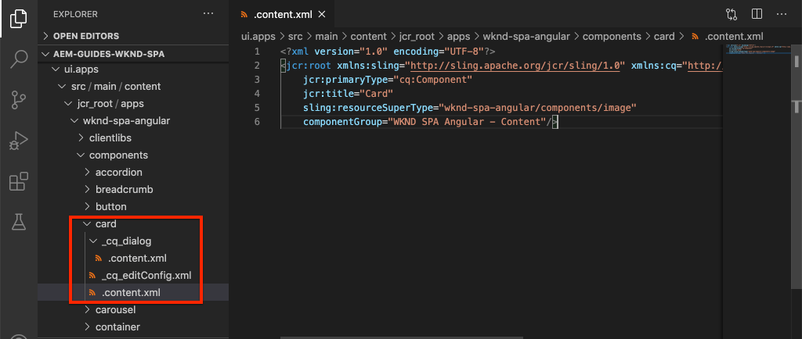

# 핵심 구성 요소 확장 {#extend-component}

AEM SPA Editor에서 사용할 기존 코어 구성 요소를 확장하는 방법을 알아봅니다. 기존 구성 요소를 확장하는 방법을 이해하는 것은 AEM SPA Editor 구현의 기능을 사용자 정의하고 확장하는 강력한 방법입니다.

## 목표

1. 추가 속성 및 컨텐츠로 기존 핵심 구성 요소를 확장합니다.
2. 를 사용하여 구성 요소 상속의 기본 사항을 파악합니다 `sling:resourceSuperType`.
3. Sling Models용 [위임 패턴을](https://github.com/adobe/aem-core-wcm-components/wiki/Delegation-Pattern-for-Sling-Models) 활용하여 기존 로직과 기능을 다시 사용하는 방법을 알아봅니다.

## 구축 내용

이 장에서 새 구성 `Card` 요소가 만들어집니다. 구성 요소 `Card` 는 SPA 내의 다른 컨텐츠에 대한 티저 역할을 수행하기 위해 제목 및 [클릭유도문안 버튼과 같은 추가 컨텐츠 필드를 추가하여](https://docs.adobe.com/content/help/ko-KR/experience-manager-core-components/using/components/image.html) 이미지 코어 구성 요소를 확장합니다.


>[!NOTE]
>
> 실제 구현에서는 Teaser 구성 요소를 [간단히 사용한 다음](https://docs.adobe.com/content/help/en/experience-manager-core-components/using/components/teaser.html) 이미지 코어 구성 [요소를 확장하여 프로젝트 요구 사항에 따라](https://docs.adobe.com/content/help/ko-KR/experience-manager-core-components/using/components/image.html) 구성 요소를 만드는 것이 `Card` 더 적절할 수 있습니다. 가능하면 항상 [핵심 구성 요소를](https://docs.adobe.com/content/help/ko-KR/experience-manager-core-components/using/introduction.html) 직접 사용하는 것이 좋습니다.

## 전제 조건

필요한 도구 및 [로컬 개발 환경 설정을 위한 지침을 검토하십시오](overview.md#local-dev-environment).

### 코드 가져오기

1. Git을 통해 이 자습서의 시작점을 다운로드하십시오.

   ```shell
   $ git clone git@github.com:adobe/aem-guides-wknd-spa.git
   $ cd aem-guides-wknd-spa
   $ git checkout Angular/extend-component-start
   ```

2. Maven을 사용하여 코드 베이스를 로컬 AEM 인스턴스에 배포합니다.

   ```shell
   $ mvn clean install -PautoInstallSinglePackage
   ```

   AEM [6.x를](overview.md#compatibility) 사용하는 경우 `classic` 프로필을 추가합니다.

   ```shell
   $ mvn clean install -PautoInstallSinglePackage -Pclassic
   ```

3. 기존 [WKND 참조 사이트에 필요한 완성된 패키지를 설치합니다](https://github.com/adobe/aem-guides-wknd/releases/latest). WKND 참조 사이트 [에서](https://github.com/adobe/aem-guides-wknd/releases/latest) 제공한 이미지는 WKND SPA에서 다시 사용됩니다. 이 패키지는 [AEM Package Manager를 사용하여 설치할 수 있습니다](http://localhost:4502/crx/packmgr/index.jsp).

   

항상 [GitHub에서](https://github.com/adobe/aem-guides-wknd-spa/tree/Angular/extend-component-solution) 완료된 코드를 보거나 분기로 전환하여 로컬로 코드를 체크 아웃할 수 `Angular/extend-component-solution`있습니다.

## Inspect 초기 카드 구현

초기 카드 구성 요소는 장 시작 코드로 제공되었습니다. 카드 구현의 시작점 Inspect

1. 선택한 IDE에서 `ui.apps` 모듈을 엽니다.
2. 파일을 `ui.apps/src/main/content/jcr_root/apps/wknd-spa-angular/components/card` 탐색하고 `.content.xml` 봅니다.

   

   ```xml
   <?xml version="1.0" encoding="UTF-8"?>
   <jcr:root xmlns:sling="http://sling.apache.org/jcr/sling/1.0" xmlns:cq="http://www.day.com/jcr/cq/1.0" xmlns:jcr="http://www.jcp.org/jcr/1.0"
       jcr:primaryType="cq:Component"
       jcr:title="Card"
       sling:resourceSuperType="wknd-spa-angular/components/image"
       componentGroup="WKND SPA Angular - Content"/>
   ```

   속성은 구성 요소가 WKND SPA 이미지 구성 요소의 모든 기능을 상속함을 `sling:resourceSuperType` 나타내는 `wknd-spa-angular/components/image` `Card` 것을 가리킵니다.

3. Inspect `ui.apps/src/main/content/jcr_root/apps/wknd-spa-angular/components/image/.content.xml`:

   ```xml
   <?xml version="1.0" encoding="UTF-8"?>
   <jcr:root xmlns:sling="http://sling.apache.org/jcr/sling/1.0" xmlns:cq="http://www.day.com/jcr/cq/1.0" xmlns:jcr="http://www.jcp.org/jcr/1.0"
       jcr:primaryType="cq:Component"
       jcr:title="Image"
       sling:resourceSuperType="core/wcm/components/image/v2/image"
       componentGroup="WKND SPA Angular - Content"/>
   ```

   요점이 `sling:resourceSuperType` 있습니다 `core/wcm/components/image/v2/image`. 이는 WKND SPA 이미지 구성 요소가 핵심 구성 요소 이미지의 모든 기능을 상속함을 나타냅니다.

   Sling 리소스 상속이라고도 하는 [프록시 패턴](https://docs.adobe.com/content/help/en/experience-manager-core-components/using/developing/guidelines.html#proxy-component-pattern) Sling 리소스 상속은 하위 구성 요소가 기능을 상속하고 원할 때 동작을 확장/무시할 수 있도록 해주는 강력한 디자인 패턴입니다. 슬링 상속은 여러 수준의 상속을 지원하므로, 궁극적으로 새로운 구성 요소는 핵심 구성 요소 이미지의 기능을 상속합니다. `Card`

   많은 개발 팀들은 D.R.Y.가 되려고 노력한다(반복하지 마라). 상속을 끊으면 AEM에서 가능합니다.

4. 폴더 아래에서 `card` 파일을 엽니다 `_cq_dialog/.content.xml`.

   이 파일은 구성 요소의 구성 요소 대화 상자 `Card` 정의입니다. Sling 상속을 사용하는 경우 Sling Resource Combination의 기능을 사용하여 대화 상자 [의](https://docs.adobe.com/content/help/en/experience-manager-65/developing/platform/sling-resource-merger.html) 부분을 대체하거나 확장할 수 있습니다. 이 샘플에서는 카드 구성 요소를 채우기 위해 작성자의 추가 데이터를 캡처하기 위해 대화 상자에 새 탭이 추가되었습니다.

   개발자가 새 탭 또는 양식 필드를 삽입할 위치를 선택할 수 있는 것과 같은 속성 `sling:orderBefore` . 이 경우 탭 `Text` 이 탭 앞에 `asset` 삽입됩니다. Sling Resource Combination을 최대한 사용하려면 [이미지 구성 요소 대화 상자의 원래 대화 상자 노드 구조를 알고 있어야 합니다](https://github.com/adobe/aem-core-wcm-components/blob/master/content/src/content/jcr_root/apps/core/wcm/components/image/v2/image/_cq_dialog/.content.xml).

5. 폴더 아래에서 `card` 파일을 엽니다 `_cq_editConfig.xml`. 이 파일은 AEM 작성 UI의 드래그 앤 드롭 동작을 나타냅니다. 이미지 구성 요소를 확장할 때는 리소스 유형이 구성 요소 자체와 일치해야 합니다. 노드를 `<parameters>` 검토합니다.

   ```xml
   <parameters
       jcr:primaryType="nt:unstructured"
       sling:resourceType="wknd-spa-angular/components/card"
       imageCrop=""
       imageMap=""
       imageRotate=""/>
   ```

   대부분의 구성 요소에는 다음이 필요하지 않지만 이미지 구성 요소의 이미지 및 하위 하위 하위 `cq:editConfig`요소는 예외입니다.

6. IDE에서 `ui.frontend` 모듈로 전환하여 `ui.frontend/src/app/components/card`:

   

7. 파일을 Inspect으로 `card.component.ts`전송합니다.

   표준 함수를 사용하여 AEM 구성 요소에 매핑하기 위해 구성 요소 `Card` 가 이미 `MapTo` 출력되었습니다.

   ```js
   MapTo('wknd-spa-angular/components/card')(CardComponent, CardEditConfig);
   ```

   클래스에 있는 세 개의 매개 변수 `@Input` 를 `src`검토하여 `alt``title`및 이러한 값은 Angular 구성 요소에 매핑될 AEM 구성 요소의 JSON 값이어야 합니다.

8. Open the file `card.component.html`:

   ```html
   <div class="card"  *ngIf="hasContent">
       <app-image class="card__image" [src]="src" [alt]="alt" [title]="title"></app-image>
   </div>
   ```

   이 예에서는 매개 변수를 전달하기만 하면 기존 각도 이미지 구성 요소 `app-image` 를 다시 사용할 수 `@Input` 있습니다 `card.component.ts`. 나중에 튜토리얼에서 추가 속성이 추가되고 표시됩니다.

## 템플릿 정책 업데이트

이 초기 `Card` 구현에서는 AEM SPA Editor의 기능을 검토합니다. 초기 구성 요소를 `Card` 보려면 템플릿 정책에 대한 업데이트가 필요합니다.

1. 아직 설치하지 않은 경우 시작 코드를 AEM의 로컬 인스턴스에 배포합니다.

   ```shell
   $ cd aem-guides-wknd-spa
   $ mvn clean install -PautoInstallSinglePackage
   ```

2. http://localhost:4502/editor.html/conf/wknd-spa-angular/settings/wcm/templates/spa-page-template/structure.html에서 SPA 페이지 템플릿으로 [이동합니다](http://localhost:4502/editor.html/conf/wknd-spa-angular/settings/wcm/templates/spa-page-template/structure.html).
3. 레이아웃 컨테이너의 정책을 업데이트하여 새 `Card` 구성 요소를 허용된 구성 요소로 추가합니다.

   

   정책에 대한 변경 사항을 저장하고 구성 요소를 허용된 구성 요소로 `Card` 확인합니다.

   

## 초기 카드 구성 요소 작성

그런 다음 AEM SPA Editor를 사용하여 `Card` 구성 요소를 작성합니다.

1. http://localhost:4502/editor.html/content/wknd-spa-angular/us/en/home.html으로 [이동합니다](http://localhost:4502/editor.html/content/wknd-spa-angular/us/en/home.html).
2. 모드 `Edit` 에서 구성 `Card` 요소를 다음 위치에 `Layout Container`추가합니다.

   

3. Drag and drop an image from the Asset finder onto the `Card` component:

   

4. 구성 `Card` 요소 대화 상자를 열고 **텍스트** 탭 추가를 확인합니다.
5. 텍스트 **탭** 에 다음 값을 입력합니다.

   

   **카드 경로** - SPA 홈 페이지 아래에서 페이지를 선택합니다.

   **CTA 텍스트** - &quot;자세히 보기&quot;

   **카드 제목** - 비워 둡니다.

   **연결된 페이지에서** 제목 가져오기 - 확인란을 선택하여 true로 지정합니다.

6. [ **자산 메타데이터** ] 탭을 업데이트하여 **대체 텍스트** 및 **캡션**&#x200B;값을추가합니다.

   현재 대화 상자를 업데이트한 후에는 추가 변경 사항이 표시되지 않습니다. 새 필드를 각도 구성 요소에 표시하려면 구성 요소에 대한 슬링 모델을 업데이트해야 `Card` 합니다.

7. 새 탭을 열고 CRXDE- [Lite로 이동합니다](http://localhost:4502/crx/de/index.jsp#/content/wknd-spa-angular/us/en/home/jcr%3Acontent/root/responsivegrid/card). 아래의 컨텐트 노드 `/content/wknd-spa-angular/us/en/home/jcr:content/root/responsivegrid` 를 Inspect으로 보내 `Card` 구성 요소 컨텐츠를 찾습니다.

   

   대화 상자 `cardPath`에 `ctaText`의해 속성이 `titleFromPage` 유지되는지 확인합니다.

## 카드 슬링 모델 업데이트

구성 요소 대화 상자의 값을 각 구성 요소에 표시하려면 구성 요소의 JSON을 채우는 슬링 모델을 업데이트해야 `Card` 합니다. Adobe는 다음 두 가지 비즈니스 로직을 구현할 수 있는 기회를 가지고 있습니다.

* true `titleFromPage` 로 **설정하면**, 지정된 페이지의 제목을 `cardPath` 반환하고, 그렇지 않으면 텍스트 `cardTitle` 필드의 값을 반환합니다.
* 에서 지정한 페이지의 마지막 수정 날짜를 반환합니다 `cardPath`.

원하는 IDE로 돌아가 `core` 모듈을 엽니다.

1. 에서 파일 `Card.java` 을 엽니다 `core/src/main/java/com/adobe/aem/guides/wknd/spa/angular/core/models/Card.java`.

   인터페이스가 현재 확장되어 `Card` 있으므로 `com.adobe.cq.wcm.core.components.models.Image` `Image` 인터페이스의 모든 방법을 상속합니다. 이 `Image` 인터페이스는 이미 `ComponentExporter` 인터페이스를 확장하여 Sling 모델을 JSON으로 내보내고 SPA 편집기로 매핑할 수 있습니다. 따라서 사용자 지정 구성 요소 장에서와 같이 `ComponentExporter` 인터페이스를 명시적으로 확장할 필요는 [없습니다](custom-component.md).

2. 인터페이스에 다음 메서드를 추가합니다.

   ```java
   @ProviderType
   public interface Card extends Image {
   
       /***
       * The URL to populate the CTA button as part of the card.
       * The link should be based on the cardPath property that points to a page.
       * @return String URL
       */
       public String getCtaLinkURL();
   
       /***
       * The text to display on the CTA button of the card.
       * @return String CTA text
       */
       public String getCtaText();
   
   
   
       /***
       * The date to be displayed as part of the card.
       * This is based on the last modified date of the page specified by the cardPath
       * @return
       */
       public Calendar getCardLastModified();
   
   
       /**
       * Return the title of the page specified by cardPath if `titleFromPage` is set to true.
       * Otherwise return the value of `cardTitle`
       * @return
       */
       public String getCardTitle();
   }
   ```

   이러한 메서드는 JSON 모델 API를 통해 노출되고 Angular 구성 요소로 전달됩니다.

3. 열기 `CardImpl.java`. 이것이 `Card.java` 인터페이스 구현입니다. 이 구현은 자습서를 가속화하기 위해 이미 부분적으로 시도되었습니다.  Sling Model Exporter를 통해 Sling Model `@Model` 을 JSON으로 직렬화할 수 있도록 및 `@Exporter` 주석을 사용하십시오.

   `CardImpl.java` 또한 Sling [Models용 위임 패턴을 사용하여](https://github.com/adobe/aem-core-wcm-components/wiki/Delegation-Pattern-for-Sling-Models) 이미지 코어 구성 요소의 모든 논리를 재작성하지 않습니다.

4. 다음 줄을 준수하십시오.

   ```java
   @Self
   @Via(type = ResourceSuperType.class)
   private Image image;
   ```

   위의 주석을 사용하면 구성 요소의 상속을 `image` 기반으로 이름이 지정된 이미지 개체를 인스턴스화할 수 `sling:resourceSuperType` `Card` 있습니다.

   ```java
   @Override
   public String getSrc() {
       return null != image ? image.getSrc() : null;
   }
   ```

   그런 다음 개체를 사용하여 논리를 직접 작성하지 않고도 인터페이스에 의해 정의된 `image` `Image` 메서드를 구현할 수 있습니다. 이 기술은 `getSrc()`및 `getAlt()` 에 사용됩니다 `getTitle()`.

5. 다음으로, 다음 값 `initModel()` 을 `cardPage` 기반으로 개인 변수를 시작하는 방법을 구현합니다. `cardPath`

   ```java
   @PostConstruct
   public void initModel() {
       if(StringUtils.isNotBlank(cardPath) && pageManager != null) {
           cardPage = pageManager.getPage(this.cardPath);
       }
   }
   ```

   Sling 모델 `@PostConstruct initModel()` 이 초기화되면 항상 Sling Model이 호출되므로 모델의 다른 메서드에서 사용할 수 있는 개체를 초기화할 수 있는 좋은 기회입니다. 이 `pageManager` 는 주석을 통해 [Sling Models에서 사용할 수 있도록 만들어진 많은 Java 지원 글로벌 개체](https://docs.adobe.com/content/help/en/experience-manager-htl/using/htl/global-objects.html#java-backed-objects) 중 `@ScriptVariable` 하나입니다. getPage [](https://docs.adobe.com/content/help/en/experience-manager-cloud-service/implementing/developing/ref/javadoc/com/day/cq/wcm/api/PageManager.html#getPage-java.lang.String-) 메서드는 경로를 가져와 경로가 올바른 페이지를 가리키지 않으면 AEM [Page](https://docs.adobe.com/content/help/en/experience-manager-cloud-service/implementing/developing/ref/javadoc/com/day/cq/wcm/api/Page.html) 개체나 null을 반환합니다.

   이렇게 하면 `cardPage` 변수가 초기화되며, 이 변수는 기본 연결된 페이지에 대한 데이터를 반환하는 다른 새 메서드에서 사용됩니다.

6. 작성 대화 상자를 저장한 JCR 속성에 이미 매핑된 전역 변수를 검토합니다. 주석을 `@ValueMapValue` 사용하여 매핑을 자동으로 수행합니다.

   ```java
   @ValueMapValue
   private String cardPath;
   
   @ValueMapValue
   private String ctaText;
   
   @ValueMapValue
   private boolean titleFromPage;
   
   @ValueMapValue
   private String cardTitle;
   ```

   이러한 변수는 `Card.java` 인터페이스에 대한 추가 메서드를 구현하는 데 사용됩니다.

7. 인터페이스에 정의된 추가 방법을 `Card.java` 구현합니다.

   ```java
   @Override
   public String getCtaLinkURL() {
       if(cardPage != null) {
           return cardPage.getPath() + ".html";
       }
       return null;
   }
   
   @Override
   public String getCtaText() {
       return ctaText;
   }
   
   @Override
   public Calendar getCardLastModified() {
      if(cardPage != null) {
          return cardPage.getLastModified();
      }
      return null;
   }
   
   @Override
   public String getCardTitle() {
       if(titleFromPage) {
           return cardPage != null ? cardPage.getTitle() : null;
       }
       return cardTitle;
   }
   ```

   >[!NOTE]
   >
   > 여기서 [완성된 CardImpl.java를 볼 수 있습니다](https://github.com/adobe/aem-guides-wknd-spa/blob/Angular/extend-component-solution/core/src/main/java/com/adobe/aem/guides/wknd/spa/angular/core/models/impl/CardImpl.java).

8. 터미널 창을 열고 디렉터리의 Maven 프로필을 사용하여 `core` 모듈에 대한 업데이트 `autoInstallBundle` 만 `core` 배포합니다.

   ```shell
   $ cd core/
   $ mvn clean install -PautoInstallBundle
   ```

   AEM [6.x를](overview.md#compatibility) 사용하는 경우 `classic` 프로필을 추가합니다.

9. 다음 위치에서 JSON 모델 응답을 봅니다. [http://localhost:4502/content/wknd-spa-angular/us/en.model.json](http://localhost:4502/content/wknd-spa-angular/us/en.model.json) and search for `wknd-spa-angular/components/card`:

   ```json
   "card": {
       "ctaText": "Read More",
       "cardTitle": "Page 1",
       "title": "Woman chillaxing with river views in Australian bushland",
       "src": "/content/wknd-spa-angular/us/en/home/_jcr_content/root/responsivegrid/card.coreimg.jpeg/1595190732886/adobestock-216674449.jpeg",
       "alt": "Female sitting on a large rock relaxing in afternoon dappled light the Australian bushland with views over the river",
       "cardLastModified": 1591360492414,
       "ctaLinkURL": "/content/wknd-spa-angular/us/en/home/page-1.html",
       ":type": "wknd-spa-angular/components/card"
   }
   ```

   JSON 모델은 Sling Model에서 메서드를 업데이트한 후 추가 키/값 쌍으로 `CardImpl` 업데이트됩니다.

## 각도 구성 요소 업데이트

이제 JSON 모델에 새로운 속성이 추가되어 `ctaLinkURL`, `ctaText`이러한 속성을 표시하도록 Angular 구성 요소 `cardTitle` 를 업데이트할 `cardLastModified` 수 있습니다.

1. IDE로 돌아가 `ui.frontend` 모듈을 엽니다. 원할 경우, 새 터미널 창에서 webpack 개발 서버를 시작하여 변경 사항을 실시간으로 확인합니다.

   ```shell
   $ cd ui.frontend
   $ npm install
   $ npm start
   ```

2. 에서 `card.component.ts` 엽니다 `ui.frontend/src/app/components/card/card.component.ts`. 새 모델을 캡처할 추가 `@Input` 주석을 추가합니다.

   ```diff
   export class CardComponent implements OnInit {
   
        @Input() src: string;
        @Input() alt: string;
        @Input() title: string;
   +    @Input() cardTitle: string;
   +    @Input() cardLastModified: number;
   +    @Input() ctaLinkURL: string;
   +    @Input() ctaText: string;
   ```

3. 클릭유도문안이 준비되었는지 확인하고 입력을 기반으로 날짜/시간 문자열을 반환하는 방법을 `cardLastModified` 추가합니다.

   ```js
   export class CardComponent implements OnInit {
       ...
       get hasCTA(): boolean {
           return this.ctaLinkURL && this.ctaLinkURL.trim().length > 0 && this.ctaText && this.ctaText.trim().length > 0;
       }
   
       get lastModifiedDate(): string {
           const lastModifiedDate = this.cardLastModified ? new Date(this.cardLastModified) : null;
   
           if (lastModifiedDate) {
           return lastModifiedDate.toLocaleDateString();
           }
           return null;
       }
       ...
   }
   ```

4. 제목 `card.component.html` 을 표시하고 다음 마크업을 추가하여 작업을 호출하고 마지막으로 수정한 날짜를 표시합니다.

   ```html
   <div class="card"  *ngIf="hasContent">
       <app-image class="card__image" [src]="src" [alt]="alt" [title]="title"></app-image>
       <div class="card__content">
           <h2 class="card__title">
               {{cardTitle}}
               <span class="card__lastmod" *ngIf="lastModifiedDate">{{lastModifiedDate}}</span>
           </h2>
           <div class="card__action-container" *ngIf="hasCTA">
               <a [routerLink]="ctaLinkURL" class="card__action-link" [title]="ctaText">
                   {{ctaText}}
               </a>
           </div>
       </div>
   </div>
   ```

   제목, 클릭 유도 문안 및 마지막 수정 날짜 `card.component.scss` 에 대한 스타일 지정 규칙이 이미 에 추가되었습니다.

   >[!NOTE]
   >
   > 완성된 Angular [Card 구성 요소 코드를 여기에서 볼 수 있습니다](https://github.com/adobe/aem-guides-wknd-spa/tree/Angular/extend-component-solution/ui.frontend/src/app/components/card).

5. Maven을 사용하여 프로젝트의 루트에서 AEM에 전체 변경 사항을 배포합니다.

   ```shell
   $ cd aem-guides-wknd-spa
   $ mvn clean install -PautoInstallSinglePackage
   ```

6. http://localhost:4502/editor.html/content/wknd-spa-angular/us/en/home.html [으로](http://localhost:4502/editor.html/content/wknd-spa-angular/us/en/home.html) 이동하여 업데이트된 구성 요소를 확인합니다.

   

7. 기존 컨텐츠를 재저작하여 다음과 유사한 페이지를 만들 수 있어야 합니다.

   

## 축하합니다! {#congratulations}

축하합니다. JSON 모델에서 Sling Models 및 대화 상자가 작동하는 방식과 함께 AEM 구성 요소를 확장하는 방법을 알아보았습니다.

항상 [GitHub에서](https://github.com/adobe/aem-guides-wknd-spa/tree/Angular/extend-component-solution) 완료된 코드를 보거나 분기로 전환하여 로컬로 코드를 체크 아웃할 수 `Angular/extend-component-solution`있습니다.
