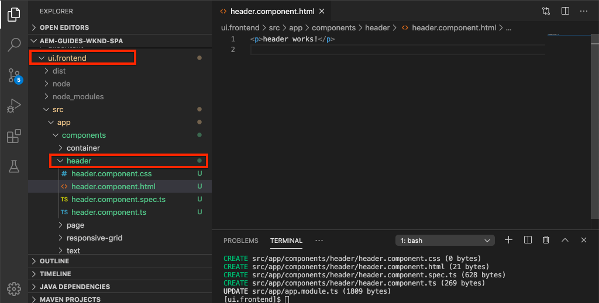

# SPA 통합 {#integrate-spa}

각도로 작성된 단일 페이지 애플리케이션(SPA)의 소스 코드를 Adobe Experience Manager(AEM) 프로젝트와 통합하는 방법을 알아봅니다. 웹 팩 개발 서버와 같은 최신 프런트 엔드 툴을 사용하여 AEM JSON 모델 API를 통해 SPA를 신속하게 개발하는 방법을 살펴볼 수 있습니다.

## 목표

1. SPA 프로젝트가 클라이언트측 라이브러리와 AEM과 통합된 방식을 살펴봅니다.
2. 전용 프런트 엔드 개발을 위해 로컬 개발 서버를 사용하는 방법을 알아봅니다.
3. AEM JSON 모델 API를 **통해** 개발할 수 있는 **프록시** 및 정적모의파일 사용

## 구축 내용

이 장은 SPA에 간단한 구성 `Header` 요소를 추가합니다. 이 정적 구성 요소를 작성하는 과정에서 AEM SPA 개발에 대한 몇 가지 접근 방식이 사용됩니다. `Header`


*정적 구성 요소를 추가하기 위해 SPA가 확장되었습니다.`Header`*

## 전제 조건

필요한 도구 및 [로컬 개발 환경 설정을 위한 지침을 검토하십시오](overview.md#local-dev-environment).

### 코드 가져오기

1. Git을 통해 이 자습서의 시작점을 다운로드하십시오.

   ```shell
   $ git clone git@github.com:adobe/aem-guides-wknd-spa.git
   $ cd aem-guides-wknd-spa
   $ git checkout Angular/integrate-spa-start
   ```

2. Maven을 사용하여 코드 베이스를 로컬 AEM 인스턴스에 배포합니다.

   ```shell
   $ mvn clean install -PautoInstallSinglePackage
   ```

   AEM [6.x를](overview.md#compatibility) 사용하는 경우 `classic` 프로필을 추가합니다.

   ```shell
   $ mvn clean install -PautoInstallSinglePackage -Pclassic
   ```

항상 [GitHub에서](https://github.com/adobe/aem-guides-wknd-spa/tree/Angular/integrate-spa-solution) 완료된 코드를 보거나 분기로 전환하여 로컬로 코드를 체크 아웃할 수 `Angular/integrate-spa-solution`있습니다.

## 통합 방법 {#integration-approach}

AEM 프로젝트의 일부로 두 개의 모듈이 만들어졌습니다. `ui.apps` 및 `ui.frontend`.

이 `ui.frontend` 모듈은 모든 [SPA 소스 코드를 포함하는 웹 팩](https://webpack.js.org/) 프로젝트입니다. 대부분의 SPA 개발 및 테스트는 웹 팩 프로젝트에서 수행됩니다. 프로덕션 빌드가 트리거되면 SPA가 웹팩을 사용하여 빌드되고 컴파일됩니다. 컴파일된 객체(CSS 및 Javascript)가 `ui.apps` 모듈로 복사되어 AEM 런타임에 배포됩니다.


*SPA 통합에 대해 자세히 설명합니다.*

프런트 엔드 빌드에 대한 추가 정보는 [여기에서 확인할 수 있습니다](https://docs.adobe.com/content/help/en/experience-manager-core-components/using/developing/archetype/uifrontend-angular.html).

## Inspect과 SPA 통합 {#inspect-spa-integration}

그런 다음 `ui.frontend` 모듈을 검사하여 [AEM Project 원형에서 자동으로 생성된 SPA를 파악합니다](https://docs.adobe.com/content/help/en/experience-manager-core-components/using/developing/archetype/uifrontend-angular.html).

1. 원하는 IDE에서 AEM Project for the WKND SPA를 엽니다. 이 자습서에서는 [Visual Studio 코드 IDE를 사용합니다](https://docs.adobe.com/content/help/en/experience-manager-learn/cloud-service/local-development-environment-set-up/development-tools.html#microsoft-visual-studio-code).

   

2. 폴더를 확장하고 `ui.frontend` 검사합니다. Open the file `ui.frontend/package.json`

3. 아래 `dependencies` 에 다음과 관련된 몇 가지가 표시됩니다 `@angular`.

   ```json
   "@angular/animations": "~9.1.11",
   "@angular/common": "~9.1.11",
   "@angular/compiler": "~9.1.11",
   "@angular/core": "~9.1.11",
   "@angular/forms": "~9.1.10",
   "@angular/platform-browser": "~9.1.10",
   "@angular/platform-browser-dynamic": "~9.1.10",
   "@angular/router": "~9.1.10",
   ```

   이 `ui.frontend` 모듈은 [라우팅을 포함하는 Angular CLI 도구](https://angular.io) 를 사용하여 생성된 [Angular 애플리케이션입니다](https://angular.io/cli) .

4. 다음과 같은 세 가지 종속성이 미리 수정되었습니다 `@adobe`.

   ```json
   "@adobe/cq-angular-editable-components": "^2.0.2",
   "@adobe/cq-spa-component-mapping": "^1.0.3",
   "@adobe/cq-spa-page-model-manager": "^1.1.3",
   ```

   위 모듈은 [AEM SPA Editor JS SDK를](https://docs.adobe.com/content/help/en/experience-manager-65/developing/headless/spas/spa-blueprint.html) 구성하고 SPA 구성 요소를 AEM 구성 요소에 매핑할 수 있도록 기능을 제공합니다.

5. 파일 `package.json` 에서 몇 `scripts` 가지가 정의됩니다.

   ```json
   "scripts": {
       "start": "ng serve --open --proxy-config ./proxy.conf.json",
       "build": "ng lint && ng build && clientlib",
       "build:production": "ng lint && ng build --prod && clientlib",
       "test": "ng test",
       "sync": "aemsync -d -w ../ui.apps/src/main/content"
   }
   ```

   이러한 스크립트는 일반적인 [Angular CLI 명령을](https://angular.io/cli/build) 기반으로 하지만 큰 AEM 프로젝트에서 작동하도록 약간 수정되었습니다.

   `start` - 로컬 웹 서버를 사용하여 로컬로 Angular 앱을 실행합니다. 로컬 AEM 인스턴스의 내용을 프록시하도록 업데이트되었습니다.

   `build` - 프로덕션 배포를 위한 Angular 앱을 컴파일합니다. 빌드 중 `&& clientlib` 에 컴파일된 SPA를 클라이언트 측 라이브러리로 모듈로 복사해야 `ui.apps` 합니다. npm 모듈 [aem-clientlib-generator](https://github.com/wcm-io-frontend/aem-clientlib-generator) 를 사용하여 이것을 활성화합니다.

   사용 가능한 스크립트에 대한 자세한 내용은 [여기에서 확인할 수 있습니다](https://docs.adobe.com/content/help/en/experience-manager-core-components/using/developing/archetype/uifrontend-angular.html).

6. 파일을 Inspect으로 `ui.frontend/clientlib.config.js`전송합니다. 이 구성 파일은 [aem-clientlib-generator](https://github.com/wcm-io-frontend/aem-clientlib-generator#clientlibconfigjs) 에서 클라이언트 라이브러리를 생성하는 방법을 결정하는 데 사용됩니다.

7. 파일을 Inspect으로 `ui.frontend/pom.xml`전송합니다. 이 파일은 `ui.frontend` 폴더를 [Maven 모듈로 변환합니다](http://maven.apache.org/guides/mini/guide-multiple-modules.html). Maven 빌드 동안 `pom.xml` 파일을 [frontend-maven-plugin](https://github.com/eirslett/frontend-maven-plugin) 으로 **테스트하고** SPA를 **빌드하도록** 업데이트했습니다.

8. Inspect의 파일 `app.component.ts` : `ui.frontend/src/app/app.component.ts`

   ```js
   import { Constants } from '@adobe/cq-angular-editable-components';
   import { ModelManager } from '@adobe/cq-spa-page-model-manager';
   import { Component } from '@angular/core';
   
   @Component({
   selector: '#spa-root', // tslint:disable-line
   styleUrls: ['./app.component.css'],
   templateUrl: './app.component.html'
   })
   export class AppComponent {
       ...
   
       constructor() {
           ModelManager.initialize().then(this.updateData);
       }
   
       private updateData = pageModel => {
           this.path = pageModel[Constants.PATH_PROP];
           this.items = pageModel[Constants.ITEMS_PROP];
           this.itemsOrder = pageModel[Constants.ITEMS_ORDER_PROP];
       }
   }
   ```

   `app.component.js` 는 SPA의 중심점입니다. `ModelManager` 는 AEM SPA Editor JS SDK에서 제공됩니다. JSON 컨텐츠는 애플리케이션에 호출하고 `pageModel` 주입해야 합니다.

## 헤더 구성 요소 추가 {#header-component}

그런 다음 SPA에 새 구성 요소를 추가하고 로컬 AEM 인스턴스에 변경 사항을 배포하여 통합을 확인합니다.

1. 새 터미널 창을 열고 `ui.frontend` 폴더로 이동합니다.

   ```shell
   $ cd aem-guides-wknd-spa/ui.frontend
   ```

2. Install [Angular CLI](https://angular.io/cli#installing-angular-cli) 전역 설치 이 단축키는 Angular 구성 요소를 생성하고 **ng** 명령을 통해 Angular 애플리케이션을 구축 및 제공하는 데 사용됩니다.

   ```shell
   $ npm install -g @angular/cli
   ```

   >[!CAUTION]
   >
   > 이 프로젝트에 사용되는 **@angular/cli** 버전은 **9.1.7입니다**. Angular CLI 버전을 동기화할 것을 권장합니다.

3. 폴더 내에서 Angular `Header` CLI `ng generate component` 명령을 실행하여 새 구성 요소를 `ui.frontend` 생성합니다.

   ```shell
   $ ng generate component components/header
   
   CREATE src/app/components/header/header.component.css (0 bytes)
   CREATE src/app/components/header/header.component.html (21 bytes)
   CREATE src/app/components/header/header.component.spec.ts (628 bytes)
   CREATE src/app/components/header/header.component.ts (269 bytes)
   UPDATE src/app/app.module.ts (1809 bytes)
   ```

   이렇게 하면 새 Angular Header 구성 요소의 뼈대가 만들어집니다 `ui.frontend/src/app/components/header`.

4. 원하는 IDE에서 `aem-guides-wknd-spa` 프로젝트를 엽니다. 폴더를 `ui.frontend/src/app/components/header` 탐색합니다.

   

5. 파일을 열고 내용 `header.component.html` 을 다음으로 바꿉니다.

   ```html
   <!--/* header.component.html */-->
   <header className="header">
       <div className="header-container">
           <h1>WKND</h1>
       </div>
   </header>
   ```

   정적 컨텐츠가 표시되므로 이 각도 구성 요소에서는 생성된 기본값에 대한 조정이 필요하지 않습니다 `header.component.ts`.

6. 에서 **app.component.html** 파일을 엽니다 `ui.frontend/src/app/app.component.html`. 다음을 `app-header`추가합니다.

   ```html
   <app-header></app-header>
   <router-outlet></router-outlet>
   ```

   모든 페이지 컨텐츠 위에 `header` 구성 요소가 포함됩니다.

7. 새 터미널을 열고 `ui.frontend` 폴더로 이동한 다음 명령을 `npm run build` 실행합니다.

   ```shell
   $ cd ui.frontend
   $ npm run build
   
   Linting "angular-app"...
   All files pass linting.
   Generating ES5 bundles for differential loading...
   ES5 bundle generation complete.
   ```

8. 폴더를 `ui.apps` 탐색합니다. 아래에 `ui.apps/src/main/content/jcr_root/apps/wknd-spa-angular/clientlibs/clientlib-angular` 는 컴파일된 SPA 파일이 폴더에서 복사되었음을`ui.frontend/build` 확인합니다.

   

9. 터미널로 돌아가 `ui.apps` 폴더로 이동합니다. 다음 마비안 명령을 실행합니다.

   ```shell
   $ cd ../ui.apps
   $ mvn clean install -PautoInstallPackage
   ...
   [INFO] ------------------------------------------------------------------------
   [INFO] BUILD SUCCESS
   [INFO] ------------------------------------------------------------------------
   [INFO] Total time:  9.629 s
   [INFO] Finished at: 2020-05-04T17:48:07-07:00
   [INFO] ------------------------------------------------------------------------
   ```

   이렇게 하면 `ui.apps` 패키지가 AEM의 로컬 실행 인스턴스에 배포됩니다.

10. 브라우저 탭을 열고 http://localhost:4502/editor.html/content/wknd-spa-angular/us/en/home.html으로 [이동합니다](http://localhost:4502/editor.html/content/wknd-spa-angular/us/en/home.html). 이제 SPA에 표시되는 `Header` 구성 요소의 컨텐츠를 볼 수 있습니다.

   

   단계 **7-9** 는 프로젝트의 루트에서 Maven 빌드를 트리거할 때 자동으로 `mvn clean install -PautoInstallSinglePackage`실행됩니다. 이제 SPA와 AEM 클라이언트측 라이브러리 간의 통합에 대한 기본 사항을 이해해야 합니다. AEM에서 구성 요소를 편집하고 추가할 수는 있지만 구성 요소는 편집할 수 `Text` `Header` 없습니다.

## 웹 팩 개발 서버 - JSON API 프록시 {#proxy-json}

이전 연습에서 보듯이 클라이언트 라이브러리를 작성하고 AEM의 로컬 인스턴스에 동기화하는 데는 몇 분이 소요됩니다. 최종 테스트 시 허용되지만 대부분의 SPA 개발 시 이상적인 조건은 아닙니다.

웹 [팩 개발 서버를](https://webpack.js.org/configuration/dev-server/) 사용하여 SPA를 신속하게 개발할 수 있습니다. SPA는 AEM에서 생성된 JSON 모델을 기반으로 합니다. 이 실습에서는 AEM의 실행 중인 인스턴스의 JSON 콘텐츠가 **Angular 프로젝트에 의해 구성된 개발 서버로** 프록시됩니다 [](https://angular.io/guide/build).

1. IDE로 돌아가 다음 위치에서 **proxy.conf.json** 파일을 엽니다 `ui.frontend/proxy.conf.json`.

   ```json
   [
       {
           "context": [
                       "/content/**/*.(jpg|jpeg|png|model.json)",
                       "/etc.clientlibs/**/*"
                   ],
           "target": "http://localhost:4502",
           "auth": "admin:admin",
           "logLevel": "debug"
       }
   ]
   ```

   Angular [App](https://angular.io/guide/build#proxying-to-a-backend-server) 은 API 요청을 프록시하는 간편한 메커니즘을 제공합니다. 에 지정된 패턴 `context` 은 로컬 AEM 빠른 시작 `localhost:4502`을 통해 프록시됩니다.

2. 다음 위치에서 **index.html** 파일을 엽니다 `ui.frontend/src/index.html`. 개발 서버에서 사용하는 루트 HTML 파일입니다.

   응모가 있습니다 `base href="/"`. 기본 [태그는](https://angular.io/guide/deployment#the-base-tag) 앱에서 상대 URL을 확인하는 데 매우 중요합니다.

   ```html
   <base href="/">
   ```

3. 터미널 창을 열고 `ui.frontend` 폴더로 이동합니다. 명령을 실행합니다 `npm start`.

   ```shell
   $ cd ui.frontend
   $ npm start
   
   > wknd-spa-angular@0.1.0 start /Users/dgordon/Documents/code/aem-guides-wknd-spa/ui.frontend
   > ng serve --open --proxy-config ./proxy.conf.json
   
   10% building 3/3 modules 0 active[HPM] Proxy created: [ '/content/**/*.(jpg|jpeg|png|model.json)', '/etc.clientlibs/**/*' ]  ->  http://localhost:4502
   [HPM] Subscribed to http-proxy events:  [ 'error', 'close' ]
   ℹ ｢wds｣: Project is running at http://localhost:4200/webpack-dev-server/
   ℹ ｢wds｣: webpack output is served from /
   ℹ ｢wds｣: 404s will fallback to //index.html
   ```

4. 새 브라우저 탭(아직 열지 않은 경우)을 열고 http://localhost:4200/content/wknd-spa-angular/us/en/home.html으로 [이동합니다](http://localhost:4200/content/wknd-spa-angular/us/en/home.html).

   

   AEM에서와 동일한 컨텐츠를 표시해야 하지만 작성 기능이 활성화되지 않은 경우 표시됩니다.

5. IDE로 돌아가 새 폴더 `img` 를 만듭니다 `ui.frontend/src/assets`.
6. 다음 WKND 로고를 다운로드하여 `img` 폴더에 추가합니다.

   

7. 에서 **header.component.html**`ui.frontend/src/app/components/header/header.component.html` 을 열고 로고를 포함합니다.

   ```html
   <header class="header">
       <div class="header-container">
           <div class="logo">
               
           </div>
       </div>
   </header>
   ```

   header.component.html에 변경 사항을 **저장합니다**.

8. 브라우저로 돌아갑니다. 반영된 앱 변경 사항을 즉시 확인할 수 있습니다.

   

   컨텐츠를 프록시하는 중이기 때문에 **AEM** 에서 컨텐츠를 계속 업데이트하고 **webpack 개발 서버에**&#x200B;반영된 내용을 볼 수 있습니다. 컨텐츠 변경 사항은 **웹팩 개발 서버에서만 볼 수 있습니다**.

9. 터미널에 있는 로컬 웹 서버 `ctrl+c` 를 중지합니다.

## 웹 팩 개발 서버 - Mock JSON API {#mock-json}

신속한 개발을 위한 또 다른 방법은 정적 JSON 파일을 사용하여 JSON 모델 역할을 하는 것입니다. JSON을 &quot;비웃음&quot;함으로써 우리는 로컬 AEM 인스턴스에 대한 의존성을 제거합니다. 또한 프런트 엔드 개발자는 기능을 테스트하고 나중에 백엔드 개발자가 구현할 JSON API의 변경 사항을 유도하기 위해 JSON 모델을 업데이트할 수 있습니다.

모의 JSON을 처음 설정하는 경우 로컬 AEM 인스턴스가 **필요합니다**.

1. 브라우저에서 http://localhost:4502/content/wknd-spa-angular/us/en.model.json으로 [이동합니다](http://localhost:4502/content/wknd-spa-angular/us/en.model.json).

   애플리케이션을 유도하는 AEM에서 내보낸 JSON입니다. JSON 출력을 복사합니다.

2. IDE로 돌아가 다음 폴더 구조와 일치하도록 `ui.frontend/src` android 및 **json** 이라는 새 폴더를 **추가하고** 추가합니다.

   ```plain
   |-- ui.frontend
       |-- src
           |-- mocks
               |-- json
   ```

3. 아래에 **en.model.json이라는 이름의** 새 파일을 만듭니다 `ui.frontend/public/mocks/json`. 1단계에서 JSON 출력 **을 여기에** 붙여넣습니다.

   

4. 아래에서 새 파일 **proxy.mock.conf.json** 을 만듭니다 `ui.frontend`. 다음 항목으로 파일을 채웁니다.

   ```json
   [
       {
       "context": [
           "/content/**/*.model.json"
       ],
       "pathRewrite": { "^/content/wknd-spa-angular/us" : "/mocks/json"} ,
       "target": "http://localhost:4200",
       "logLevel": "debug"
       }
   ]
   ```

   이 프록시 구성은 다음으로 시작하는 요청을 다시 작성하고 `/content/wknd-spa-angular/us` 해당 정적 JSON 파일 `/mocks/json` 을 제공합니다. 예:

   ```plain
   /content/wknd-spa-angular/us/en.model.json -> /mocks/json/en.model.json
   ```

5. angular.json 파일을 **엽니다**. 업데이트된 **자산** 배열이 있는 새 **개발** 구성을 추가하여 만든 **android** 폴더를 참조합니다.

   ```json
    "dev": {
             "assets": [
               "src/mocks",
               "src/assets",
               "src/favicon.ico",
               "src/logo192.png",
               "src/logo512.png",
               "src/manifest.json"
             ]
       },
   ```

   

   전용 **개발** 구성을 만들면 **조롱하** 는 폴더가 개발 중에만 사용되고 프로덕션 빌드에서 AEM에 배포되지 않습니다.

6. angular.json **파일에서 다음** 으로 browserTarget **구성을 업데이트하여 새** 개발 **구성을** 사용하십시오.

   ```diff
     ...
     "serve": {
         "builder": "@angular-devkit/build-angular:dev-server",
         "options": {
   +       "browserTarget": "angular-app:build:dev"
   -       "browserTarget": "angular-app:build"
         },
     ...
   ```

   

7. 파일을 열고 새 `ui.frontend/package.json` start:mock **명령을 추가하여** proxy.mock.json **** 파일을 참조합니다.

   ```diff
       "scripts": {
           "start": "ng serve --open --proxy-config ./proxy.conf.json",
   +       "start:mock": "ng serve --open --proxy-config ./proxy.mock.conf.json",
           "build": "ng lint && ng build && clientlib",
           "build:production": "ng lint && ng build --prod && clientlib",
           "test": "ng test",
           "sync": "aemsync -d -w ../ui.apps/src/main/content"
       }
   ```

   새 명령을 추가하면 프록시 구성 간을 손쉽게 전환할 수 있습니다.

8. 현재 실행 중인 경우 **웹 팩 개발 서버를 중지합니다**. **start:mock** 스크립트를 사용하여 웹 팩 개발 서버를 **** 시작합니다.

   ```shell
   $ npm run start:mock
   
   > wknd-spa-angular@0.1.0 start:mock /Users/dgordon/Documents/code/aem-guides-wknd-spa/ui.frontend
   > ng serve --open --proxy-config ./proxy.mock.conf.json
   ```

   http://localhost:4200/content/wknd-spa-angular/us/en/home.html [으로](http://localhost:4200/content/wknd-spa-angular/us/en/home.html) 이동하면 동일한 SPA가 표시되지만 **모의** JSON 파일에서 콘텐츠를 가져오는 중입니다.

9. 앞서 만든 **en.model.json** 파일을 약간 변경하십시오. 업데이트된 컨텐츠는 **웹팩 개발 서버에 즉시 반영되어야 합니다**.

   

   JSON 모델을 조작하고 라이브 SPA에서 효과를 확인할 수 있으므로 개발자는 JSON 모델 API를 이해하는 데 도움이 됩니다. 또한 프런트 엔드(front-end) 및 백 엔드(back-end) 개발이 동시에 이루어질 수 있습니다.

## Sass를 사용하여 스타일 추가

다음으로 업데이트된 일부 스타일이 프로젝트에 추가됩니다. 이 프로젝트는 변수 [와](https://sass-lang.com/) 같은 유용한 몇 가지 기능에 대한 Sass 지원을 추가합니다.

1. 터미널 창을 열고 시작 시 **웹 팩 개발 서버를** 중지합니다. 폴더 내부에서 `ui.frontend` 다음 명령을 입력하여 Angular 앱을 업데이트하여 **.scss** 파일을 처리합니다.

   ```shell
   $ cd ui.frontend
   $ ng config schematics.@schematics/angular:component.styleext scss
   ```

   이렇게 하면 파일 아래쪽에 새 `angular.json` 항목이 있는 파일이 업데이트됩니다.

   ```json
   "schematics": {
       "@schematics/angular:component": {
       "styleext": "scss"
       }
   }
   ```

2. 브라우저 `normalize-scss` 에서 스타일을 표준화하려면 설치합니다.

   ```shell
   $ npm install normalize-scss --save
   ```

3. IDE로 돌아가 아래 `ui.frontend/src` 에서 이름이 지정된 새 폴더를 만듭니다 `styles`.
4. 명명된 아래에 새 파일 `ui.frontend/src/styles` 을 만들고 다음 변수 `_variables.scss` 로 채웁니다.

   ```scss
   //_variables.scss
   
   //== Colors
   //
   //## Gray and brand colors for use across theme.
   
   $black:                  #202020;
   $gray:                   #696969;
   $gray-light:             #EBEBEB;
   $gray-lighter:           #F7F7F7;
   $white:                  #FFFFFF;
   $yellow:                 #FFEA00;
   $blue:                   #0045FF;
   
   
   //== Typography
   //
   //## Font, line-height, and color for body text, headings, and more.
   
   $font-family-sans-serif:  "Helvetica Neue", Helvetica, Arial, sans-serif;
   $font-family-serif:       Georgia, "Times New Roman", Times, serif;
   $font-family-base:        $font-family-sans-serif;
   $font-size-base:          18px;
   
   $line-height-base:        1.5;
   $line-height-computed:    floor(($font-size-base * $line-height-base));
   
   // Functional Colors
   $brand-primary:             $yellow;
   $body-bg:                   $white;
   $text-color:                $black;
   $text-color-inverse:        $gray-light;
   $link-color:                $blue;
   
   //Layout
   $max-width: 1024px;
   $header-height: 75px;
   
   // Spacing
   $gutter-padding: 12px;
   ```

5. 파일 **styles.css** 의 확장명을 styles.scss `ui.frontend/src/styles.css` 에 다시 **지정합니다**. 내용을 다음으로 바꿉니다.

   ```scss
   /* styles.scss * /
   
   /* Normalize */
   @import '~normalize-scss/sass/normalize';
   
   @import './styles/variables';
   
   body {
       background-color: $body-bg;
       font-family: $font-family-base;
       margin: 0;
       padding: 0;
       font-size: $font-size-base;
       text-align: left;
       color: $text-color;
       line-height: $line-height-base;
   }
   
   body.page {
       max-width: $max-width;
       margin: 0 auto;
       padding: $gutter-padding;
       padding-top: $header-height;
   }
   ```

6. styles.scss **를 사용하여 angular.json** 을 업데이트하고 **style.css** 에 대한 모든 참조의 이름을 **재지정합니다**. 3개의 추천서가 있어야 합니다.

   ```diff
     "styles": [
   -    "src/styles.css"
   +    "src/styles.scss"
      ],
   ```

## 헤더 스타일 업데이트

그런 다음 Sass를 사용하여 **헤더** 구성 요소에 몇 가지 브랜드별 스타일을 추가합니다.

1. 웹 **팩 개발 서버를** 시작하여 실시간으로 업데이트되는 스타일을 확인합니다.

   ```shell
   $ npm run start:mock
   ```

2. header.component.css `ui.frontend/src/app/components/header` 의 이름을 **header.component.scss로 다시** 지정합니다 ****. 다음 항목으로 파일을 채웁니다.

   ```scss
   @import "~src/styles/variables";
   
   .header {
       width: 100%;
       position: fixed;
       top: 0;
       left:0;
       z-index: 99;
       background-color: $brand-primary;
       box-shadow: 0px 0px 10px 0px rgba(0, 0, 0, 0.24);
   }
   
   .header-container {
       display: flex;
       max-width: $max-width;
       margin: 0 auto;
       padding-left: $gutter-padding;
       padding-right: $gutter-padding;
   }
   
   .logo {
       z-index: 100;
       display: flex;
       padding-top: $gutter-padding;
       padding-bottom: $gutter-padding;
   }
   
   .logo-img {
       width: 100px;
   }
   ```

3. 참조 **header.component.js** 를 **업데이트합니다**.

   ```diff
   ...
     @Component({
       selector: 'app-header',
       templateUrl: './header.component.html',
   -   styleUrls: ['./header.component.css']
   +   styleUrls: ['./header.component.scss']
     })
   ...
   ```

4. 브라우저 및 **웹팩 개발 서버로 돌아갑니다**.

   

   이제 업데이트된 스타일이 **머리글** 구성 요소에 추가되어 표시됩니다.

## AEM에 SPA 업데이트 배포

헤더에 대한 변경 사항 **은** 현재 **webpack 개발 서버에서만 볼 수 있습니다**. 업데이트된 SPA를 AEM에 배포하여 변경 사항을 확인합니다.

1. 웹 **팩 개발 서버를 중지합니다**.
2. Maven을 사용하여 프로젝트의 루트로 `/aem-guides-wknd-spa` 이동하고 프로젝트를 AEM에 배포합니다.

   ```shell
   $ cd ..
   $ mvn clean install -PautoInstallSinglePackage
   ```

3. http://localhost:4502/editor.html/content/wknd-spa-angular/us/en/home.html으로 [이동합니다](http://localhost:4502/editor.html/content/wknd-spa-angular/us/en/home.html). 로고와 스타일이 적용된 업데이트된 **헤더가** 표시됩니다.

   

   업데이트된 SPA가 AEM에 있으므로 저작을 계속할 수 있습니다.

## 축하합니다! {#congratulations}

축하합니다. SPA를 업데이트하고 AEM와의 통합을 검토하셨습니다! 이제 웹 **팩 개발 서버를 사용하여 AEM JSON 모델 API에 대해 SPA를 개발하는 두 가지 방법을 알고 있습니다**.

항상 [GitHub에서](https://github.com/adobe/aem-guides-wknd-spa/tree/Angular/integrate-spa-solution) 완료된 코드를 보거나 분기로 전환하여 로컬로 코드를 체크 아웃할 수 `Angular/integrate-spa-solution`있습니다.

### 다음 단계 {#next-steps}

[AEM 구성 요소에 SPA 구성 요소 매핑](map-components.md) - AEM SPA Editor JS SDK를 사용하여 각 구성 요소를 Adobe Experience Manager(AEM) 구성 요소에 매핑하는 방법을 알아봅니다. 구성 요소 매핑을 사용하면 기존 AEM 저작과 유사한 SPA 구성 요소를 AEM SPA Editor 내에서 동적으로 업데이트할 수 있습니다.
