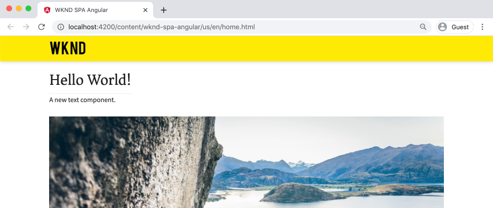
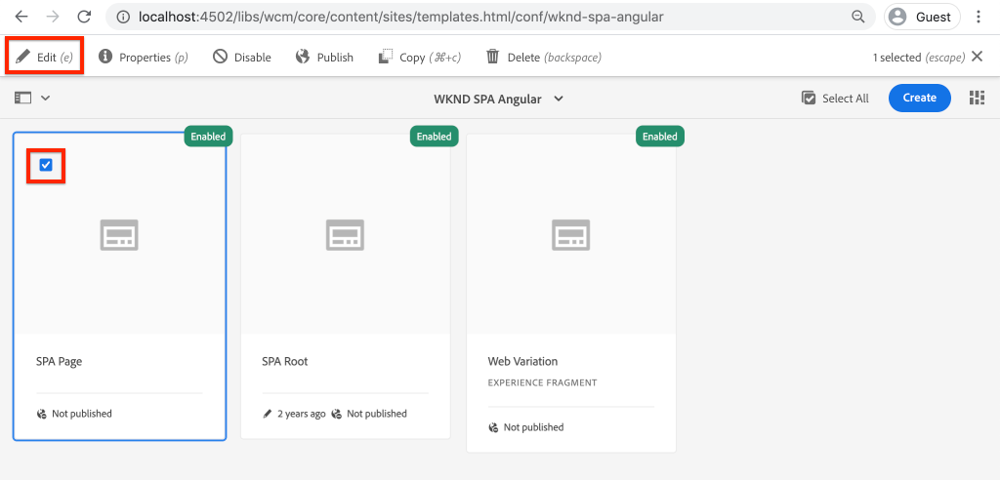

# AEM 구성 요소에 SPA 구성 요소 매핑 {#map-components}

AEM SPA Editor JS SDK를 사용하여 Angular 구성 요소를 Adobe Experience Manager(AEM) 구성 요소에 매핑하는 방법을 알아봅니다. 구성 요소 매핑을 사용하면 AEM SPA Editor 내에서 SPA 구성 요소를 동적으로 업데이트할 수 있습니다. 이는 일반적인 AEM 저작과 유사합니다.

이 장에서는 AEM JSON 모델 API에 대해 자세히 설명하고 AEM 구성 요소에 의해 노출된 JSON 컨텐츠를 Angular 구성 요소에 prop로 자동으로 주입하는 방법을 살펴봅니다.

## 목표

1. AEM 구성 요소를 SPA 구성 요소에 매핑하는 방법을 알아봅니다.
2. 컨테이너 구성 요소와 **컨텐츠** 구성 요소 간의 차이점을 **이해합니다** .
3. 기존 AEM 구성 요소에 매핑되는 새 각도 구성 요소를 만듭니다.

## 구축 내용

이 장에서는 제공된 `Text` SPA 구성 요소가 AEM 구성 요소에 매핑되는 방식을 `Text`검사합니다. SPA에서 사용할 수 있고 AEM에서 작성할 수 있는 새로운 SPA 구성 요소가 만들어집니다. `Image` 또한 레이아웃 컨테이너 **및** 템플릿 편집기 **** 정책의 기본 기능을 사용하여 모양에서 보다 다양한 보기를 만들 수 있습니다.


## 전제 조건

필요한 도구 및 [로컬 개발 환경 설정을 위한 지침을 검토하십시오](overview.md#local-dev-environment).

### 코드 가져오기

1. Git을 통해 이 자습서의 시작점을 다운로드하십시오.

   ```shell
   $ git clone git@github.com:adobe/aem-guides-wknd-spa.git
   $ cd aem-guides-wknd-spa
   $ git checkout Angular/map-components-start
   ```

2. Maven을 사용하여 코드 베이스를 로컬 AEM 인스턴스에 배포합니다.

   ```shell
   $ mvn clean install -PautoInstallSinglePackage
   ```

   AEM [6.x를](overview.md#compatibility) 사용하는 경우 `classic` 프로필을 추가합니다.

   ```shell
   $ mvn clean install -PautoInstallSinglePackage -Pclassic
   ```

항상 [GitHub에서](https://github.com/adobe/aem-guides-wknd-spa/tree/Angular/map-components-solution) 완료된 코드를 보거나 분기로 전환하여 로컬로 코드를 체크 아웃할 수 `Angular/map-components-solution`있습니다.

## 매핑 방법

기본 개념은 SPA 구성 요소를 AEM 구성 요소에 매핑하는 것입니다. AEM 구성 요소, 서버측 실행, JSON 모델 API의 일부로 컨텐츠 내보내기 JSON 콘텐츠는 브라우저에서 클라이언트 쪽을 실행하는 SPA에 의해 사용됩니다. SPA 구성 요소와 AEM 구성 요소 간의 1:1 매핑이 만들어집니다.


*AEM 구성 요소를 각 구성 요소에 매핑하는 고급 개요*

## 텍스트 구성 요소 Inspect

AEM [프로젝트 원형](https://github.com/adobe/aem-project-archetype) 유형은 AEM `Text` 텍스트 구성 요소에 매핑되는 구성 요소를 [제공합니다](https://docs.adobe.com/content/help/ko-KR/experience-manager-core-components/using/components/text.html). AEM에서 **컨텐츠** 를 렌더링하기 위한 컨텐츠 ** 구성 요소의 예입니다.

구성 요소의 작동 방식을 살펴보겠습니다.

### JSON 모델 Inspect

1. SPA 코드로 이동하기 전에 AEM에서 제공하는 JSON 모델을 이해하는 것이 중요합니다. 핵심 구성 요소 [라이브러리로](https://www.aemcomponents.dev/content/core-components-examples/library/page-authoring/text.html) 이동하고 텍스트 구성 요소의 페이지를 확인합니다. 코어 구성 요소 라이브러리는 모든 AEM 코어 구성 요소의 예를 제공합니다.
2. 다음 **중 하나에 대해 JSON** 탭을 선택합니다.

   

   다음 세 가지 속성이 표시됩니다. `text`, `richText`and `:type`.

   `:type` 는 AEM 구성 요소의 `sling:resourceType` (또는 경로)를 나열하는 예약된 속성입니다. 의 값 `:type` 은 AEM 구성 요소를 SPA 구성 요소에 매핑하는 데 사용됩니다.

   `text` 및 `richText` 는 SPA 구성 요소에 노출되는 추가 속성입니다.

### Inspect the Text component

1. 새 터미널을 열고 프로젝트 내의 `ui.frontend` 폴더로 이동합니다. 다음 `npm install` 을 `npm start` 실행하여 **webpack 개발 서버를 시작합니다**.

   ```shell
   $ cd ui.frontend
   $ npm run start:mock
   ```

   이 `ui.frontend` 모듈은 현재 [모의 JSON 모델을 사용하도록 설정되어 있습니다](./integrate-spa.md#mock-json).

2. http://localhost:4200/content/wknd-spa-angular/us/en/home.html에 새 브라우저 창이 열려 [있습니다.](http://localhost:4200/content/wknd-spa-angular/us/en/home.html)

   

3. 원하는 IDE에서 AEM Project for the WKND SPA를 엽니다. 모듈을 `ui.frontend` 확장하고 다음 아래의 **text.component.ts 파일을** 엽니다 `ui.frontend/src/app/components/text/text.component.ts`.

   

4. 검사할 첫 번째 영역은 ~line 35 `class TextComponent` 입니다.

   ```js
   export class TextComponent {
       @Input() richText: boolean;
       @Input() text: string;
       @Input() itemName: string;
   
       @HostBinding('innerHtml') get content() {
           return this.richText
           ? this.sanitizer.bypassSecurityTrustHtml(this.text)
           : this.text;
       }
       @HostBinding('attr.data-rte-editelement') editAttribute = true;
   
       constructor(private sanitizer: DomSanitizer) {}
   }
   ```

   [@Input()](https://angular.io/api/core/Input) 데코레이터는 값이 매핑된 JSON 개체를 통해 이전에 검토된 필드를 선언하는 데 사용됩니다.

   `@HostBinding('innerHtml') get content()` 은 작성한 텍스트 컨텐츠를 의 값에서 노출하는 메서드입니다 `this.text`. 컨텐츠가 풍부한 텍스트인 경우( `this.richText` 플래그로 판별됨) Angular의 내장 보안 기능이 무시됩니다. Angular의 [DomWidden은](https://angular.io/api/platform-browser/DomSanitizer) 원시 HTML을 &quot;스크러빙&quot;하고 크로스 사이트 스크립팅 취약점을 방지하는 데 사용됩니다. 이 메서드는 `innerHtml` @HostBinding [](https://angular.io/api/core/HostBinding) 장식자를 사용하여 속성에 바인딩됩니다.

5. Next inspect the `TextEditConfig` at ~line 24:

   ```js
   const TextEditConfig = {
       emptyLabel: 'Text',
       isEmpty: cqModel =>
           !cqModel || !cqModel.text || cqModel.text.trim().length < 1
   };
   ```

   위의 코드는 AEM 작성 환경에서 자리 표시자를 렌더링할 시기를 결정합니다. 메서드가 `isEmpty` true를 반환하면 **** 자리 표시자가 렌더링됩니다.

6. 마지막으로 ~line 53의 `MapTo` 호출을 살펴보십시오.

   ```js
   MapTo('wknd-spa-angular/components/text')(TextComponent, TextEditConfig );
   ```

   **MapTo는** AEM SPA Editor JS SDK(`@adobe/cq-angular-editable-components`)에서 제공합니다. 경로는 AEM 구성 요소 `wknd-spa-angular/components/text` `sling:resourceType` 의 경로를 나타냅니다. 이 경로는 앞서 본 JSON 모델에 `:type` 의해 노출된 경로와 일치합니다. **MapTo는** JSON 모델 응답을 구문 분석하고 올바른 값을 SPA 구성 요소의 `@Input()` 변수에 전달합니다.

   AEM 구성 요소 정의 `Text` 는 에서 찾을 수 있습니다 `ui.apps/src/main/content/jcr_root/apps/wknd-spa-angular/components/text`.

7. 에서 **en.model.json** 파일을 수정하여 다양하게 실험해 볼 수 있습니다 `ui.frontend/src/mocks/json/en.model.json`.

   At ~line 62 update the first `Text` value to use an **`H1`** and **`u`** tags:

   ```json
       "text": {
           "text": "<h1><u>Hello World!</u></h1>",
           "richText": true,
           ":type": "wknd-spa-angular/components/text"
       }
   ```

   웹 **팩 개발 서버에서 제공하는 효과를 보려면 브라우저로 돌아가십시오**.

   

   렌더링 논리가 제대로 작동하는지 확인하려면 `richText` true **/** false **간에 속성을** 전환해 보십시오.

8. Inspect **text.component.html** at `ui.frontend/src/app/components/text/text.component.html`.

   이 파일은 구성 요소의 전체 컨텐츠가 속성에 의해 설정되므로 `innerHTML` 비어 있습니다.

9. Inspect에서 **app.module.ts** 를 `ui.frontend/src/app/app.module.ts`사용합니다.

   ```js
   @NgModule({
   imports: [
       BrowserModule,
       SpaAngularEditableComponentsModule,
       AppRoutingModule
   ],
   providers: [ModelManagerService, { provide: APP_BASE_HREF, useValue: '/' }],
   declarations: [AppComponent, TextComponent, PageComponent, HeaderComponent],
   entryComponents: [TextComponent, PageComponent],
   bootstrap: [AppComponent]
   })
   export class AppModule {}
   ```

   TextComponent **는 명시적으로** 포함되지 않지만 AEM SPA Editor JS SDK에서 제공하는 **AEMResponsiveGridComponent** 를 통해 동적으로포함됩니다. 따라서 **app.module.ts의** entryComponents [배열에](https://angular.io/guide/entry-components) 나열되어야 합니다.

## 이미지 구성 요소 만들기

그런 다음 AEM `Image` 이미지 구성 요소 [](https://docs.adobe.com/content/help/ko-KR/experience-manager-core-components/using/components/image.html)에 매핑되는 각도 구성 요소를 만듭니다. 구성 요소 `Image` 는 **컨텐츠** 구성 요소의 또 다른 예입니다.

### JSON의 Inspect

SPA 코드로 이동하기 전에 AEM에서 제공하는 JSON 모델을 검사하십시오.

1. 핵심 구성 요소 라이브러리의 [이미지 예로 이동합니다](https://www.aemcomponents.dev/content/core-components-examples/library/page-authoring/image.html).

   

   SPA 구성 요소 `src`를 채우는 데, `alt`및 `title` 의 속성이 `Image` 사용됩니다.

   >[!NOTE]
   >
   > 개발자가 적응형 및 레이지 로드 구성 요소를 만들 수 있도록 하는 노출(`lazyEnabled`, `widths`) 이미지 속성이 있습니다. 이 자습서에 내장된 구성 요소는 간단하며 이러한 고급 속성을 **사용하지 않습니다** .

2. IDE로 돌아가 을 `en.model.json` 엽니다 `ui.frontend/src/mocks/json/en.model.json`. 이 구성 요소는 프로젝트의 순 새 구성 요소이므로 이미지 JSON을 &quot;모의&quot;해야 합니다.

   ~line 70에서 `image` 모델에 대한 JSON 항목을 추가(두 번째 뒤에 후행 쉼표 `,` 에 대해 잊지 `text_386303036`않음)하고 `:itemsOrder` 배열을 업데이트합니다.

   ```json
   ...
   ":items": {
               ...
               "text_386303036": {
                   "text": "<p>A new text component.</p>\r\n",
                   "richText": true,
                   ":type": "wknd-spa-angular/components/text"
                   },
               "image": {
                   "alt": "Rock Climber in New Zealand",
                   "title": "Rock Climber in New Zealand",
                   "src": "/mocks/images/adobestock-140634652.jpeg",
                   ":type": "wknd-spa-angular/components/image"
               }
           },
           ":itemsOrder": [
               "text",
               "text_386303036",
               "image"
           ],
   ```

   이 프로젝트에는 `/mock-content/adobestock-140634652.jpeg` webpack 개발자 서버 ****&#x200B;와 함께 사용할 샘플 이미지가 포함되어 있습니다.

   여기에서 전체 [en.model.json을 볼 수 있습니다](https://github.com/adobe/aem-guides-wknd-spa/blob/Angular/map-components-solution/ui.frontend/src/mocks/json/en.model.json).

3. 구성 요소에서 표시할 스톡 사진을 추가합니다.

   아래에 **images라는 새 폴더를** 만듭니다 `ui.frontend/src/mocks`. adobestock- [140634652.jpeg를](assets/map-components/adobestock-140634652.jpeg) 다운로드하여 새로 만든 **이미지** 폴더에 배치합니다. 원하는 경우 자신의 이미지를 자유롭게 사용할 수 있습니다.

### 이미지 구성 요소 구현

1. 시작하는 **경우 웹 팩 개발 서버를** 중지합니다.
2. 폴더 내에서 Angular CLI `ng generate component` 명령을 실행하여 새 이미지 구성 요소를 `ui.frontend` 만듭니다.

   ```shell
   $ ng generate component components/image
   ```

3. IDE에서 **image.component.ts를** 열고 `ui.frontend/src/app/components/image/image.component.ts` 다음과 같이 업데이트합니다.

   ```js
   import {Component, Input, OnInit} from '@angular/core';
   import {MapTo} from '@adobe/cq-angular-editable-components';
   
   const ImageEditConfig = {
   emptyLabel: 'Image',
   isEmpty: cqModel =>
       !cqModel || !cqModel.src || cqModel.src.trim().length < 1
   };
   
   @Component({
   selector: 'app-image',
   templateUrl: './image.component.html',
   styleUrls: ['./image.component.scss']
   })
   export class ImageComponent implements OnInit {
   
   @Input() src: string;
   @Input() alt: string;
   @Input() title: string;
   
   constructor() { }
   
   get hasImage() {
       return this.src && this.src.trim().length > 0;
   }
   
   ngOnInit() { }
   }
   
   MapTo('wknd-spa-angular/components/image')(ImageComponent, ImageEditConfig);
   ```

   `ImageEditConfig` 는 속성이 채워지는지 여부를 기반으로 AEM에서 작성자 자리 표시자를 렌더링할지 여부를 결정하기 위한 `src` 구성입니다.

   `@Input()` of `src`, `alt`and `title` are the properties mapped from the JSON API.

   `hasImage()` 는 이미지를 렌더링해야 하는지 여부를 결정하는 방법입니다.

   `MapTo` 은 SPA 구성 요소를 의 AEM 구성 요소에 매핑합니다 `ui.apps/src/main/content/jcr_root/apps/wknd-spa-angular/components/image`.

4. image. **component.html** 을 열고 다음과 같이 업데이트합니다.

   ```html
   <ng-container *ngIf="hasImage">
       
   </ng-container>
   ```

   true를 반환하면 `` 요소가 `hasImage` 렌더링됩니다 ****.

5. image.component.scss를 열고 **** 다음과 같이 업데이트합니다.

   ```scss
   :host-context {
       display: block;
   }
   
   .image {
       margin: 1rem 0;
       width: 100%;
       border: 0;
   }
   ```

   >[!NOTE]
   >
   > AEM SPA `:host-context` 편집기 자리 표시자가 **올바르게 작동하려면 이 규칙이** 매우 중요합니다. AEM 페이지 편집기에서 작성하려는 모든 SPA 구성 요소에는 이 규칙이 최소 필요합니다.

6. 다음 `app.module.ts` 을 열고 배열 `ImageComponent` 에 `entryComponents` 추가합니다.

   ```js
   entryComponents: [TextComponent, PageComponent, ImageComponent],
   ```

   와 `TextComponent`같이, `ImageComponent` 는 동적으로 로드되며 `entryComponents` 배열에 포함되어야 합니다.

7. 웹 **팩 개발 서버를** 시작하여 렌더링을 `ImageComponent` 확인합니다.

   ```shell
   $ npm run start:mock
   ```

   

   *SPA에 이미지 추가*

   >[!NOTE]
   >
   > **보너스 당면 과제**:이미지 아래에 캡션으로 값을 표시하는 새 방법 `title` 을 구현합니다.

## AEM에서 정책 업데이트

구성 요소 `ImageComponent` 는 **웹 팩 개발 서버에서만 볼 수 있습니다**. 다음으로 업데이트된 SPA를 AEM에 배포하고 템플릿 정책을 업데이트합니다.

1. 웹 **팩 개발 서버** 및 프로젝트의 **루트에서** Maven 기술을 사용하여 변경 사항을 AEM에 배포합니다.

   ```shell
   $ cd aem-guides-wknd-spa
   $ mvn clean install -PautoInstallSinglePackage
   ```

2. AEM 시작 화면에서 **[!UICONTROL 도구]** > 템플릿 **[!UICONTROL > WKND SPA 각도]** 로 **[이동합니다](http://localhost:4502/libs/wcm/core/content/sites/templates.html/conf/wknd-spa-angular)**.

   SPA 페이지를 **선택하고 편집합니다**.

   

3. [ **레이아웃 컨테이너** ]를 선택하고 정책 **아이콘을 클릭하여 정책을** 편집합니다.

   

4. 허용된 **구성 요소** > **WKND SPA 각도** - 컨텐츠 **>** 이미지구성 요소를 선택합니다.

   

   기본 **구성 요소** > 매핑 **** 추가 **아래에서** 이미지 - WKND SPA 각도 - 컨텐츠구성 요소를 선택합니다.

   

   MIME **형식을** 입력합니다 `image/*`.

   완료를 **클릭하여** 정책 업데이트를 저장합니다.

5. 레이아웃 **컨테이너** 에서 **텍스트** 구성 요소의 **정책** 아이콘을클릭합니다.

   

   WKND **SPA Text라는 새 정책을 만듭니다**. 추가 서식 **옵션을 활성화하려면 플러그인** > **서식** > 모든 상자를 선택합니다.

   

   [ **플러그인** ] > [ **단락 스타일** ] > 확인란을 선택하여 **단락 스타일**&#x200B;활성화:

   

   완료를 **클릭하여** 정책 업데이트를 저장합니다.

6. 홈 페이지 **http://localhost:4502/editor.html/content/wknd-spa-angular/us/en/home.html** 으로 [이동합니다](http://localhost:4502/editor.html/content/wknd-spa-angular/us/en/home.html).

   또한 구성 요소를 편집하고 `Text` 전체 화면 **** 모드에서 추가 단락 스타일을 추가할 수도 있습니다.

   

7. 자산 파인더에서 이미지를 끌어 놓아도 **됩니다**.

   

8. 표준 WKND 참조 사이트 [를 위한 완성된 코드 베이스를](http://localhost:4502/assets.html/content/dam) AEM Assets [를 통해](https://github.com/adobe/aem-guides-wknd/releases/latest)직접 이미지를 추가하거나 WKND [참조 사이트에는](https://github.com/adobe/aem-guides-wknd/releases/latest) WKND SPA에서 다시 사용할 수 있는 많은 이미지가 포함되어 있습니다. 이 패키지는 [AEM Package Manager를 사용하여 설치할 수 있습니다](http://localhost:4502/crx/packmgr/index.jsp).

   

## Inspect 레이아웃 컨테이너

레이아웃 **컨테이너에** 대한 지원은 AEM SPA Editor SDK에서 자동으로 제공됩니다. 이름으로 표시된 **레이아웃**&#x200B;컨테이너는 **컨테이너** 구성 요소입니다. 컨테이너 구성 요소는 *다른* 구성 요소를 나타내며 동적으로 인스턴스화하는 JSON 구조를 받아들이는 구성 요소입니다.

레이아웃 컨테이너를 더 살펴봅시다.

1. IDE에서 다음 위치에 **responsive-grid.component.ts** 를 엽니다 `ui.frontend/src/app/components/responsive-grid`.

   ```js
   import { AEMResponsiveGridComponent,MapTo } from '@adobe/cq-angular-editable-components';
   
   MapTo('wcm/foundation/components/responsivegrid')(AEMResponsiveGridComponent);
   ```

   AEM SPA `AEMResponsiveGridComponent` Editor SDK의 일부로 구현되며 을 통해 프로젝트에 포함됩니다 `import-components`.

2. 브라우저에서 http://localhost:4502/content/wknd-spa-angular/us/en.model.json으로 [이동합니다.](http://localhost:4502/content/wknd-spa-angular/us/en.model.json)

   

   레이아웃 **컨테이너** 구성 `sling:resourceType` 요소 `wcm/foundation/components/responsivegrid` 는 구성 요소 `:type` 와 같이 속성 `Text` 을 사용하여 SPA 편집기에서 인식됩니다 `Image` .

   레이아웃 모드를 사용하여 구성 요소 크기를 다시 [조정하는 것과 동일한 기능을 SPA](https://docs.adobe.com/content/help/en/experience-manager-65/authoring/siteandpage/responsive-layout.html#defining-layouts-layout-mode) 편집기에서 사용할 수 있습니다.

3. http://localhost:4502/editor.html/content/wknd-spa-angular/us/en/home.html으로 [돌아갑니다](http://localhost:4502/editor.html/content/wknd-spa-angular/us/en/home.html). 추가 **이미지** 구성 요소를 추가하고 레이아웃 **옵션을 사용하여 크기를 다시** 조정해보십시오.

   

4. JSON 모델 http://localhost:4502/content/wknd-spa-angular/us/en.model.json [를](http://localhost:4502/content/wknd-spa-angular/us/en.model.json) 다시 열고 JSON의 `columnClassNames` 일부로 다음을 관찰합니다.

   

   클래스 이름 `aem-GridColumn--default--4` 은 구성 요소가 12개의 열 격자를 기준으로 4개의 열 너비여야 함을 나타냅니다. 응답형 [격자에 대한 자세한 내용은 여기를 참조하십시오](https://adobe-marketing-cloud.github.io/aem-responsivegrid/).

5. IDE로 돌아가고 `ui.apps` 모듈에 에 정의된 클라이언트측 라이브러리가 있습니다 `ui.apps/src/main/content/jcr_root/apps/wknd-spa-angular/clientlibs/clientlib-grid`. Open the file `less/grid.less`.

   이 파일은 레이아웃 컨테이너`default`에 사용되는 중단점( `tablet`및 `phone`)을 **결정합니다**. 이 파일은 프로젝트 사양에 따라 사용자 정의될 예정입니다. 현재 중단점은 `1200px` 및 으로 설정됩니다 `650px`.

6. 다음과 같은 뷰를 작성하려면 구성 요소의 응답형 기능과 업데이트된 리치 텍스트 정책을 사용할 수 있어야 합니다. `Text`

   

## 축하합니다! {#congratulations}

축하합니다. SPA 구성 요소를 AEM Components에 매핑하는 방법을 배웠고 새 구성 요소를 구현했습니다 `Image` . 또한 **레이아웃 컨테이너의 응답형 기능을 살펴볼 수 있습니다**.

항상 [GitHub에서](https://github.com/adobe/aem-guides-wknd-spa/tree/Angular/map-components-solution) 완료된 코드를 보거나 분기로 전환하여 로컬로 코드를 체크 아웃할 수 `Angular/map-components-solution`있습니다.

### 다음 단계 {#next-steps}

[탐색 및 라우팅](navigation-routing.md) - SPA Editor SDK를 사용하여 AEM 페이지에 매핑하여 SPA에서 여러 뷰를 지원하는 방법을 살펴볼 수 있습니다. 동적 탐색은 각도 라우터를 사용하여 구현되고 기존 헤더 구성 요소에 추가됩니다.

## 보너스 - 소스 제어에 구성 유지 {#bonus}

대부분의 경우, 특히 AEM 프로젝트를 시작할 때는 템플릿 및 관련 컨텐츠 정책과 같은 구성을 소스 제어에 유지하는 것이 중요합니다. 따라서 모든 개발자는 동일한 컨텐츠 및 구성 세트에 대해 작업할 수 있고 환경 간에 추가적인 일관성을 유지할 수 있습니다. 프로젝트가 특정 성숙도에 도달하면 템플릿 관리 방식을 고급 사용자 그룹으로 전환할 수 있습니다.

다음 몇 단계는 Visual Studio 코드 IDE와 [VSCode AEM Sync](https://marketplace.visualstudio.com/items?itemName=yamato-ltd.vscode-aem-sync) 를 사용하여 발생하지만 AEM의 로컬 인스턴스에서 컨텐츠를 **가져오거나** 가져오도록 **** 구성한 모든 도구 및 IDE를 사용하여 수행할수 있습니다.

1. Visual Studio 코드 IDE에서 Marketplace 확장을 통해 **VSCode AEM Sync** 를 설치했는지 확인합니다.

   

2. 프로젝트 탐색기에서 **ui.content** 모듈을 확장하고 탐색합니다 `/conf/wknd-spa-angular/settings/wcm/templates`.

3. **폴더를 마우스 오른쪽 단추로 클릭하고** AEM 서버에서 `templates` 가져오기를 선택합니다 ****.

   

4. 컨텐츠를 가져오는 단계를 반복하지만 에 있는 **정책** 폴더를 선택합니다 `/conf/wknd-spa-angular/settings/wcm/templates/policies`.

5. Inspect에 있는 `filter.xml` 파일 `ui.content/src/main/content/META-INF/vault/filter.xml`.

   ```xml
   <!--ui.content filter.xml-->
   <?xml version="1.0" encoding="UTF-8"?>
    <workspaceFilter version="1.0">
        <filter root="/conf/wknd-spa-angular" mode="merge"/>
        <filter root="/content/wknd-spa-angular" mode="merge"/>
        <filter root="/content/dam/wknd-spa-angular" mode="merge"/>
        <filter root="/content/experience-fragments/wknd-spa-angular" mode="merge"/>
    </workspaceFilter>
   ```

   이 `filter.xml` 파일은 패키지와 함께 설치할 노드의 경로를 식별합니다. 기존 컨텐츠가 수정되지 않고 새 컨텐츠만 추가된다는 것을 나타내는 각 필터 `mode="merge"` 에 표시됩니다. 컨텐츠 작성자는 이러한 경로를 업데이트하고 있으므로 코드 배포가 컨텐츠를 덮어쓰지 **않는** 것이 중요합니다. 필터 요소 [작업에 대한 자세한 내용은 FileVault 설명서를](https://jackrabbit.apache.org/filevault/filter.html) 참조하십시오.

   각 모듈 `ui.content/src/main/content/META-INF/vault/filter.xml` 에 의해 관리되는 서로 다른 노드를 비교하고 `ui.apps/src/main/content/META-INF/vault/filter.xml` 파악합니다.
