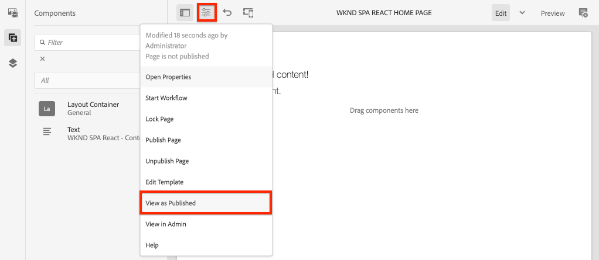

# SPA 편집기 프로젝트 {#spa-editor-project}

AEM SPA 편집기와 통합된 Reimate 애플리케이션을 위한 시작점으로 Adobe Experience Manager(AEM) Maven 프로젝트를 사용하는 방법을 살펴볼 수 있습니다.

## 목표

1. Maven 원형에서 구축한 새로운 AEM SPA Editor 프로젝트의 구조를 살펴봅니다.
2. 시작 프로젝트를 AEM의 로컬 인스턴스에 배포합니다.

## 구축 내용

이 장에서는 AEM 프로젝트 [원형형을 기반으로 새로운 AEM 프로젝트가 배포됩니다](https://github.com/adobe/aem-project-archetype). AEM 프로젝트는 매우 간단한 Responsive SPA의 시작점으로 부트스트윗될 것입니다. 이 장에서 사용된 프로젝트는 WKND SPA를 구현하는 기반이 될 것이며, 향후 장에 세워질 예정입니다.


*WKND SPA에 대한 사이트 계층 시작*

## 전제 조건

필요한 도구 및 [로컬 개발 환경 설정을 위한 지침을 검토하십시오](overview.md#local-dev-environment). 작성 **** 모드에서 시작된 새로운 Adobe Experience Manager 인스턴스가 로컬에서 실행되고 있는지 확인합니다.

## 프로젝트 다운로드

AEM용 Maven 다중 모듈 프로젝트를 만드는 몇 가지 옵션이 있습니다. 이 자습서에서는 자습서 코드의 기초로 최신 [AEM 프로젝트](https://github.com/adobe/aem-project-archetype) 원형을 사용했습니다. 여러 버전의 AEM을 지원하기 위해 프로젝트 코드를 수정했습니다. 이전 버전과의 호환성 [에 대한 참고 사항을 검토하십시오](overview.md#compatibility).

>[!CAUTION]
>
> 실제 구현에 필요한 새로운 프로젝트를 **만들기 위해** 최신 [버전의](https://github.com/adobe/aem-project-archetype) 원형버전을 사용하는 것이 좋습니다. AEM 프로젝트는 원형의 속성을 사용하여 AEM의 단일 버전 `aemVersion` 을 대상으로 해야 합니다.

1. Git을 통해 이 자습서의 시작점을 다운로드하십시오.

   ```shell
   $ git clone git@github.com:adobe/aem-guides-wknd-spa.git
   $ cd aem-guides-wknd-spa
   $ git checkout React/create-project-start
   ```

2. 다음 폴더 및 파일 구조는 로컬 파일 시스템의 Maven 원형에서 생성된 AEM 프로젝트를 나타냅니다.

   ```plain
   |--- aem-guides-wknd-spa
       |--- all/
       |--- core/
       |--- dispatcher/
       |--- ui.apps/
       |--- ui.apps.structure/
       |--- ui.content/
       |--- ui.frontend /
       |--- it.tests/
       |--- pom.xml
       |--- README.md
       |--- .gitignore
       |--- archetype.properties
   ```

3. 다음 속성은 [AEM Project 원형에서 AEM 프로젝트를 생성할 때 사용되었습니다](https://github.com/Adobe-Marketing-Cloud/aem-project-archetype/releases/tag/aem-project-archetype-14).

   | 속성 | 값 |
   |-----------------|-------------------------------------|
   | aemVersion | 구름 |
   | appTitle | WKND SPA 반응 |
   | appId | 복식 |
   | groupId | com.adobe.aem.guides |
   | frontendModule | 반응 |
   | 패키지 | com.adobe.aem.guides.wknd.spa.react |
   | includeExamples | n |

   >[!NOTE]
   >
   > 속성을 `frontendModule=react` 확인합니다. 이를 통해 AEM 프로젝트 원형에서는 AEM SPA 편집기와 함께 사용할 시작 [반응 코드 베이스로](https://docs.adobe.com/content/help/en/experience-manager-core-components/using/developing/archetype/uifrontend-react.html) 프로젝트를 부트스트래핑할 수 있습니다.

## 프로젝트 빌드

그런 다음 Maven을 사용하여 프로젝트 코드를 컴파일하고 작성하고 AEM의 로컬 인스턴스에 배포합니다.

1. AEM 인스턴스가 포트 **4502에서 로컬로 실행되고 있는지 확인합니다**.
2. 명령줄 터미널에서 Maven이 설치되어 있는지 확인합니다.

   ```shell
   $ mvn --version
    Apache Maven 3.6.2
    Maven home: /Library/apache-maven-3.6.2
    Java version: 11.0.4, vendor: Oracle Corporation, runtime: /Library/Java/JavaVirtualMachines/jdk-11.0.4.jdk/Contents/Home
   ```

3. 디렉토리에서 아래 Maven 명령을 실행하여 프로젝트를 빌드하고 AEM에 배포합니다. `aem-guides-wknd-spa`

   ```shell
   $ mvn clean install -PautoInstallSinglePackage
   ```

   AEM [6.x를 사용하는 경우](overview.md#compatibility):

   ```shell
   $ mvn clean install -PautoInstallSinglePackage -Pclassic
   ```

   프로젝트의 여러 모듈을 컴파일하고 AEM에 배포해야 합니다.

   ```plain
    [INFO] ------------------------------------------------------------------------
    [INFO] Reactor Summary for wknd-spa-react 1.0.0-SNAPSHOT:
    [INFO] 
    [INFO] wknd-spa-react ..................................... SUCCESS [  0.523 s]
    [INFO] WKND SPA React - Core .............................. SUCCESS [  8.069 s]
    [INFO] wknd-spa-react.ui.frontend - UI Frontend ........... SUCCESS [01:23 min]
    [INFO] WKND SPA React - Repository Structure Package ...... SUCCESS [  0.830 s]
    [INFO] WKND SPA React - UI apps ........................... SUCCESS [  4.654 s]
    [INFO] WKND SPA React - UI content ........................ SUCCESS [  1.607 s]
    [INFO] WKND SPA React - All ............................... SUCCESS [  0.384 s]
    [INFO] WKND SPA React - Integration Tests Bundles ......... SUCCESS [  0.770 s]
    [INFO] WKND SPA React - Integration Tests Launcher ........ SUCCESS [  1.407 s]
    [INFO] WKND SPA React - Dispatcher ........................ SUCCESS [  0.055 s]
    [INFO] ------------------------------------------------------------------------
    [INFO] BUILD SUCCESS
    [INFO] ------------------------------------------------------------------------
    [INFO] Total time:  01:44 min
   ```

   Maven 프로필 ***autoInstallSinglePackage는*** 프로젝트의 개별 모듈을 컴파일하고 단일 패키지를 AEM 인스턴스에 배포합니다. 기본적으로 이 패키지는 포트 **4502에서 로컬로 실행 중인 AEM 인스턴스와** admin:admin의 자격 증명으로 배포됩니다 ****.

4. 로컬 AEM **[!UICONTROL 인스턴스에서]** 패키지 관리자로 이동합니다. [http://localhost:4502/crx/packmgr/index.jsp](http://localhost:4502/crx/packmgr/index.jsp).

5. 3개의 패키지 `wknd-spa-react.all`가 `wknd-spa-react.ui.apps` 있고 `wknd-spa-react.ui.content`,

   

   *AEM 패키지 관리자*

   프로젝트에 필요한 모든 사용자 지정 코드는 이러한 패키지에 번들로 제공되어 AEM 런타임에 설치됩니다.

6. 또한 `spa.project.core` 및 `core.wcm.components`에 대해 여러 개의 패키지가 표시됩니다. 이러한 종속성은 원형 유형에 의해 자동으로 포함됩니다. AEM 코어 구성 요소에 대한 자세한 내용은 [여기에서 확인할 수 있습니다](https://docs.adobe.com/content/help/ko-KR/experience-manager-core-components/using/introduction.html).

   `spa.project.core` 는 SPA 편집기가 기대하는 JSON 모델 API를 생성하는 데 필요한 종속성이 필요합니다.

## 컨텐츠 작성

그 다음 원형에서 생성된 시작 SPA를 열고 일부 컨텐츠를 업데이트합니다.

1. 사이트 **[!UICONTROL 콘솔로]** 이동합니다. [http://localhost:4502/sites.html/content](http://localhost:4502/sites.html/content).

   WKND SPA에는 국가, 언어 및 홈 페이지가 있는 기본 사이트 구조가 포함되어 있습니다. 이 계층은 `language_country` 및에 대한 원형의 기본값을 기반으로 합니다 `isSingleCountryWebsite`. 이러한 값은 프로젝트를 생성할 때 [사용 가능한 속성을](https://github.com/adobe/aem-project-archetype#available-properties) 업데이트하여 덮어쓸 수 있습니다.

2. 페이지를 선택하고 메뉴 모음에서 **[!DNL us]** 편집 **[!DNL en]** **[!DNL WKND SPA React Home Page]****** 단추를 클릭하여 >페이지를 엽니다.

   

3. 텍스트 **[!UICONTROL 구성]** 요소가 이미 페이지에 추가되었습니다. AEM의 다른 구성 요소와 마찬가지로 이 구성 요소를 편집할 수 있습니다.

   

4. 페이지에 추가 **[!UICONTROL 텍스트]** 구성 요소를 추가합니다.

   작성 경험은 기존 AEM Sites 페이지의 경험과 비슷합니다. 현재 사용할 수 있는 구성 요소 수는 제한되어 있습니다. 튜토리얼의 과정에 더 많은 항목이 추가됩니다.

## Inspect 단일 페이지 애플리케이션

그런 다음 브라우저의 개발자 도구를 사용하는 단일 페이지 응용 프로그램인지 확인합니다.

1. 페이지 **[!UICONTROL 편집기에서]****[!UICONTROL 페이지 정보]** 단추 > **[!UICONTROL 게시됨으로 보기]**&#x200B;를 클릭합니다.

   

   이렇게 하면 AEM 편집기가 효과적으로 꺼지는 쿼리 매개 변수 `?wcmmode=disabled` 가 있는 새 탭이 열립니다. [http://localhost:4502/content/wknd-spa-react/us/en/home.html?wcmmode=disabled](http://localhost:4502/content/wknd-spa-react/us/en/home.html?wcmmode=disabled)

2. 페이지의 소스를 보고 텍스트 컨텐츠 **[!DNL Hello World]** 또는 다른 컨텐츠를 찾을 수 없음을 확인합니다. 대신 다음과 같은 HTML이 표시됩니다.

   ```html
   ...
   <body>
       <noscript>You need to enable JavaScript to run this app.</noscript>
       <div id="spa-root"></div>
       <script type="text/javascript" src="/etc.clientlibs/wknd-spa-react/clientlibs/clientlib-react.min.js"></script>
   </body>
   ...
   ```

   `clientlib-react.min.js` 는 페이지에 로드되고 컨텐츠를 렌더링할 책임이 있는 React SPA입니다.

   하지만 컨텐츠는 *어디에서 오나요?*

3. 탭으로 돌아가기: [http://localhost:4502/content/wknd-spa-react/us/en/home.html?wcmmode=disabled](http://localhost:4502/content/wknd-spa-react/us/en/home.html?wcmmode=disabled)
4. 브라우저의 개발자 도구를 열고 새로 고치는 동안 페이지의 네트워크 트래픽을 검사합니다. XHR **요청** 보기:

   

   http://localhost:4502/content/wknd-spa-react/us/en.model.json에 [요청해야 합니다](http://localhost:4502/content/wknd-spa-react/us/en.model.json). 여기에는 JSON으로 서식이 지정된 모든 컨텐츠가 포함되어 있으며 SPA가 구동됩니다.

5. 새 탭에서 http://localhost:4502/content/wknd-spa-react/us/en.model.json을 [엽니다.](http://localhost:4502/content/wknd-spa-react/us/en.model.json)

   요청은 응용 프로그램을 구동할 컨텐트 모델을 나타냅니다 `en.model.json` . JSON 출력을 Inspect으로 만들면 **[!UICONTROL 텍스트]** 구성 요소를 나타내는 조각을 찾을 수 있습니다.

   ```json
   ...
   ":items": {
       "text": {
           "text": "<p>Hello World! Updated content!</p>\r\n",
           "richText": true,
           ":type": "wknd-spa-react/components/text"
       },
       "text_98796435": {
           "text": "<p>A new text component.</p>\r\n",
           "richText": true,
           ":type": "wknd-spa-react/components/text"
       },
   }
   ...
   ```

   다음 장에서는 이 JSON 컨텐츠가 AEM 구성 요소에서 SPA 구성 요소로 어떻게 매핑되어 AEM SPA Editor 경험의 기반을 형성하는지 살펴봅니다.

   >[!NOTE]
   >
   > JSON 출력을 자동으로 포맷하기 위해 브라우저 익스텐션을 설치하는 것이 도움이 될 수 있습니다.

## 축하합니다! {#congratulations}

축하합니다. 첫 번째 AEM SPA Editor 프로젝트를 만들었습니다.

SPA는 매우 간단합니다. 다음 몇 장에서 더 많은 기능이 추가됩니다.

### 다음 단계 {#next-steps}

[SPA](integrate-spa.md) 통합 - SPA 소스 코드가 AEM Project와 어떻게 통합되어 있는지 파악하고 SPA를 신속하게 개발할 수 있는 툴을 파악할 수 있습니다.
