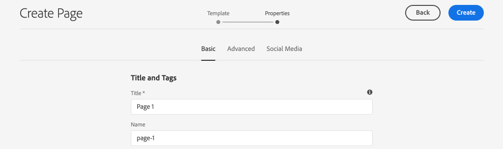
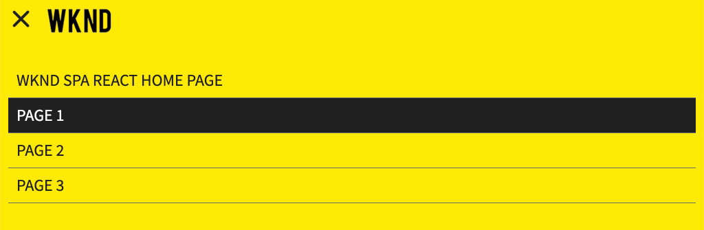

# 내비게이션 및 라우팅 추가 {#navigation-routing}

SPA Editor SDK를 사용하여 AEM Pages에 매핑하여 SPA에서 다양한 뷰를 지원하는 방법을 살펴볼 수 있습니다. 동적 탐색은 반응 라우터를 사용하여 구현되며 기존 헤더 구성 요소에 추가됩니다.

## 목표

1. SPA 편집기를 사용할 때 사용할 수 있는 SPA 모델 라우팅 옵션에 대해 알아봅니다.
2. SPA의 다양한 [보기](https://reacttraining.com/react-router/) 사이를 탐색하기 위해 Responsive Router를 사용하는 방법을 학습합니다.
3. AEM 페이지 계층 구조를 기반으로 하는 동적 탐색을 구현합니다.

## 구축 내용

이 장은 기존 구성 요소에 탐색 메뉴를 `Header` 추가합니다. 탐색 메뉴는 AEM 페이지 계층 구조에 의해 구현되며 [탐색 코어 구성 요소에서 제공하는 JSON 모델을 사용하게 됩니다](https://docs.adobe.com/content/help/ko-KR/experience-manager-core-components/using/components/navigation.html).


## 전제 조건

필요한 도구 및 [로컬 개발 환경 설정을 위한 지침을 검토하십시오](overview.md#local-dev-environment).

### 코드 가져오기

1. Git을 통해 이 자습서의 시작점을 다운로드하십시오.

   ```shell
   $ git clone git@github.com:adobe/aem-guides-wknd-spa.git
   $ cd aem-guides-wknd-spa
   $ git checkout React/navigation-routing-start
   ```

2. Maven을 사용하여 코드 베이스를 로컬 AEM 인스턴스에 배포합니다.

   ```shell
   $ mvn clean install -PautoInstallSinglePackage
   ```

   AEM [6.x를](overview.md#compatibility) 사용하는 경우 `classic` 프로필을 추가합니다.

   ```shell
   $ mvn clean install -PautoInstallSinglePackage -Pclassic
   ```

3. 기존 [WKND 참조 사이트에 필요한 완성된 패키지를 설치합니다](https://github.com/adobe/aem-guides-wknd/releases/latest). WKND 참조 사이트 [에서](https://github.com/adobe/aem-guides-wknd/releases/latest) 제공한 이미지는 WKND SPA에서 다시 사용됩니다. 이 패키지는 [AEM Package Manager를 사용하여 설치할 수 있습니다](http://localhost:4502/crx/packmgr/index.jsp).

   

항상 [GitHub에서](https://github.com/adobe/aem-guides-wknd-spa/tree/React/navigation-routing-solution) 완료된 코드를 보거나 분기로 전환하여 로컬로 코드를 체크 아웃할 수 `React/navigation-routing-solution`있습니다.

## Inspect 헤더 업데이트 {#inspect-header}

이전 장에서 구성 요소는 를 통해 포함된 순수 `Header` 반응 구성 요소로 추가되었습니다 `App.js`. 이 장에서 구성 `Header` 요소는 제거되었으며 템플릿 편집기를 통해 [추가됩니다](https://docs.adobe.com/content/help/en/experience-manager-learn/sites/page-authoring/template-editor-feature-video-use.html). 그러면 사용자가 AEM 내에서 내비게이션 메뉴를 구성할 수 `Header` 있습니다.

>[!NOTE]
>
> 이 장을 시작하기 위해 코드 베이스에 이미 여러 CSS 및 JavaScript 업데이트가 수행되었습니다. 핵심 개념에 초점을 맞추기 위해 **일부** 코드 변경 사항이 논의되지는 않습니다. 전체 변경 사항을 [여기에서 볼 수 있습니다](https://github.com/adobe/aem-guides-wknd-spa/compare/React/map-components-solution...React/navigation-routing-start).

1. IDE에서 이 장에 대한 SPA 스타터 프로젝트를 엽니다.
2. 모듈 아래의 파일 `ui.frontend` 검사 위치 `Header.js` : `ui.frontend/src/components/Header/Header.js`.

   구성 요소가 AEM 구성 요소에 매핑될 수 있도록 `HeaderEditConfig` 및 `MapTo` 하는 기능을 포함하여 몇 가지 업데이트가 수행되었습니다 `wknd-spa-react/components/header`.

   ```js
   /* Header.js */
   ...
   export const HeaderEditConfig = {
       ...
   }
   ...
   MapTo('wknd-spa-react/components/header')(withRouter(Header), HeaderEditConfig);
   ```

3. 모듈에서 AEM 구성 요소의 구성 요소 정의를 `ui.apps` `Header` 검사합니다. `ui.apps/src/main/content/jcr_root/apps/wknd-spa-react/components/header/.content.xml`:

   ```xml
   <?xml version="1.0" encoding="UTF-8"?>
   <jcr:root xmlns:sling="http://sling.apache.org/jcr/sling/1.0" xmlns:cq="http://www.day.com/jcr/cq/1.0"
       xmlns:jcr="http://www.jcp.org/jcr/1.0"
       jcr:primaryType="cq:Component"
       jcr:title="Header"
       sling:resourceSuperType="wknd-spa-react/components/navigation"
       componentGroup="WKND SPA React - Structure"/>
   ```

   AEM `Header` 구성 요소는 속성을 통해 [탐색 코어 구성 요소의](https://docs.adobe.com/content/help/ko-KR/experience-manager-core-components/using/components/navigation.html) 모든 기능을 `sling:resourceSuperType` 상속합니다.

## 템플릿에 헤더 추가 {#add-header-template}

1. 브라우저를 열고 AEM(http://localhost:4502/)에 [로그인합니다](http://localhost:4502/). 시작 코드 베이스는 이미 배포되어야 합니다.
2. SPA 페이지 **템플릿으로 이동합니다**. [http://localhost:4502/editor.html/conf/wknd-spa-react/settings/wcm/templates/spa-page-template/structure.html](http://localhost:4502/editor.html/conf/wknd-spa-react/settings/wcm/templates/spa-page-template/structure.html).
3. 가장 바깥쪽에 있는 루트 레이아웃 **컨테이너를** 선택하고 해당 **정책** 아이콘을 클릭합니다. 작성을 위해 **레이아웃 컨테이너** 를 잠금 해제하지 **** 않도록 주의하십시오.

   

4. SPA **Structure라는 새 정책을 만듭니다**.

   

   허용된 **구성 요소****>** 일반 **>** 레이아웃 컨테이너 구성 요소를선택합니다.

   허용된 **구성 요소** > **WKND SPA 반응 - 구조** > **헤더 구성 요소를** 선택합니다.

   

   허용된 구성 요소 **>** WKND SPA **반응 - 컨텐츠** > **이미지** 및 **텍스트 구성 요소를 선택합니다** . 총 4개의 구성 요소를 선택해야 합니다.

   Click **Done** to save the changes.

5. 페이지를 새로 고치고 **머리글** 구성 요소를 잠금 해제된 레이아웃 컨테이너 위에 **추가합니다**.

   

6. 헤더 **구성 요소를** 선택하고 해당 정책 **** 아이콘을 클릭하여 정책을 편집합니다.
7. WKND SPA 헤더의 **정책 제목** 을 사용하여 새 **정책을 만듭니다**.

   속성 아래에서 **다음을 수행합니다**.

   * 탐색 **루트를** 로 `/content/wknd-spa-react/us/en`설정합니다.
   * [ **제외 루트 수준** ]을 **1로 설정합니다**.
   * Uncheck **Collect all child pages**.
   * 탐색 **구조** 깊이를 **3으로 설정합니다**.

   

   이렇게 하면 아래 깊이 있는 탐색 2단계가 수집됩니다 `/content/wknd-spa-react/us/en`.

8. 변경 내용을 저장한 후에는 채워진 내용을 템플릿의 `Header` 일부로 볼 수 있습니다.

   

## 하위 페이지 만들기

그런 다음 AEM에서 SPA에서 다양한 보기가 될 페이지를 추가로 만듭니다. 또한 AEM에서 제공하는 JSON 모델의 계층적 구조도 검사할 예정입니다.

1. 사이트 **콘솔로** 이동합니다. [http://localhost:4502/sites.html/content/wknd-spa-react/us/en/home](http://localhost:4502/sites.html/content/wknd-spa-react/us/en/home). WKND **SPA Reresponse 홈 페이지를** 선택하고 **만들기** > **페이지**&#x200B;를 클릭합니다.

   

2. 템플릿 **아래에서** **SPA 페이지를 선택합니다**. [ **속성** ] 아래에서 **** Title **에** Page 1 **을 입력하고** Page-1을 이름으로 입력합니다.

   

   [ **만들기** ]를 클릭하고 대화 상자 팝업에서 [ **열기** ]를 클릭하여 AEM SPA 편집기에서 페이지를 엽니다.

3. 기본 레이아웃 컨테이너에 새 **텍스트** 구성 **요소를 추가합니다**. 구성 요소를 편집하고 텍스트를 입력합니다. **RTE 및** H1 **요소를 사용하는 페이지 1** (단락 요소를 변경하려면 전체 화면 모드로 전환해야 함)

   

   이미지와 같은 컨텐츠를 추가할 수 있습니다.

4. AEM Sites 콘솔으로 돌아가서 위 단계를 반복하여 **페이지 2를** 페이지 1의 동위 ****&#x200B;멤버로 만든 두 번째 페이지를 만듭니다.
5. 마지막으로 세 번째 페이지인 **페이지 3****을** 2페이지의 하위 **페이지로**&#x200B;만듭니다. 완료되면 사이트 계층 구조는 다음과 같이 표시됩니다.

   

6. 새 탭에서 AEM에서 제공하는 JSON 모델 API를 엽니다. [http://localhost:4502/content/wknd-spa-react/us/en.model.json](http://localhost:4502/content/wknd-spa-react/us/en.model.json). 이 JSON 콘텐츠는 SPA를 처음 로드할 때 요청됩니다. 외부 구조는 다음과 같습니다.

   ```json
   {
   "language": "en",
   "title": "en",
   "templateName": "spa-app-template",
   "designPath": "/libs/settings/wcm/designs/default",
   "cssClassNames": "spa page basicpage",
   ":type": "wknd-spa-react/components/spa",
   ":items": {},
   ":itemsOrder": [],
   ":hierarchyType": "page",
   ":path": "/content/wknd-spa-react/us/en",
   ":children": {
       "/content/wknd-spa-react/us/en/home": {},
       "/content/wknd-spa-react/us/en/home/page-1": {},
       "/content/wknd-spa-react/us/en/home/page-2": {},
       "/content/wknd-spa-react/us/en/home/page-2/page-3": {}
       }
   }
   ```

   아래에 `:children` 만들어진 각 페이지의 항목이 표시됩니다. 모든 페이지의 컨텐츠는 이 초기 JSON 요청에 있습니다. 탐색 경로가 구현되면 컨텐츠가 이미 클라이언트측에서 사용 가능하므로 SPA의 후속 뷰가 빠르게 로드됩니다.

   초기 JSON 요청에서 SPA의 **모든** 컨텐츠를 로드할 때는 초기 페이지 로드 속도가 느려지므로 적절한 방법이 없습니다. 그런 다음 페이지의 계층 심도가 어떻게 수집되는지 살펴보겠습니다.

7. 다음 위치에서 **SPA 루트** 템플릿으로 이동합니다. [http://localhost:4502/editor.html/conf/wknd-spa-react/settings/wcm/templates/spa-app-template/structure.html](http://localhost:4502/editor.html/conf/wknd-spa-react/settings/wcm/templates/spa-app-template/structure.html).

   페이지 **속성 메뉴** > **페이지 정책을 클릭합니다**.

   

8. SPA **루트** 템플릿에는 수집된 JSON 컨텐츠를 제어하는 추가 **계층적 구조** 탭이 있습니다. 구조 **깊이는** 사이트 계층 구조에서 루트 아래에 있는 하위 페이지를 수집하는 깊이를 **결정합니다**. 구조 패턴 **필드** 를 사용하여 정규 표현식을 기반으로 추가 페이지를 필터링할 수도 있습니다.

   구조 **깊이를** 2 **로 업데이트합니다**.

   

   완료를 **클릭하여** 정책에 대한 변경 사항을 저장합니다.

9. JSON 모델 http://localhost:4502/content/wknd-spa-react/us/en.model.json을 다시 [엽니다](http://localhost:4502/content/wknd-spa-react/us/en.model.json).

   ```json
   {
   "language": "en",
   "title": "en",
   "templateName": "spa-app-template",
   "designPath": "/libs/settings/wcm/designs/default",
   "cssClassNames": "spa page basicpage",
   ":type": "wknd-spa-react/components/spa",
   ":items": {},
   ":itemsOrder": [],
   ":hierarchyType": "page",
   ":path": "/content/wknd-spa-react/us/en",
   ":children": {
       "/content/wknd-spa-react/us/en/home": {},
       "/content/wknd-spa-react/us/en/home/page-1": {},
       "/content/wknd-spa-react/us/en/home/page-2": {}
       }
   }
   ```

   페이지 **3** 경로가 제거되었습니다. `/content/wknd-spa-react/us/en/home/page-2/page-3` 처음 JSON 모델에서.

   나중에 AEM SPA Editor SDK에서 추가 컨텐츠를 동적으로 로드하는 방법을 알아봅니다.

## 탐색 구현

그런 다음 탐색 메뉴를 컨텐츠의 일부로 구현합니다 `Header`. 코드를 직접 추가할 수 `Header.js` 있지만 큰 구성 요소를 사용하지 않는 것이 좋습니다. 대신 나중에 다시 사용할 수 있는 `Navigation` SPA 구성 요소를 구현할 예정입니다.

1. AEM 구성 요소에 의해 표시되는 JSON을 http://localhost:4502/content/wknd-spa-react/us/en.model.json에서 `Header` 확인하십시오 [](http://localhost:4502/content/wknd-spa-react/us/en.model.json).

   ```json
   ...
   "header": {
       "items": [
       {
       "level": 0,
       "active": true,
       "path": "/content/wknd-spa-react/us/en/home",
       "description": null,
       "url": "/content/wknd-spa-react/us/en/home.html",
       "lastModified": 1589062597083,
       "title": "WKND SPA React Home Page",
       "children": [
               {
               "children": [],
               "level": 1,
               "active": false,
               "path": "/content/wknd-spa-react/us/en/home/page-1",
               "description": null,
               "url": "/content/wknd-spa-react/us/en/home/page-1.html",
               "lastModified": 1589429385100,
               "title": "Page 1"
               },
               {
               "level": 1,
               "active": true,
               "path": "/content/wknd-spa-react/us/en/home/page-2",
               "description": null,
               "url": "/content/wknd-spa-react/us/en/home/page-2.html",
               "lastModified": 1589429603507,
               "title": "Page 2",
               "children": [
                   {
                   "children": [],
                   "level": 2,
                   "active": false,
                   "path": "/content/wknd-spa-react/us/en/home/page-2/page-3",
                   "description": null,
                   "url": "/content/wknd-spa-react/us/en/home/page-2/page-3.html",
                   "lastModified": 1589430413831,
                   "title": "Page 3"
                   }
               ],
               }
           ]
           }
       ],
   ":type": "wknd-spa-react/components/header"
   ```

   AEM 페이지의 계층 속성은 탐색 메뉴를 채우는 데 사용할 수 있는 JSON에서 모델링됩니다. 구성 `Header` 요소는 [탐색 코어 구성 요소의 모든 기능을](https://docs.adobe.com/content/help/ko-KR/experience-manager-core-components/using/components/navigation.html) 상속하며 JSON을 통해 노출된 컨텐츠는 반응형 prop에 자동으로 매핑됩니다.

2. 새 터미널 창을 열고 SPA 프로젝트의 `ui.frontend` 폴더로 이동합니다. 명령을 사용하여 **webpack-dev-server** 를 시작합니다 `npm start`.

   ```shell
   $ cd ui.frontend
   $ npm start
   ```

3. 새 브라우저 탭을 열고 http://localhost:3000/으로 [이동합니다](http://localhost:3000/).

   webpack-dev-server **는 AEM의 로컬 인스턴스에서 JSON 모델을 프록시하도록**`ui.frontend/.env.development`구성해야 합니다. 그러면 이전 연습에서 AEM에서 만든 컨텐츠에 대해 직접 코드를 작성할 수 있습니다. 동일한 검색 세션에서 AEM에 인증되었는지 확인합니다.

   

   현재 `Header` 이미 구현된 메뉴 전환 기능이 있습니다. 그런 다음 탐색 메뉴를 구현합니다.

4. 원하는 IDE로 돌아가 `Header.js` 에서 엽니다 `ui.frontend/src/components/Header/Header.js`.
5. 하드 코딩된 문자열을 제거하고 AEM 구성 요소에서 전달된 동적 prop을 사용하도록 `homeLink()` 메서드를 업데이트합니다.

   ```js
   /* Header.js */
   ...
   get homeLink() {
        //expect a single root defined as part of the navigation
       if(!this.props.items || this.props.items.length !== 1) {
           return null;
       }
   
       return this.props.items[0].url;
   }
   ...
   ```

   위의 코드는 구성 요소로 구성된 루트 탐색 항목을 기반으로 URL을 채웁니다. `homeLink()` 는 메서드의 로고를 채우는 데 사용되고 `logo()` `backButton()`뒤로 단추를

   변경 내용을 저장합니다 `Header.js`.

6. 맨 위에 줄을 추가하여 다른 가져오기 `Header.js` 에서 구성 `Navigation` 요소를 가져옵니다.

   ```js
   /* Header.js */
   ...
   import Navigation from '../Navigation/Navigation';
   ```

7. 다음으로 구성 요소를 인스턴스화하는 `get navigation()` 방법을 `Navigation` 업데이트합니다.

   ```js
   /* Header.js */
   ...
   get navigation() {
       //pass all the props to Navigation component
       return <Navigation {...this.props} />;
   }
   ...
   ```

   앞에서 언급했듯이, Adobe는 구성 요소 내에서 탐색 `Header` 을 구현하는 대신 구성 요소의 논리 중 대부분을 `Navigation` 구현합니다.  Prop에는 메뉴를 빌드하는 데 필요한 JSON 구조가 `Header` 포함되어 있으며, 모든 prop을 전달합니다.
8. 에서 파일 `Navigation.js` 을 엽니다 `ui.frontend/src/components/Navigation/Navigation.js`.
9. 메서드를 `renderGroupNav(children)` 구현합니다.

   ```js
   /* Navigation.js */
   ...
   renderGroupNav(children) {
   
       if(children === null || children.length < 1 ) {
           return null;
       }
       return (<ul className={this.baseCss + '__group'}>
                   {children.map(
                       (item,index) => { return this.renderNavItem(item,index)}
                   )}
               </ul>
       );
   }
   ...
   ```

   이 메서드는 탐색 항목의 배열을 `children`가져와서 순서가 지정되지 않은 목록을 만듭니다. 그런 다음 배열에 대해 반복하고 항목을 다음으로 전달합니다. 다음 `renderNavItem`은 구현됩니다.

10. 구현: `renderNavItem`

   ```js
   /* Navigation.js */
   ...
   renderNavItem(item, index) {
       const cssClass = this.baseCss + '__item ' + 
                        this.baseCss + '__item--level-' + item.level + ' ' +
                        (item.active ? ' ' + this.baseCss + '__item--active' : '');
       return (
           <li key={this.baseCss + '__item-' + index} className={cssClass}>
                   { this.renderLink(item) }
                   { this.renderGroupNav(item.children) }
           </li>
       );
   }
   ...
   ```

   이 메서드는 속성과 속성을 기반으로 CSS 클래스를 사용하여 목록 항목 `level` 을 렌더링합니다 `active`. 그런 다음 메서드를 호출하여 앵커 태그 `renderLink` 를 만듭니다. 컨텐츠는 계층 `Navigation` 형식이므로 재귀 전략을 사용하여 현재 항목의 하위 항목 `renderGroupNav` 을 호출합니다.

11. 메서드를 `renderLink` 구현합니다.

   파일 상단에 다른 가져오기 기능과 함께 [Reimate 라우터의](https://reacttraining.com/react-router/web/api/Link) 일부인 링크 구성 요소에 대한 가져오기 방법을 추가합니다.

   ```js
   import {Link} from "react-router-dom";
   ```

   다음으로 메서드 구현을 `renderLink` 마칩니다.

   ```js
   renderLink(item){
       return (
           <Link to={item.url} title={item.title} aria-current={item.active && 'page'}
              className={this.baseCss + '__item-link'}>{item.title}</Link>
       );
   }
   ```

   일반 앵커 태그 대신 `<a>`링크 [](https://reacttraining.com/react-router/web/api/Link) 구성 요소가 사용됩니다. 따라서 전체 페이지 새로 고침이 트리거되지 않고 AEM SPA Editor JS SDK에서 제공하는 Reimate 라우터를 활용합니다.

12. 변경 내용 `Navigation.js` 을 저장하고 **webpack-dev-server로 돌아갑니다**. [http://localhost:3000](http://localhost:3000)

   

   메뉴 전환을 클릭하여 탐색을 열면 채워진 탐색 링크가 표시됩니다. SPA의 다른 전망을 볼 수 있어야 합니다.

## Inspect 더 스파 라우팅

이제 내비게이션이 구현되었으므로 AEM에서 라우팅을 검사합니다.

1. IDE에서 파일을 `index.js` 엽니다 `ui.frontend/src/index.js`.

   ```js
   /* index.js */
   import { Router } from 'react-router-dom';
   ...
   ...
    ModelManager.initialize().then(pageModel => {
       const history = createBrowserHistory();
       render(
       <Router history={history}>
           <App
           history={history}
           cqChildren={pageModel[Constants.CHILDREN_PROP]}
           cqItems={pageModel[Constants.ITEMS_PROP]}
           cqItemsOrder={pageModel[Constants.ITEMS_ORDER_PROP]}
           cqPath={pageModel[Constants.PATH_PROP]}
           locationPathname={window.location.pathname}
           />
       </Router>,
       document.getElementById('spa-root')
       );
   });
   ```

   이 `App` 가 React Router의 `Router` 구성 요소에 [래핑되어 있습니다](https://reacttraining.com/react-router/). AEM SPA Editor JS SDK에서 `ModelManager`제공되는 이 JSON 모델 API를 기반으로 한 AEM 페이지에 동적 경로를 추가합니다.

2. 터미널을 열고 프로젝트의 루트로 이동한 다음 Maven 기술을 사용하여 프로젝트를 AEM에 배포합니다.

   ```shell
   $ cd aem-guides-wknd-spa
   $ mvn clean install -PautoInstallSinglePackage
   ```

3. AEM의 SPA 홈 페이지로 이동합니다. [http://localhost:4502/content/wknd-spa-react/us/en/home.html](http://localhost:4502/content/wknd-spa-react/us/en/home.html) 및 브라우저의 개발자 도구를 엽니다. 아래 스크린샷은 Google Chrome 브라우저에서 캡처됩니다.

   페이지를 새로 고치면 XHR 요청(SPA 루트) `/content/wknd-spa-react/us/en.model.json`이 표시됩니다. 자습서에서 앞서 작성한 SPA 루트 템플릿에 대한 계층 깊이 구성을 기준으로 세 개의 하위 페이지만 포함됩니다. 여기에는 **페이지 3이**&#x200B;포함되지 않습니다.

   

4. 개발자 도구가 열려 있는 상태에서 탐색 기능을 사용하여 `Header` 페이지 3 ****:

   

   다음과 같은 새로운 XHR 요청을 준수합니다. `/content/wknd-spa-react/us/en/home/page-2/page-3.model.json`

   

   AEM 모델 관리자는 **페이지 3** JSON 콘텐츠를 사용할 수 없으며 추가 XHR 요청을 자동으로 트리거합니다.

5. 구성 요소의 다양한 탐색 링크를 사용하여 SPA를 계속 탐색합니다 `Header` . 추가적인 XHR 요청이 수행되지 않고 전체 페이지가 새로 고쳐지지 않도록 주의하십시오. 따라서 최종 사용자가 SPA를 빠르게 사용할 수 있고 불필요한 요청을 AEM으로 다시 줄일 수 있습니다.

   

6. 다음으로 직접 이동하여 딥 링크를 다양하게 실험해 보십시오. [http://localhost:4502/content/wknd-spa-react/us/en/home/page-2.html](http://localhost:4502/content/wknd-spa-react/us/en/home/page-2.html). 브라우저의 [뒤로] 버튼이 계속 작동되는지 확인하십시오.

## 축하합니다! {#congratulations}

축하합니다. SPA Editor SDK를 사용하여 AEM Pages에 매핑하여 SPA에서 여러 뷰를 지원하는 방법을 알아보았습니다. 동적 탐색이 React Router를 사용하여 구현되어 구성 요소에 `Header` 추가되었습니다.

항상 [GitHub에서](https://github.com/adobe/aem-guides-wknd-spa/tree/React/navigation-routing-solution) 완료된 코드를 보거나 분기로 전환하여 로컬로 코드를 체크 아웃할 수 `React/navigation-routing-solution`있습니다.
